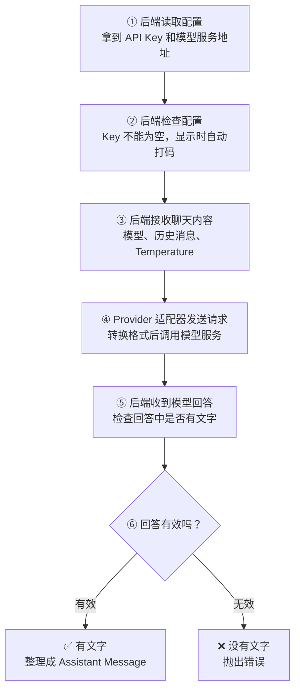

# Day 12：建立 OpenAI-compatible Provider 适配器

## 今日目标

1. 理解 Provider Adapter、SDK、Async I/O、SecretStr 和 Mock。
2. 使用服务端环境变量与 Pydantic 建立 Provider 配置边界。
3. 使用官方 `openai` Python SDK 实现最小异步 Provider 调用。
4. 用 Mock 验证请求转换和响应转换，不发起真实模型请求。

今天不新增 Chat Endpoint，不启用前端 Prompt 输入，不填写或提交真实 API Key，不调用真实模型，不实现流式输出，也不提前抽象多个 Provider。

## 必备理论

### 1. Provider Adapter（模型服务适配器）

**专业解释：**

Provider Adapter 在项目内部数据契约与第三方模型 API 之间完成请求转换、网络调用和响应转换。

**大白话：**

它类似 Vue 项目里的统一 `request.ts` 或 API Service。页面只认识业务数据，不需要到处理解 Axios 配置和后端差异。

**举例：**

```text
ChatRequest
   ↓ 转换
OpenAI-compatible messages
   ↓ Provider 返回
ChatMessage(role="assistant", content="...")
```

**在 Jack AI Studio 中的作用：**

它隔离第三方 SDK。后续 Route 只调用适配器，多 Provider 的具体差异留在 Provider 层处理。

### 2. SDK（Software Development Kit，软件开发工具包）

**专业解释：**

SDK 是服务提供方封装的客户端库，负责认证、请求结构、网络调用、重试和响应对象等基础能力。

**大白话：**

它像前端使用 Axios，而不是自己从 TCP 开始实现 HTTP。

**举例：**

```python
client = AsyncOpenAI(api_key="...")
```

**在 Jack AI Studio 中的作用：**

Day 12 引入 `openai` Python SDK，避免重复封装底层 HTTP。业务契约仍由项目自己的 Pydantic Schema 控制。

### 3. Async I/O（异步输入输出）

**专业解释：**

Async I/O 在等待网络响应时释放执行权，使事件循环可以继续处理其他任务。

**大白话：**

它类似 Koa 的 `await next()` 或前端的 `await fetch()`：等待外部服务时，不把整个程序卡住。

**举例：**

```python
completion = await client.chat.completions.create(...)
```

**在 Jack AI Studio 中的作用：**

模型响应可能需要数秒。异步 Provider 为后续 FastAPI 同时处理多个 Chat 请求建立基础。

### 4. SecretStr（保密字符串）

**专业解释：**

`SecretStr` 是 Pydantic 的敏感值类型，默认隐藏字符串表示，避免调试输出直接暴露机密。

**大白话：**

它像密码输入框的遮罩层。但遮住不代表必填，所以仍要用 `min_length=1` 拒绝空 Key。

**举例：**

```python
api_key: SecretStr = Field(min_length=1)
```

**在 Jack AI Studio 中的作用：**

Provider API Key 只存在于后端配置对象和运行环境，不进入 Web JavaScript，也不提交 Git。

### 5. Mock（模拟对象）

**专业解释：**

Mock 在测试中替代真实外部依赖，提供可控响应并记录调用参数。

**大白话：**

它类似前端单测 Mock Axios：验证“传了什么、如何处理结果”，但不真的请求服务器。

**举例：**

`FakeOpenAIClient` 返回测试文本，并记录 `model`、`messages` 和 `temperature`。

**在 Jack AI Studio 中的作用：**

今天用 Mock 验证适配器，不需要真实 Key、不消耗额度，也不会受外部网络波动影响。

## Python 学习

### IsolatedAsyncioTestCase（隔离异步单元测试）

普通 `TestCase` 不能直接 `await`。Python 的 `IsolatedAsyncioTestCase` 会为每个异步测试提供隔离的事件循环：

```python
class ProviderTest(IsolatedAsyncioTestCase):
    async def test_generate(self) -> None:
        message = await provider.generate(request)
        self.assertEqual(message.role, MessageRole.ASSISTANT)
```

这类似 Vitest 中直接使用 `async () => { await ... }` 测试异步请求。

## 项目实战

### 当前链路

一句话先看懂：**后端拿到安全配置和聊天内容，调用模型服务，再把有效回答整理成 Assistant Message。**



对应代码只需要记住三个入口：

- 第 ①② 步：`load_provider_config()` 和 `ProviderConfig`
- 第 ③ 步：Day 11 的 `ChatRequest`
- 第 ④～⑥ 步：`OpenAICompatibleProvider.generate()`

### 配置边界

```text
服务端环境变量
├── AI_PROVIDER_API_KEY      必填，SecretStr
└── AI_PROVIDER_BASE_URL     可选，兼容服务地址
```

`AI_PROVIDER_BASE_URL` 留空时使用 SDK 默认的 OpenAI API 地址；兼容服务可以提供自己的 `/v1` Base URL。

### 今天没有发生的链路

```text
浏览器
   ✕ 没有 POST /chat
   ✕ 没有读取 API Key
   ✕ 没有真实模型响应
   ✕ 没有流式事件
```

## 关键代码说明

- `ProviderConfig` 使用 Pydantic 校验 API Key 和可选 Base URL。
- `SecretStr` 负责隐藏显示，`Field(min_length=1)` 负责拒绝空 Key，两者职责不同。
- `OpenAICompatibleProvider` 只接受项目自己的 `ChatRequest`。
- `generate()` 使用 `async/await` 执行网络 I/O。
- Provider 返回空文本时抛出统一的 `ProviderResponseError`，不返回无效消息。
- `FakeOpenAIClient` 仅用于测试，不是业务中的假模型。
- 当前适配器使用常见的 Chat Completions 消息协议，以服务项目的 OpenAI-compatible 多 Provider 目标；第三方差异被限制在 Provider 层。

## 今日英文术语

1. **Provider Adapter**：项目契约与第三方模型 API 之间的转换层。
2. **SDK**：服务提供方封装的开发工具包。
3. **Async I/O**：等待外部输入输出时不阻塞其他任务。
4. **Environment Variable**：由运行环境注入的外部配置。
5. **API Key**：调用 Provider 时使用的机密凭证。
6. **SecretStr**：Pydantic 的敏感字符串类型。
7. **Base URL**：API 请求的基础地址。
8. **Mock**：测试中替代真实外部依赖的模拟对象。
9. **Dependency Injection**：从外部传入依赖，便于替换和测试。
10. **Chat Completions**：使用消息列表生成模型回复的兼容接口协议。

## 今日练习

1. 说明 Provider Adapter 与 FastAPI Route 的职责区别。
2. 解释为什么模型网络调用应使用 `async/await`。
3. 说明 `SecretStr` 为什么不能代替 `min_length=1`。
4. 解释 Mock 测试与真实 Provider 联调分别能证明什么。
5. 说明为什么 API Key 和 Base URL 都不应由浏览器直接提交。

## 验收标准

- [x] Day 12 只建立 Provider 配置与适配器，没有新增 Chat Endpoint。
- [x] 官方 `openai` Python SDK 已作为直接依赖并锁定。
- [x] API Key 只从服务端环境变量读取，示例文件不包含真实机密。
- [x] `OpenAICompatibleProvider` 能转换请求并返回 Assistant Message。
- [x] Mock 测试覆盖配置、请求参数、正常响应和空响应。
- [x] `pnpm check:foundation` 与 Git diff 检查通过。
- [x] 桌面端和移动端 Chat 页面回归通过。
- [x] 用户完成 Day 12 核心概念问答与显示确认。
- [x] `PROGRESS.md` 在最终验收后更新为 Day 12 已完成。

## 遇到的问题

- 首轮测试发现 `SecretStr` 只隐藏显示，不会自动拒绝空字符串；增加 `Field(min_length=1)` 后缺失 API Key 会被 Pydantic 正确拒绝。
- `pnpm check:foundation` 一次通过，包含 ESLint、TypeScript、Next.js Build、`uv lock --check`、Python `compileall` 和 11 个 unittest。
- Next.js 生产构建确认 `/chat` 仍是 Static Route，首页继续按请求动态读取 API Health。
- 浏览器已验证 1440×900 和 390×844 下 Provider Adapter、No Endpoint 与禁用输入区显示正确，无横向溢出，控制台无 warning 或 error。
- 从 Chat 返回首页的导航正常，首页显示 Day 12、`12 / 90` 与 `SPRINT 02 · AI CHAT`。

## 今日总结

Day 12 已完成。Provider 配置、异步适配器、Mock 测试、统一质量门禁、桌面端与移动端浏览器回归、Mermaid 流程图和核心概念问答均通过。

## Git Commit

Day 12 验收完成后建议提交：

```text
feat(provider): add OpenAI-compatible adapter for day 12
```

## 下一天预告

Day 13 将在 Day 12 完成后，根据 Provider 适配器边界确定，不提前开发。
