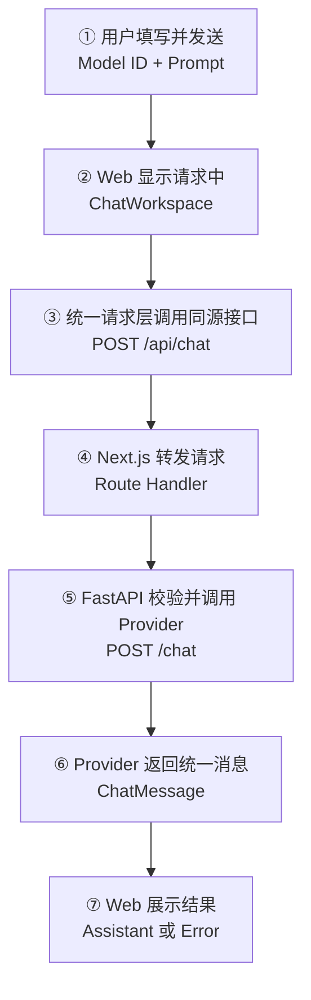
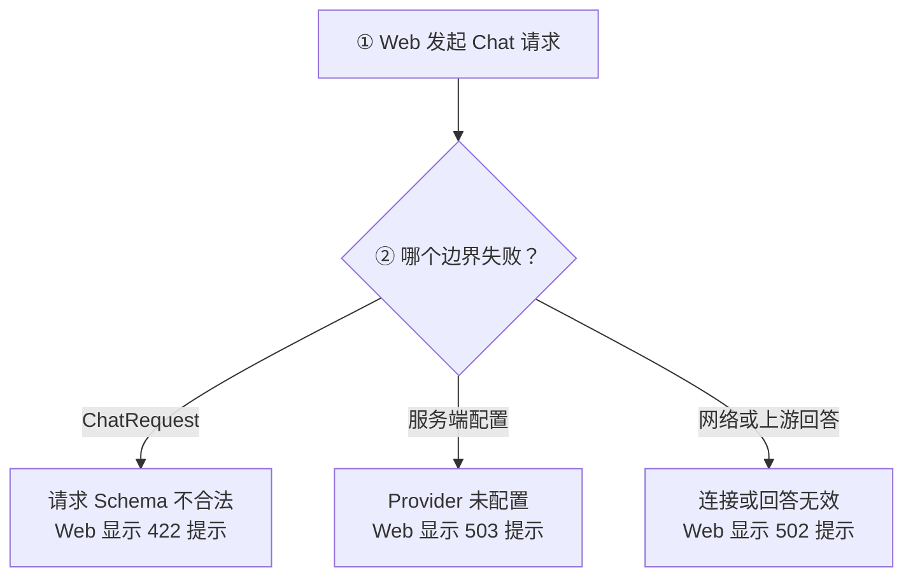

# Day 13：打通 Web 与 AI Chat Endpoint

## 今日目标

1. 理解 Dependency Injection、HTTP Error Mapping、API Contract 和 Backend for Frontend。
2. 新增 FastAPI `POST /chat`，连接 Day 11 Schema 与 Day 12 Provider Adapter。
3. 启用 Web Chat 输入，通过统一请求封装和 Next.js Route Handler 调用 FastAPI。
4. 实现 Loading、Success、Error 状态，并使用 Fake Provider 完成无真实 Key 的自动化验证。

今天不调用真实模型，不实现 Streaming、多 Provider、会话持久化、多轮上下文、重试或完整日志系统。

## 必备理论

### 1. Dependency Injection（依赖注入）

**专业解释：**

Dependency Injection 让对象从外部获得依赖，而不是在业务函数内部固定创建依赖。FastAPI 可以在执行 Route 前解析依赖，并允许测试替换依赖。

**大白话：**

它可以类比 Vue 的 `provide/inject`，也像把统一 Request Client 传给 Service。使用方只声明“我需要它”，不负责把实现焊死。

**举例：**

生产请求由 `get_chat_provider()` 创建 `OpenAICompatibleProvider`；测试使用 `app.dependency_overrides` 替换成 `FakeChatProvider`。

**在 Jack AI Studio 中的作用：**

`POST /chat` 可以测试完整 HTTP 链路，同时不读取真实 API Key、不访问 Provider，也不消耗额度。

### 2. HTTP Error Mapping（HTTP 错误映射）

**专业解释：**

HTTP Error Mapping 把内部校验错误、配置错误和外部依赖错误转换成稳定的 HTTP Status Code 与安全响应。

**大白话：**

它像 Koa 的统一错误处理中间件：后端知道具体原因，前端只收到约定好的错误，不看到内部堆栈或密钥。

**举例：**

- `422 Unprocessable Entity`：Provider 依赖可用时，请求不符合 `ChatRequest`。
- `502 Bad Gateway`：无法连接后端，或上游 Provider 返回无效结果。
- `503 Service Unavailable`：FastAPI 尚未配置 Provider API Key。

**在 Jack AI Studio 中的作用：**

Web 可以把不同错误转换成用户能理解的中文提示，而不是只显示“请求失败”。

### 3. API Contract（API 契约）

**专业解释：**

API Contract 规定 Endpoint 的 Method、Path、请求 Schema、响应 Schema 和错误语义。

**大白话：**

它像前后端共同确认的 TypeScript Interface，但 FastAPI 和 Pydantic 会在运行时真正执行校验。

**举例：**

`POST /chat` 接受 `ChatRequest`，成功时返回 `ChatMessage(role="assistant")`。

**在 Jack AI Studio 中的作用：**

Web 只依赖项目自己的 Chat Contract，不直接认识 OpenAI-compatible SDK。

### 4. Backend for Frontend（BFF，服务于前端的后端层）

**专业解释：**

BFF 是贴近特定前端的服务边界。当前 Next.js Route Handler 接收浏览器同源请求，再使用服务端 `API_BASE_URL` 转发给 FastAPI。

**大白话：**

它像前端自己的“服务台”：浏览器只找同一个 Next.js 站点，服务台再联系真正处理 AI 业务的 FastAPI。

**举例：**

浏览器请求 `/api/chat`，`app/api/chat/route.ts` 转发到 FastAPI `/chat`。

**在 Jack AI Studio 中的作用：**

它避免浏览器硬编码 FastAPI 地址和处理跨域。BFF 只负责转发，不复制 Provider 业务逻辑；API Key 仍只存在于 FastAPI 服务端。

### 5. Request State（请求状态）

**专业解释：**

Request State 描述异步请求在 UI 中的 Idle、Loading、Success 和 Error 阶段，并决定输入、按钮和结果区域的展示行为。

**大白话：**

它和企业后台里的“提交中、提交成功、提交失败”一样；用户必须知道系统正在处理还是已经失败。

**举例：**

发送时禁用 Model 与 Prompt，显示 `WAITING FOR PROVIDER`；成功后渲染 Assistant Message；失败后显示安全的中文错误。

**在 Jack AI Studio 中的作用：**

它让 Chat Workspace 成为真实可操作的产品入口。当前只管理内存状态，刷新页面后不会保留消息。

## Python 学习

### Annotated 与 Depends

```python
ChatProviderDependency = Annotated[
    OpenAICompatibleProvider,
    Depends(get_chat_provider),
]
```

类型检查器看到 `OpenAICompatibleProvider`；FastAPI 看到 `Depends(...)` 后会先取得 Provider，再传给 Route。可以类比 TypeScript 类型与框架依赖容器的组合。

## 项目实战

### 主请求链路

一句话先看懂：**用户在 Web 输入 Model 和 Prompt，统一请求层经过 Next.js BFF 调用 FastAPI，最后把 Assistant Message 或安全错误展示回页面。**



### 异常链路



### 分层职责

```text
components/chat-workspace.tsx
├── 管理 Model、Prompt 和 Request State
├── 展示 User、Assistant 与 Error
└── 只调用统一 Chat API 封装

lib/chat-api.ts
├── 定义 TypeScript Chat Contract
├── 请求同源 POST /api/chat
└── 校验响应并统一错误文案

app/api/chat/route.ts
├── 在 Next.js 服务端读取 API_BASE_URL
└── 转发请求与 FastAPI 状态码

routes/chat.py
├── 校验 ChatRequest 与注入 Provider
├── 调用 Provider Adapter
└── 映射 HTTP Error
```

页面组件不直接散写 `fetch`，Next.js BFF 不复制 AI 业务，FastAPI Route 不处理 SDK 细节。

## 关键代码说明

- `ChatWorkspace` 是最小 Client Component，只负责输入、消息和 Request State。
- `createChatCompletion()` 是 Web 统一 Chat 请求封装，页面组件不直接调用 `fetch`。
- Next.js `POST /api/chat` 使用服务端 `API_BASE_URL` 转发 FastAPI，避免跨域和浏览器硬编码后端地址。
- `app.include_router(chat_router)` 把 FastAPI Chat Route 注册到应用。
- `get_chat_provider()` 只从服务端环境变量创建 Provider，缺少 Key 时返回 `503`。
- Provider 无有效文本时返回 `502`，不会把内部异常直接暴露给客户端。
- `FakeChatProvider` 通过 Dependency Override 替代真实 Provider，测试不读取真实 Key。
- 当前每次只发送本轮 User Message；页面消息不持久化，也不提前实现多轮上下文。

## 今日英文术语

1. **Dependency Injection**：从外部提供函数或对象所需依赖。
2. **Dependency Override**：测试时替换框架依赖实现。
3. **API Contract**：接口请求、响应和错误的共同约定。
4. **Backend for Frontend**：贴近特定前端的服务端接口层。
5. **Route Handler**：Next.js App Router 中处理 HTTP 请求的服务端文件。
6. **Request State**：异步请求的 Idle、Loading、Success 和 Error 状态。
7. **HTTP Status Code**：表达请求处理结果的三位状态码。
8. **Same-origin**：协议、域名和端口相同的浏览器请求来源。
9. **Response Model**：FastAPI 用于校验和描述响应的数据模型。
10. **Non-streaming**：等待完整回答后一次性返回的响应方式。

## 今日练习

1. 为什么浏览器调用 `/api/chat`，而不是直接硬编码 FastAPI 地址？
2. Next.js Route Handler 与 FastAPI Route 的职责有什么区别？
3. 为什么 `ChatWorkspace` 不直接散写 `fetch`？
4. Loading、Success 和 Error 三种状态分别需要更新哪些 UI？
5. 为什么 Provider API Key 不能放进 `NEXT_PUBLIC_` 环境变量？

## 验收标准

- [x] FastAPI 新增 `POST /chat`，请求和响应使用项目 Pydantic Schema。
- [x] Route 通过 Dependency Injection 调用现有 Provider Adapter。
- [x] `422`、`502`、`503` 已建立安全错误边界。
- [x] HTTP 自动化测试不读取真实 Key、不请求真实模型。
- [x] Web Prompt 输入已启用，并通过统一请求封装调用同源 `/api/chat`。
- [x] Next.js Route Handler 使用服务端 `API_BASE_URL` 转发 FastAPI。
- [x] Web 已实现 Loading、Assistant Message 和安全 Error 状态。
- [x] 修正 Web 后的完整质量门禁与 Git diff 检查通过。
- [x] Uvicorn、Swagger/OpenAPI 已确认 `POST /chat` 契约与错误响应。
- [x] 桌面端与移动端完成 Web Chat 交互和无横向溢出验证。
- [x] 完成 Day 13 核心概念问答。
- [x] `PROGRESS.md` 在最终验收后更新为 Day 13 已完成。

## 遇到的问题

- 首轮错误地把 Day 13 收窄为纯后端 Endpoint，导致 Web 仍显示 `NO ENDPOINT` 和 `DISABLED`；已把前后端闭环要求写入根目录 `AGENTS.md`，并补齐 Web 链路。
- 从仓库根目录直接按模块名运行 focused test 时，`apps/api` 不在 Import Path；改用项目标准的 `unittest discover -t apps/api` 后通过。
- 当前 FastAPI `TestClient` 输出 Starlette deprecation warning；不影响测试，暂不为消除提示引入新依赖。
- FastAPI 可能先解析 Route Dependency：Provider 未配置且请求体同时无效时，`503` 会优先于 `422`。
- 使用本地 Fake API 完成桌面端 Success、`503` Error 和移动端 Success 验收；390×844 与 1440×900 均无横向溢出，控制台无 warning/error，未调用真实模型。
- 核心概念问答验收通过；已理解 BFF 同源代理、Next.js 与 FastAPI Route 职责、统一请求封装、Request State 和 `NEXT_PUBLIC_` 的公开边界。

## 今日总结

Day 13 已完成。Web 到 FastAPI 的非流式 Chat 闭环、统一请求封装、Next.js Route Handler、FastAPI Endpoint、Provider Adapter、Request State 和错误展示均已实现；完整质量门禁、桌面/移动端浏览器交互与核心概念问答全部通过。

## Git Commit

Day 13 最终验收后建议提交：

```text
feat(chat): connect web chat endpoint for day 13
```

## 下一天预告

Day 14 将在 Day 13 验收完成后，根据当前非流式 Chat 链路确定，不提前开发。
