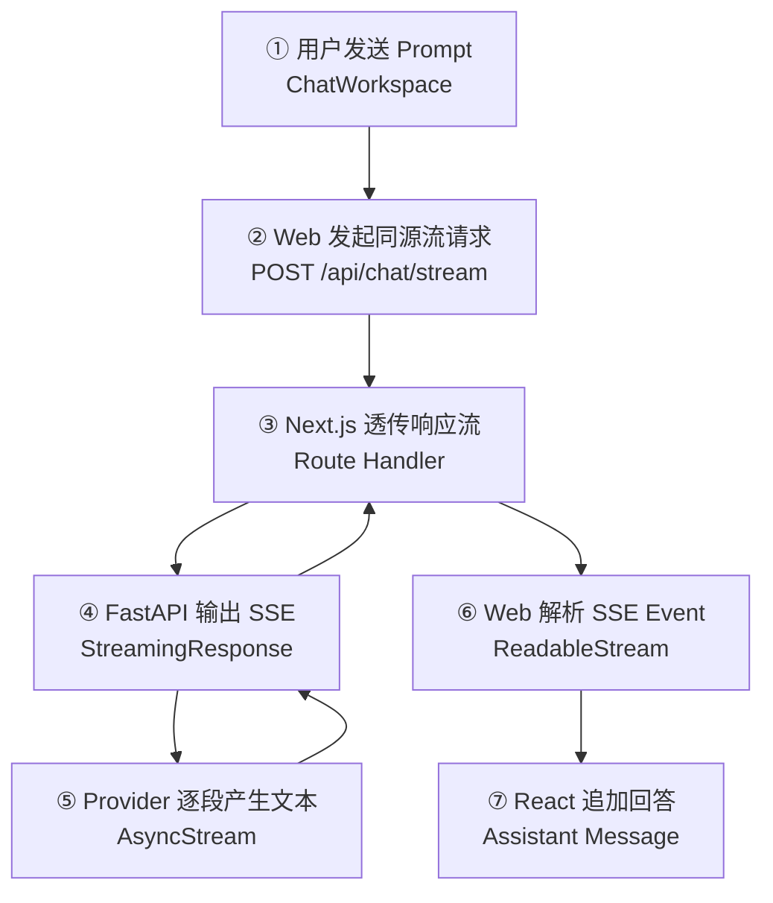
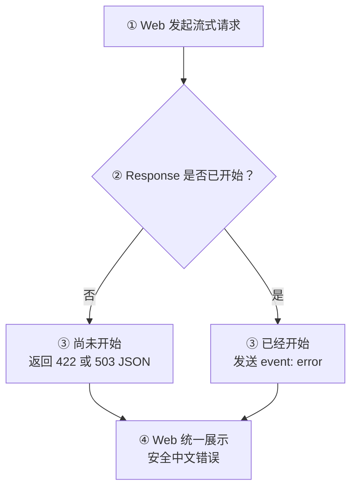

# Day 14：打通端到端 SSE 流式输出

## 今日目标

1. 理解 Streaming、SSE、Chunk、ReadableStream 与 Async Generator。
2. 让 Provider Adapter 使用 OpenAI-compatible SDK 的 `stream=True` 逐段读取文本。
3. 新增 FastAPI `POST /chat/stream`，把 Provider Chunk 转换为统一 SSE Event。
4. 让 Next.js Route Handler 透传 Response Body，Web 逐段更新 Assistant Message。
5. 使用 Fake Stream 完成自动化测试和浏览器验收，不调用真实模型。

今天不实现请求取消、多轮上下文、Markdown、会话持久化、重试、多 Provider 或真实模型联调。

## 必备理论

### 1. Streaming（流式输出）

**专业解释：**

Streaming 让服务端在完整结果尚未生成时，持续发送已经得到的数据分片；客户端可以边接收、边处理、边展示。

**大白话：**

它像餐厅做好一道菜就先上一道，不必等整桌菜全部完成。用户能更早看到回答，主观等待时间更短。

**举例：**

模型依次生成“你好”“，我是”“ Jack AI Studio”，页面会把三个分片逐步追加成完整回答。

**在 Jack AI Studio 中的作用：**

AI 回答可能需要数秒甚至更久。Chat Workspace 使用流式输出后，可以立即展示模型已经生成的内容。Day 14 只实现单轮文本流。

### 2. Server-Sent Events（SSE，服务器发送事件）

**专业解释：**

SSE 是基于 HTTP 的文本事件流格式，响应使用 `text/event-stream`，每个事件由字段行组成，并用空行分隔。

**大白话：**

它像服务端持续往一条打开的 HTTP 水管里投递带标签的小纸条。今天约定三种标签：`delta`、`done` 和 `error`。

**举例：**

```text
event: delta
data: {"content":"你好"}

event: done
data: {}
```

**在 Jack AI Studio 中的作用：**

FastAPI 把不同 Provider 的文本分片统一编码成项目自己的 SSE Event，Web 不需要认识第三方 SDK 的响应结构。

### 3. Chunk（数据分片）

**专业解释：**

Chunk 是流传输过程中一次到达的数据片段。网络 Chunk 与业务 Event 的边界不保证一致，一个 Event 可能被拆成多个 Chunk，多个 Event 也可能出现在同一 Chunk。

**大白话：**

快递箱里的物品不一定按订单分箱。客户端不能假设“读到一次”就正好得到一个完整事件，必须先缓存再按空行切分。

**举例：**

第一次读取可能只有 `event: del`，第二次才收到剩余的 `ta\ndata: ...`；解析器需要把两段拼起来。

**在 Jack AI Studio 中的作用：**

`chat-api.ts` 保留未完成的文本 Buffer，只解析完整 SSE Event，避免中文和 JSON 被网络分片切断后解析失败。

### 4. ReadableStream（可读流）

**专业解释：**

`ReadableStream` 是 Web Streams API 的可读数据源。客户端通过 Reader 异步读取二进制 Chunk，再用 `TextDecoder` 增量解码为文本。

**大白话：**

它类似前端不断执行异步的“下一段”操作：`reader.read()` 每次给出当前到达的数据和是否结束。

**举例：**

```ts
const reader = response.body.getReader()
const { done, value } = await reader.read()
```

**在 Jack AI Studio 中的作用：**

浏览器读取 Next.js 返回的 `response.body`，解析 `delta` 后立即追加 Assistant Message；`done` 表示正常结束，`error` 表示流内失败。

### 5. Async Generator（异步生成器）

**专业解释：**

Async Generator 是使用 `async def` 与 `yield` 定义、通过 `async for` 消费的异步数据序列，适合逐步产生依赖网络 I/O 的结果。

**大白话：**

普通异步函数最后只 `return` 一次；异步生成器可以每拿到一段就 `yield` 一次，后面继续等待下一段。

**举例：**

Provider 的 `stream()` 每收到一个有效 `delta.content` 就 `yield content`。

**在 Jack AI Studio 中的作用：**

Provider、FastAPI `StreamingResponse` 与 SSE 事件生成器都使用异步迭代串联，不必先把完整回答保存在内存后再返回。

## Python 学习

### async for、yield 与 AsyncIterator

```python
async def stream(self, request: ChatRequest) -> AsyncIterator[str]:
    response = await client.chat.completions.create(
        model=request.model,
        messages=messages,
        stream=True,
    )

    async for chunk in response:
        if chunk.choices and chunk.choices[0].delta.content:
            yield chunk.choices[0].delta.content
```

- `await` 等待建立 Provider Stream。
- `async for` 等待每个异步 Chunk。
- `yield` 把当前文本交给上层，同时保留函数执行位置。
- `AsyncIterator[str]` 表示调用方会异步拿到多段字符串，而不是一次得到一个字符串。

可以类比 JavaScript 的 `for await...of` 与 Async Generator。

## 项目实战

### 主请求与响应流

一句话先看懂：**请求先从浏览器走到 Provider，文本分片再沿同一条链路逐段返回，React 每收到一个 `delta` 就更新页面。**



### 异常流程



为什么流中错误仍是 HTTP `200`：`StreamingResponse` 开始发送 Header 后，Status Code 已经确定，无法在 Provider 中途失败时改成 `502`。因此项目使用 `event: error` 表达流内失败，并避免把内部异常暴露给浏览器。

### 分层职责

```text
components/chat-workspace.tsx
├── 创建空的 Assistant Message
├── 收到 delta 后逐段追加 content
└── 管理 Loading、Success 与 Error

lib/chat-api.ts
├── 统一发起 POST /api/chat/stream
├── 缓存并解析不完整的 SSE Chunk
└── 把 delta、done、error 转成业务回调或异常

app/api/chat/stream/route.ts
└── 透传 FastAPI Response Body 和流式 Header

routes/chat.py
├── 把 Provider 文本编码为 SSE Event
└── 使用 StreamingResponse 持续输出

providers/openai_compatible.py
└── 使用 SDK stream=True 读取 Provider Chunk
```

页面组件不直接解析 SSE，Next.js BFF 不缓冲完整回答，FastAPI Route 不认识第三方 Chunk 细节。

## 关键代码说明

- `OpenAICompatibleProvider.stream()` 过滤无 `choices`、`None` 和空文本 Chunk，并统一转换 Provider 异常。
- `stream_chat_events()` 只输出项目约定的 `delta`、`done`、`error` 三类 Event。
- `StreamingResponse` 使用 `text/event-stream`、`Cache-Control: no-cache` 和 `X-Accel-Buffering: no`。
- `forwardChatRequest()` 是 Next.js 服务端统一代理封装；普通 Chat 与 Streaming Chat 不重复实现 `fetch`、超时和错误处理。
- Next.js 直接返回 FastAPI 的 `response.body`，不会先执行 `response.text()`，否则会失去逐段展示效果。
- `streamChatCompletion()` 使用 Buffer 处理跨 Chunk 的 SSE Event，避免假设一次 `read()` 等于一个事件。
- `ChatWorkspace` 先插入空 Assistant Message，再把每个 `delta` 追加到同一条消息。
- Fake Stream 覆盖多个 Chunk、空 Chunk、正常 `done` 和流内 `error`，不读取真实 Key。

## 今日英文术语

1. **Streaming**：完整结果生成前持续返回数据。
2. **Server-Sent Events (SSE)**：基于 HTTP 的服务端文本事件流格式。
3. **Chunk**：流传输过程中一次到达的数据分片。
4. **Event**：SSE 中带名称与数据的业务消息单元。
5. **ReadableStream**：浏览器可逐段读取的数据源。
6. **TextDecoder**：把二进制字节增量解码为文本。
7. **Async Generator**：能够异步 `yield` 多个结果的函数。
8. **AsyncIterator**：通过异步迭代逐项提供数据的类型契约。
9. **Buffer**：暂存尚未形成完整 Event 的文本区域。
10. **Pass-through**：中间层不聚合内容，直接透传数据流。

## 今日练习

1. Streaming 相比 Non-streaming 主要改善了什么？它会让模型生成总时长一定变短吗？
2. 为什么不能假设一次 `reader.read()` 正好得到一个完整 SSE Event？
3. Next.js Route Handler 为什么要直接透传 `response.body`，而不能先 `await response.json()`？
4. `delta`、`done`、`error` 三种 Event 分别表达什么？
5. 为什么 Provider 在流开始后失败时，HTTP 仍可能是 `200`？Web 应该如何判断这次请求失败？

## 验收标准

- [x] Provider Adapter 使用 `stream=True` 并逐段返回有效文本。
- [x] FastAPI 新增 `POST /chat/stream`，输出统一 SSE Event。
- [x] Provider Streaming 测试使用 Fake Client，不读取真实 Key。
- [x] FastAPI 测试覆盖 `delta`、`done` 和安全 `error` Event。
- [x] Next.js Route Handler 通过统一代理封装透传 Response Body。
- [x] Web 请求层能够解析跨 Chunk 的 SSE Event。
- [x] Chat Workspace 逐段追加 Assistant Message，并保留 Loading、Success、Error 状态。
- [x] 完整质量门禁与 Git diff 检查通过。
- [x] 桌面端和移动端完成流式 Success、Error 与无横向溢出验证。
- [x] 完成 Day 14 核心概念问答。
- [x] `PROGRESS.md` 在最终验收后更新为 Day 14 已完成。

## 遇到的问题

- SSE 的业务 Event 与网络 Chunk 不是同一层边界；Web 解析器使用 Buffer 跨 Chunk 拼接完整 Event。
- 流开始后不能再修改 HTTP Status Code；Provider 中途失败使用安全的 `event: error` 表达。
- 当前保留 Day 13 非流式 `POST /chat`，避免为新增 Streaming 破坏已有接口。
- 完整质量门禁通过：Next.js Production Build 包含 `/api/chat/stream`，Python 全部 20 个测试通过；仅保留已有 Starlette `TestClient` deprecation warning。
- 使用独立 `3001/8001` 端口和 Fake SSE API 完成浏览器验收：桌面端确认 Loading、逐段 Success 与流内 Error；移动端 `390×844` 的 `scrollWidth` 与 `innerWidth` 均为 `390`，无横向溢出，未调用真实模型。
- 核心概念问答验收通过：已理解 Streaming 改善等待体验但不保证缩短总时长、Next.js 的流式中转职责、SSE 三类 Event，以及 HTTP `200` 与流内 `error` 的区别。需要继续注意：网络 Chunk 不等于 SSE Event，调用 `response.json()` 会消费并等待完整响应。

## 今日总结

Day 14 已完成。端到端 SSE Streaming、Fake Stream 自动化测试、完整质量门禁、桌面/移动端浏览器验收和核心概念问答全部通过。

## Git Commit

Day 14 最终验收后建议提交：

```text
feat(chat): add SSE streaming for day 14
```

## 下一天预告

Day 15 将在 Day 14 完成验收后，根据当前 Streaming Chat 基线确定，不提前开发。
