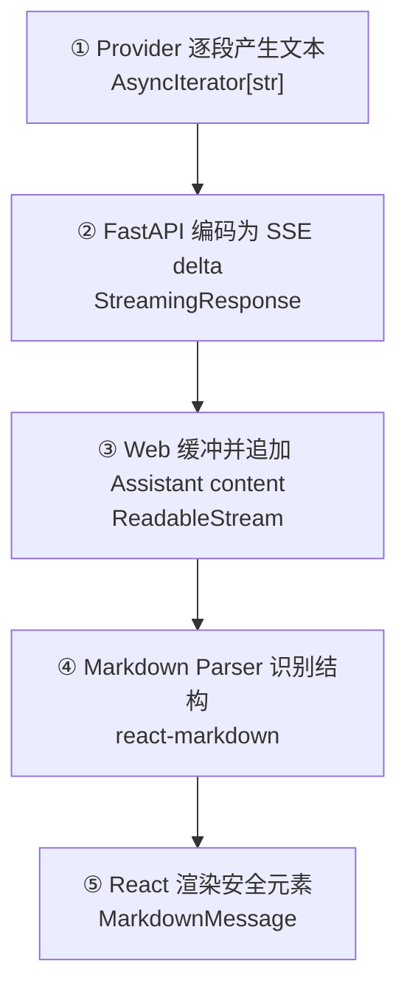

# Day 15：让流式回答支持 Markdown

## 今日目标

1. 理解 Markdown、AST（抽象语法树）和安全渲染的边界。
2. 使用 `react-markdown` 把 Assistant Message 渲染为可读的标题、列表、代码和链接。
3. 保持 SSE Delta 逐段追加，不改变 Web → Next.js → FastAPI 的请求链路。
4. 验证 Markdown 输出在流式中间状态、完成状态和移动端布局下都能正常显示。

本次只处理 Assistant Message 的 Markdown 展示，不实现原始 HTML、会话持久化、Prompt Library、Structured Output 或 Tool Calling。

## 必备理论

### 1. Markdown（轻量标记语言）

**专业解释：**

Markdown 是用纯文本符号表达标题、列表、代码和链接等结构的标记语言。模型常用 Markdown 组织回答，但浏览器不会自动把这些符号变成排版。

**大白话：**

它像给普通文字加一套简单的排版记号：`#` 表示标题，反引号表示代码，`-` 表示列表。

**举例：**

````markdown
## 请求示例

```ts
const response = await fetch("/api/chat/stream")
```
````

**在 Jack AI Studio 中的作用：**

Assistant Message 继续以纯文本从 SSE 到达，Web 只在展示层解析 Markdown，让回答更适合阅读和复制。

### 2. AST（Abstract Syntax Tree，抽象语法树）

**专业解释：**

Markdown Parser 会先把文本转换成描述结构的树，再由 React 生成对应元素。树结构比用字符串替换更能正确处理嵌套列表、代码块和段落。

**大白话：**

它像把一段文章先拆成“标题、段落、列表、代码块”的目录，再按目录排版。

**举例：**

`**Provider**` 会被识别为强调节点，最终渲染成 `<strong>Provider</strong>`。

**在 Jack AI Studio 中的作用：**

`react-markdown` 负责解析结构，`MarkdownMessage` 只负责选择符合 Chat Workspace 的视觉样式。

### 3. Safe Rendering（安全渲染）

**专业解释：**

安全渲染要求模型输出只能变成允许的 React 元素，不能把任意原始 HTML 或脚本直接插入页面。

**大白话：**

模型回答是外部输入，不能因为它看起来像网页代码，就把它当成可信的页面代码执行。

**举例：**

`<script>alert(1)</script>` 不应成为浏览器可执行脚本；当前组件不启用 `rehype-raw`，因此原始 HTML 不会被当作 DOM 注入。

**在 Jack AI Studio 中的作用：**

这是 AI Chat 的基础安全边界。后续还要在链接、文件和 Tool 输出等位置继续做输入约束。

## Python 学习

今天没有新增 Python 语法。重点是把“后端产生文本”和“前端解释文本”分层：Provider 与 SSE 只传输字符串，Markdown 解析属于 Web 展示职责。

## 项目实战



### 本次实现范围

- 新增 `MarkdownMessage` 展示组件，覆盖标题、段落、列表、引用、代码和链接。
- 增加不依赖 Provider 的本地 Markdown 演示，使用延迟分片模拟回答逐段到达。
- Assistant Message 使用 Markdown 渲染；用户消息继续使用 `whitespace-pre-wrap` 纯文本。
- 流式光标保留在 Markdown 内容之后，避免影响 Delta 追加逻辑。
- 不启用原始 HTML 解析，不改变 API 请求与 SSE Event 契约。

## 关键代码说明

- `react-markdown` 把文本解析为 React 元素，不需要 `dangerouslySetInnerHTML`。
- `components` 映射只调整视觉样式，不把 Markdown 解析职责放进 `ChatWorkspace`。
- `MarkdownMessage` 每次收到 Delta 都会随 React 状态更新重新渲染，因此兼容不完整的流式 Markdown。
- 代码块使用横向滚动，避免长代码撑破移动端页面。
- 链接使用新窗口和 `rel="noreferrer"`，降低从 Chat 页面直接离开的风险。

## 今日英文术语

1. **Markdown**：用纯文本符号表达排版结构的轻量标记语言。
2. **Parser**：把文本转换为可处理结构的解析器。
3. **AST**：描述文本结构的抽象语法树。
4. **Renderer**：把结构转换为页面元素的渲染器。
5. **Safe Rendering**：限制外部文本只能生成安全元素的渲染方式。
6. **Raw HTML**：Markdown 文本中的原始 HTML 片段。
7. **Code Block**：用于展示多行代码的 Markdown 区块。
8. **Inline Code**：嵌在段落中的单行代码片段。
9. **GFM**：GitHub Flavored Markdown，GitHub 扩展语法；本日暂不额外启用。
10. **XSS**：跨站脚本攻击，外部文本被误当作可执行页面代码的风险。

## 今日练习

1. 解释为什么 SSE 传输层不应该直接生成 HTML。
2. 说明 Markdown Parser 与 Renderer 的职责区别。
3. 解释为什么当前没有引入 `rehype-raw`。
4. 在 Chat 中观察标题、列表和代码块在流式生成过程中的变化。
5. 说明为什么代码块需要横向滚动而不是撑宽移动端页面。

## 验收标准

- [x] Assistant Message 可以在真实交互中显示标题、段落、列表、引用、行内代码和代码块。
- [x] 流式 Delta 仍逐段更新，完成前后均不会出现重复内容。
- [x] `Markdown 演示` 不调用 `/api/chat/stream`，也不需要 Model ID 或 API Key。
- [x] 未使用 `dangerouslySetInnerHTML` 或原始 HTML 注入。
- [x] 移动端静态页面 `390px` 下无横向溢出，`scrollWidth` 等于 `innerWidth`；代码块设置了独立横向滚动。
- [x] `pnpm check:foundation` 和 Git diff 检查通过。
- [x] 完成 Day 15 核心概念问答。
- [x] `PROGRESS.md` 在最终验收后更新为 Day 15 已完成。

## 遇到的问题

- `react-markdown` 集成后的 Web Lint、TypeScript、Production Build 和 API 20 个回归测试均通过。
- 移动端静态布局验收通过：`390×844` 下 `scrollWidth=390`，没有横向溢出。
- 用户完成真实浏览器验收：Markdown 标题、列表、代码块和流式增量显示正常，移动端无横向溢出。
- 概念问答通过：已理解 SSE 传输与 React 展示分层、Parser/Renderer 的职责、`rehype-raw` 的 XSS 风险、本地演示不调用 Provider，以及代码块横向滚动的原因。

## 今日总结

Day 15 已完成 Markdown 展示层实现、自动化质量检查、桌面/移动端浏览器验收和核心概念问答。

## Git Commit

```text
feat(chat): render assistant markdown for day 15
```

## 下一天预告

Day 16 将根据当前 Markdown Chat 基线确定，不提前开发。
