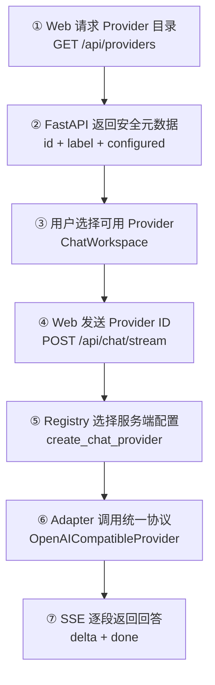
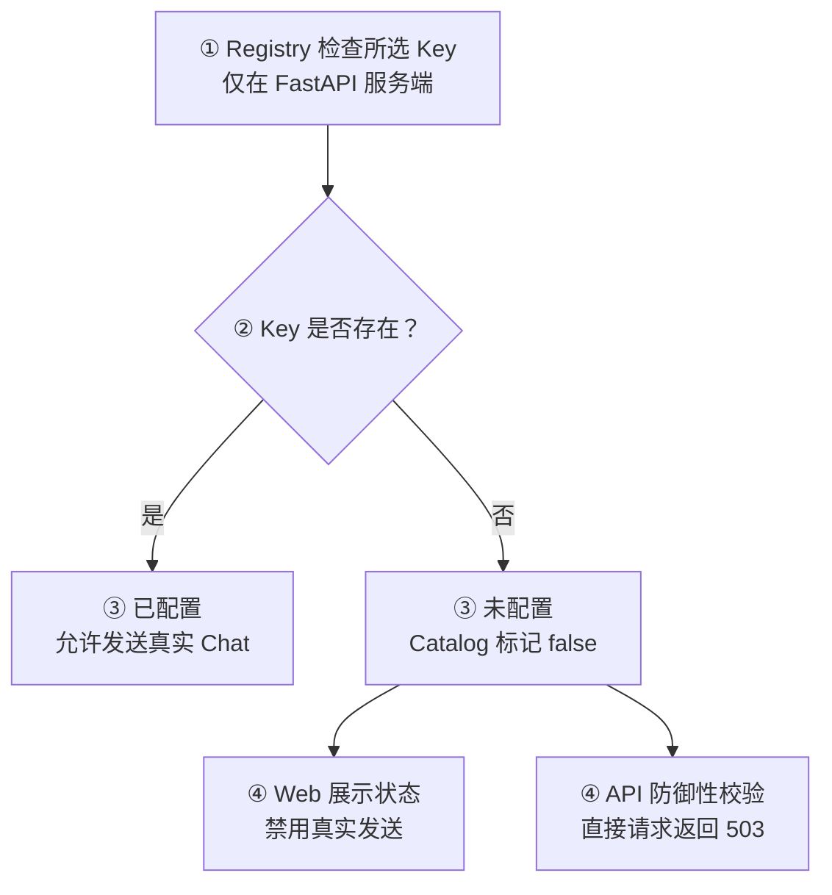

# Day 16：建立多 Provider 选择与配置目录

## 今日目标

1. 理解 Multi-provider、Provider Registry 和 Provider Catalog 的职责。
2. 让 `ChatRequest` 携带稳定的 Provider ID，并由 FastAPI 选择服务端配置。
3. 新增 `GET /providers`，只向 Web 返回安全元数据和配置状态。
4. 在 Chat Workspace 中完成 Provider Loading、Configured、Unconfigured 和 Error 状态闭环。
5. 保持现有 SSE Streaming、Markdown 和 BFF 请求链路不变。

本次只支持 `openai-compatible` 与 `openrouter` 两个配置槽位。两者复用现有 OpenAI-compatible Adapter，不调用真实模型，不实现 Provider 管理后台、数据库配置、模型列表发现、故障切换或负载均衡。

## 必备理论

### 1. Multi-provider（多模型服务提供方）

**专业解释：**

Multi-provider 表示一个 AI 应用可以通过统一业务契约连接多个模型服务提供方。业务层选择稳定的 Provider ID，适配层负责处理不同服务的连接配置与协议差异。

**大白话：**

它像企业后台同时支持多个支付渠道：页面提交的是“使用哪个渠道”，业务代码不应该到处判断每家的 URL 和密钥。

**举例：**

`ChatRequest.provider="openrouter"` 会选择 OpenRouter 的服务端环境变量，但仍调用统一的 `provider.stream(request)`。

**在 Jack AI Studio 中的作用：**

Chat 可以在不修改页面消息逻辑、SSE 解析器和 Markdown 展示层的情况下切换 Provider。Day 16 只完成选择与配置边界。

### 2. Provider Registry（Provider 注册表）

**专业解释：**

Provider Registry 是从稳定 Provider ID 到创建信息的集中映射，记录展示名称、环境变量名和默认连接地址，再创建符合统一接口的 Adapter。

**大白话：**

它类似前端路由表：路由名决定加载哪个页面；Provider ID 决定读取哪组服务端配置，但调用方只面对统一入口。

**举例：**

`openai-compatible` 读取 `AI_PROVIDER_API_KEY`，`openrouter` 读取 `AI_PROVIDER_OPENROUTER_API_KEY`。

**在 Jack AI Studio 中的作用：**

FastAPI Route 不再固定创建单个 Provider。新增 Provider 时，配置差异集中在 Registry，而不是散落到 Route、Web 和 SSE 代码中。

### 3. Provider Catalog（Provider 目录）

**专业解释：**

Provider Catalog 是提供给客户端的安全能力目录，只返回 UI 需要的标识、名称与可用状态，不返回 API Key、Base URL 等私有配置。

**大白话：**

它像后台菜单接口：告诉页面“有哪些入口、当前能不能用”，但不会把服务器密码一起发给浏览器。

**举例：**

```json
{
  "id": "openrouter",
  "label": "OpenRouter",
  "configured": false
}
```

**在 Jack AI Studio 中的作用：**

Web 使用 `GET /api/providers` 渲染下拉选项和配置状态，避免与 FastAPI 各维护一份 Provider 列表。

### 4. Stable Identifier（稳定标识）

**专业解释：**

Stable Identifier 是跨层传递且不随展示文案变化的机器可读值。它应由 API Contract 校验，不能把用户可见名称直接当作内部选择依据。

**大白话：**

它类似 Vue Router 的 `name`：页面标题可以改，但代码仍通过稳定名称找到目标。

**举例：**

Web 展示 `OpenAI-compatible`，请求中发送 `openai-compatible`。

**在 Jack AI Studio 中的作用：**

Pydantic 的 `ChatProviderId` 和 TypeScript 的 `ChatProviderId` 共同限制可选值；未知 Provider 会在 API 边界返回 `422`。

## Python 学习

### `@dataclass(frozen=True)`（不可变数据类）

```python
@dataclass(frozen=True)
class ProviderDefinition:
    id: ChatProviderId
    label: str
    api_key_env_name: str
    base_url_env_name: str
```

- `@dataclass` 自动生成初始化和展示等基础方法，适合表达只保存数据的结构。
- `frozen=True` 表示创建后不能修改字段，避免运行中意外改变 Provider 定义。
- 它可以类比 TypeScript 的 `Readonly<ProviderDefinition>`。
- 这里不使用 Pydantic，因为 Registry Definition 是项目内部静态数据，不是外部输入边界。

## 项目实战

### Provider 目录与选择主流程

一句话先看懂：**Web 先获取安全目录，再把稳定 Provider ID 放进 ChatRequest，FastAPI Registry 才在服务端选择对应密钥。**



### 配置状态流程



### 分层职责

```text
components/chat-workspace.tsx
├── 加载 Provider Catalog
├── 展示 Provider 配置状态
└── 把选中的 Provider ID 放入 ChatRequest

lib/chat-api.ts
├── 校验 Provider Catalog 响应
├── 统一请求 GET /api/providers
└── 保留现有 SSE 解析与错误处理

app/api/providers/route.ts
└── 通过服务端 BFF 转发 FastAPI Provider Catalog

providers/registry.py
├── 集中维护 Provider Definition
├── 只输出安全的 Provider Summary
└── 根据 ID 读取对应服务端环境变量

providers/openai_compatible.py
└── 继续负责统一 SDK 请求与响应转换
```

## 关键代码说明

- `ChatProviderId` 使用枚举限制 API 支持的 Provider，未知值由 Pydantic 返回 `422`。
- `PROVIDER_DEFINITIONS` 集中保存 ID、Label、环境变量名和可选默认 Base URL。
- `list_chat_providers()` 只根据 Key 是否存在计算 `configured`，不会返回 Key 或 Base URL。
- `create_chat_provider()` 选择配置后仍创建同一个 `OpenAICompatibleProvider`，没有复制 Streaming 逻辑。
- `getChatProviders()` 位于 Web 统一请求层，组件不直接散写 `fetch`。
- `ChatWorkspace` 优先选中已配置 Provider；未配置时仍可选择查看状态，但真实发送按钮保持禁用。
- API 仍执行独立的 `503` 防御性校验，不能只依赖前端禁用按钮。

## 今日英文术语

1. **Multi-provider**：一个应用支持多个模型服务提供方。
2. **Provider Registry**：Provider ID 到创建信息的集中注册表。
3. **Provider Catalog**：提供给客户端的安全 Provider 能力目录。
4. **Stable Identifier**：跨系统使用且不随展示文案变化的稳定标识。
5. **Configuration Slot**：为某个 Provider 预留的一组独立服务端配置。
6. **Capability Discovery**：客户端发现服务端支持能力及状态的过程。
7. **Adapter Reuse**：多个兼容服务复用同一个协议适配器。
8. **Fallback**：首选项不可用时切换到备用项；本日不实现自动 Fallback。
9. **Load Balancing**：在多个服务实例或 Provider 之间分配请求；本日不实现。
10. **Defense in Depth**：前端状态与后端校验同时建立安全边界。

## 今日练习

1. 为什么 Web 不能直接读取 Provider API Key 或 Base URL？
2. Provider Registry 与 OpenAI-compatible Adapter 的职责有什么区别？
3. 为什么 Catalog 返回 `configured`，API 仍要在发送时再次校验配置？
4. 为什么请求里应该发送稳定 ID，而不是直接发送展示名称？
5. 两个 Provider 都兼容 OpenAI 协议时，为什么不需要复制两套 Streaming 代码？

## 验收问答记录

### 1. 为什么 Web 不能直接读取 Provider API Key 或 Base URL？

你的回答：Key 和 URL 属于重要的私密信息，应该由后端维护，不能直接让 Web 读取。

结论：正确。API Key 必须只存在服务端；Base URL 虽然不一定本身是密码，也属于服务端连接配置，不应由浏览器决定。这样可以避免密钥泄露、绕过后端审计，也能防止客户端随意改变上游地址。

### 2. Provider Registry 与 OpenAI-compatible Adapter 的职责有什么区别？

你的回答：Provider Registry 负责供应商注册唯一，后面的职责还不清楚。

补充：Registry 是“选择表”，根据稳定 Provider ID 找到展示信息、环境变量名、默认 Base URL，并创建对应 Provider；它不负责真正调用模型。Adapter 是“协议翻译层”，把项目的 `ChatRequest` 转为第三方 SDK 请求，再把普通响应或流式 Chunk 转成项目统一的消息/文本。可以类比前端路由表与页面组件：Registry 决定去哪，Adapter 负责怎么完成调用。

### 3. 为什么 Catalog 返回 `configured` 后，API 仍要再次校验配置？

你的回答：获取到的状态到最终发送时不一定仍然有效，需要再次校验。

结论：正确。这是 Defense in Depth（纵深防御）。Catalog 是一次状态快照，Key 可能被删除、失效或环境发生变化；而且请求可以绕过 Web 直接调用 API，所以 FastAPI 必须在真实发送前重新校验。

### 4. 为什么请求中使用稳定 Provider ID，而不是展示名称？

你的回答：Provider ID 是唯一标识。

结论：正确。展示名称面向用户，可能被修改、翻译或出现同名；稳定 ID 面向程序，由 Pydantic 和 TypeScript Contract 校验，适合跨 Web、BFF、FastAPI 和 Registry 传递。

### 5. 两个 Provider 都兼容 OpenAI 协议时，为什么不需要复制两套 Streaming 代码？

你的回答：为了可复用性。

补充：正确。两个 Provider 的差异被限制在 Registry 的配置选择和 Adapter 边界内，Route、SSE Event、ReadableStream Parser、Chat Workspace 和 Markdown 展示都只依赖统一契约。如果未来出现不兼容的 Provider，只需要新增实现同一接口的 Adapter，不复制整条 Web/API 链路。

## 验收标准

- [x] `ChatRequest` 新增受约束的 `provider`，并兼容未传值的旧请求。
- [x] Provider Registry 集中管理两个 Provider 的配置映射。
- [x] `GET /providers` 只返回安全元数据和配置状态。
- [x] Web 通过统一请求层和 Next.js BFF 加载 Provider Catalog。
- [x] Chat Workspace 展示 Provider Loading、Configured、Unconfigured 和 Error 状态。
- [x] Streaming Chat 请求携带所选 Provider ID，现有 SSE 与 Markdown 链路保持不变。
- [x] Fake/环境变量测试覆盖 Provider 目录、选择、未配置和未知值。
- [x] 完整质量门禁与 Git diff 检查通过。
- [x] 桌面端和 `390×844` 移动端完成 Provider 选择、状态与无横向溢出验证。
- [x] 完成 Day 16 核心概念问答。
- [x] `PROGRESS.md` 在最终验收后更新为 Day 16 已完成。

## 遇到的问题

- Focused test 直接使用模块路径时没有把 `apps/api` 加入 Import Path；改用项目标准的 `unittest discover -t apps/api` 后正常运行。
- 移动端初次验收发现 Markdown 代码块的最小内容宽度把 Chat Workspace 从 `390px` 撑到 `483px`；在 Grid/Flex/Message 边界补充 `min-w-0` 后，代码块留在自身滚动区域，复验 `scrollWidth=innerWidth=390`。
- 浏览器已验证 Provider Catalog 的 Loading、Configured、Unconfigured 和断连 Error 状态；本地演示期间 API 日志只有 `GET /providers`，没有发出真实 Chat 请求。
- 已有 Starlette `TestClient` deprecation warning 仍不阻塞，不为消除提示引入新依赖。

## 今日总结

Day 16 开发、完整质量门禁、桌面/移动端浏览器验收和核心概念问答已完成。

## Git Commit

验收完成后建议提交：

```text
feat(provider): add multi-provider selection for day 16
```

## 下一天预告

Day 17 将在 Day 16 验收完成后，根据当前 Multi-provider Chat 基线确定，不提前开发。
