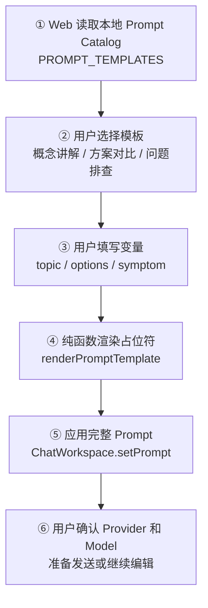
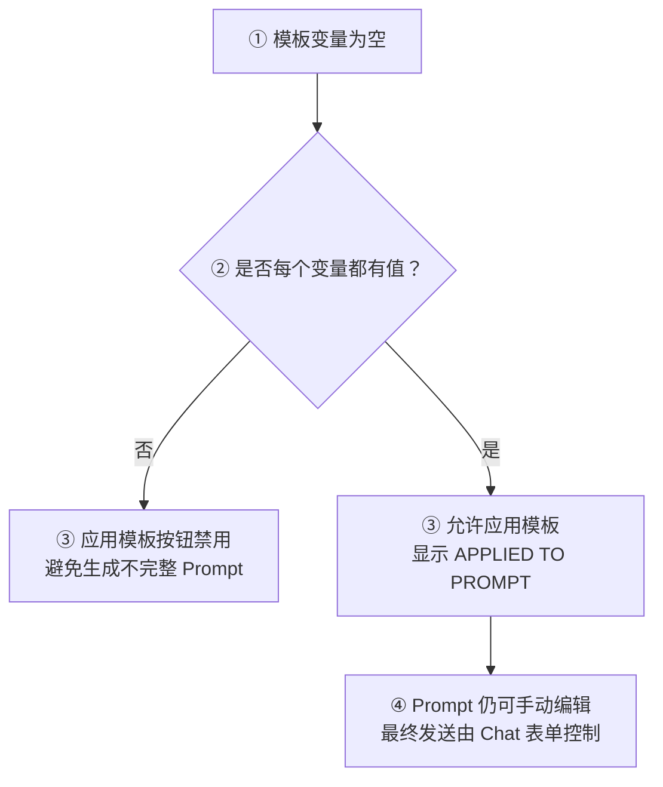

# Day 17：建立本地 Prompt Library

## 今日目标

1. 理解 Prompt Template（提示词模板）、Variable Interpolation（变量插值）和 Catalog（目录）的职责。
2. 使用类型化模板数据，避免在 Chat 组件中散落重复 Prompt 字符串。
3. 支持选择模板、填写变量，并把渲染后的 Prompt 应用到 Chat 输入框。
4. 保持现有 Provider、SSE、Markdown 和请求状态链路不变。
5. 在桌面端与 `390×844` 移动端验证模板应用、按钮状态和长 Prompt 布局。

本日是明确的前端专项日：模板先作为 Web 内存中的静态 Catalog 存在，不新增 API、不调用模型、不做数据库持久化。后续进入数据持久化 Sprint 后，再承接用户自定义模板、编辑、删除和跨设备同步。

## 必备理论

### 1. Prompt Template（提示词模板）

**专业解释：**

Prompt Template 是带有固定指令结构和可替换变量的 Prompt。模板把稳定的任务要求与每次变化的业务内容分离，渲染后才形成本次发送给模型的完整 Prompt。

**大白话：**

它像企业后台的打印单模板：标题、格式和注意事项固定，客户名称、日期等字段每次填写。

**举例：**

```text
请使用中文解释 {{topic}}，并给出一个 TypeScript 例子。
```

填写 `topic=Provider Registry` 后，才得到本次可发送的 Prompt。

**在 Jack AI Studio 中的作用：**

Day 17 用它组织概念讲解、方案对比和问题排查三个本地模板，减少用户重复输入结构化要求。

### 2. Variable Interpolation（变量插值）

**专业解释：**

Variable Interpolation 是将变量值安全地填入模板占位符的过程。模板渲染函数只替换已声明的变量，不改变其余固定指令。

**大白话：**

它像把表单字段填进文档空格，而不是把整份文档用字符串拼接重新写一遍。

**举例：**

`{{topic}}` 配上 `React State` 会变成 `React State`，模板中的编号要求和换行保持不变。

**在 Jack AI Studio 中的作用：**

`renderPromptTemplate()` 负责纯文本渲染，`PromptLibrary` 负责收集变量值；Chat Workspace 只接收最终字符串。

### 3. Prompt Catalog（提示词目录）

**专业解释：**

Prompt Catalog 是可供用户选择的模板集合及其元数据，包括模板 ID、标题、描述、正文和变量定义。它不等于数据库，也不自动代表用户已经保存了模板。

**大白话：**

它像菜单：先列出几道可选菜，再根据你填写的口味生成本次订单；当前菜单是页面内置的，还没有保存到服务器。

**举例：**

`PROMPT_TEMPLATES` 中的 `debug-problem` 记录标题、说明、`{{symptom}}` 变量和固定排查步骤。

**在 Jack AI Studio 中的作用：**

Day 17 用只读静态 Catalog 验证复用流程；持久化、权限和用户自定义管理明确留给后续 Sprint。

### 4. Instruction/Data Separation（指令与数据分离）

**专业解释：**

Instruction/Data Separation 将模板中的固定行为要求与用户填写的业务数据分开管理。它有助于保持 Prompt 结构稳定，但不等于自动防御 Prompt Injection。

**大白话：**

它像表单的“系统字段”和“用户输入”分栏：分栏能让代码更清楚，但用户输入仍然需要后续安全策略处理。

**举例：**

`要求：按概率列出根因` 属于固定指令，`移动端代码块撑宽页面` 属于变量数据。

**在 Jack AI Studio 中的作用：**

本日只做结构分离和本地应用，不宣称模板能够阻止恶意 Prompt 或替代服务端安全边界。

## Python 学习

本日没有新增 Python 语法。重点是把前端经验迁移到类型化数据设计：

- TypeScript `PromptTemplate` 类似 Python `TypedDict` 或 Pydantic 输出模型，描述模板数据结构。
- `renderPromptTemplate()` 是纯函数：输入模板和变量，输出字符串，不读取 React State，也不发网络请求。
- `PromptLibrary` 负责 State 和事件；这类似 Vue 中把纯计算逻辑抽到 composable/helper，把组件保留为交互层。

## 项目实战

### 选择与应用主流程

一句话先看懂：**用户选模板并填写变量，纯函数生成完整 Prompt，组件再把结果交给 Chat Workspace 的 Prompt State。**



### 状态与边界流程



### 分层职责

```text
lib/prompt-library.ts
├── 定义 PromptTemplate 与变量类型
├── 提供三个本地模板
└── 纯函数替换已声明占位符

components/prompt-library.tsx
├── 管理模板选择和变量 State
├── 校验变量是否填写完整
└── 通过 onApply 传出完整 Prompt

components/chat-workspace.tsx
├── 持有最终 Prompt State
├── 接收 Prompt Library 的应用结果
└── 继续负责 Provider、Model、SSE 和错误状态
```

## 关键代码说明

- `PromptTemplate` 把 `id/title/description/content/variables` 固定成类型化结构。
- 模板使用 `{{variable}}` 占位符；渲染函数只遍历模板声明过的变量，避免无关字符串替换。
- `PromptLibrary` 在变量为空时禁用“应用模板”，避免把不完整内容写入 Chat Prompt。
- 应用模板后仍允许用户直接编辑 Prompt；模板不是不可修改的最终请求。
- Prompt Library 位于 Chat 表单之外，变量输入回车不会误触真实 Chat 提交。
- 本日没有新增 `fetch`、API Route 或环境变量；Prompt 只有在用户点击流式发送后才进入既有请求链路。
- 本地静态 Catalog 不等于持久化 Library，刷新页面后模板选择和变量值都会恢复初始状态。

## 今日英文术语

1. **Prompt Template**
   - 翻译：提示词模板。
   - 当前语境解释：带有固定指令和可替换变量的文本结构，渲染后才形成一次具体请求。
2. **Variable Interpolation**
   - 翻译：变量插值。
   - 当前语境解释：`renderPromptTemplate()` 将用户填写的值放入 `{{variable}}` 占位符，并保留其余模板指令。
3. **Prompt Catalog**
   - 翻译：提示词目录。
   - 当前语境解释：`PROMPT_TEMPLATES` 提供可选择的本地模板和元数据，但不代表数据已经保存到服务器。
4. **Placeholder**
   - 翻译：占位符。
   - 当前语境解释：模板中等待变量值填入的标记，例如 `{{topic}}`。
5. **Template Metadata**
   - 翻译：模板元数据。
   - 当前语境解释：模板的 `id`、标题、描述和变量定义等辅助信息，用于列表展示和选择。
6. **Pure Function**
   - 翻译：纯函数。
   - 当前语境解释：相同模板和变量始终返回相同字符串，不读取 React State、不修改页面，也不发网络请求。
7. **Instruction/Data Separation**
   - 翻译：指令与数据分离。
   - 当前语境解释：把固定行为要求和用户填写内容分别管理，提升 Prompt 结构清晰度，但不能单独防御 Prompt Injection。
8. **Local State**
   - 翻译：本地状态。
   - 当前语境解释：只存在当前页面内存中的模板选择和变量值，刷新页面后会丢失。
9. **Persistence**
   - 翻译：持久化。
   - 当前语境解释：把数据保存到数据库或其他持久存储，使刷新页面或更换设备后仍可读取；本日不实现。
10. **Prompt Injection**
    - 翻译：提示词注入。
    - 当前语境解释：输入内容试图改变原有指令或越过约束的风险；本日的模板分层不等于完整安全防护。

## 今日练习

1. Prompt Template 和最终发送给模型的 Prompt 有什么区别？
2. 为什么变量替换函数应该独立于 React Component？
3. 为什么变量没有填写完整时要禁用“应用模板”？
4. 本地 Prompt Catalog 为什么还不能叫“持久化 Prompt Library”？
5. Instruction/Data Separation 能不能单独解决 Prompt Injection？为什么？

## 验收问答

1. **Prompt Template 和最终发送给模型的 Prompt 有什么区别？**
   - 用户回答：Prompt Template 先内置一部分固定提示词，用户选择后再补充变量，最终组成发给模型的 Prompt。
   - 评价：正确。模板是可复用的结构，最终 Prompt 是完成变量替换后、本次实际发送的完整文本。

2. **为什么变量替换函数应该独立于 React Component？**
   - 用户回答：把变量替换功能抽离成独立模块，便于后续扩展和管理。
   - 评价：正确。独立纯函数还能脱离 React State 和网络请求单独测试，并被其他入口复用。

3. **为什么变量没有填写完整时要禁用“应用模板”？**
   - 用户回答：完整 Prompt 包含模板内容和用户补充的变量，变量不完整就不能形成完整 Prompt。
   - 评价：正确。禁用可以阻止未替换占位符进入 Chat 输入框，避免用户误用不完整请求。

4. **本地 Prompt Catalog 为什么还不能叫“持久化 Prompt Library”？**
   - 用户回答：本地 Catalog 只是快速组装 Prompt，还没有真正调用大模型，也没有走到后端。
   - 评价：部分正确。关键边界是模板目前只在前端内存中，未写入数据库或其他持久存储；刷新页面后模板状态和变量值会丢失。是否调用模型不是判断“持久化”的标准。

5. **Instruction/Data Separation 能不能单独解决 Prompt Injection？**
   - 用户回答：不能，因为用户数据什么都有可能，单独防不住。
   - 评价：正确。分离只能让固定指令和输入数据的职责更清晰，还需要输入校验、权限边界、工具限制和服务端安全策略。

## 验收标准

- [x] 建立类型化 Prompt Template Catalog，包含 3 个本地模板。
- [x] 变量输入为空时，“应用模板”按钮保持禁用。
- [x] 填写变量后能渲染占位符，并把完整 Prompt 应用到 Chat 输入框。
- [x] 应用后的 Prompt 仍可手动编辑，不改变现有 Provider/SSE 请求契约。
- [x] 本日没有新增 API、真实模型调用或持久化行为。
- [x] 完整质量门禁与 Git diff 检查通过。
- [x] 桌面端和 `390×844` 移动端完成模板选择、应用与无横向溢出验证。
- [x] 完成 Day 17 核心概念问答；第 4 题已补充“持久化”的准确边界。
- [x] `PROGRESS.md` 已在最终验收后更新为 Day 17 已完成。

## 遇到的问题

- `pnpm check:foundation`、完整 Production Build、Python 28 个回归测试和 Git diff 检查已通过；仅保留已有 Starlette `TestClient` deprecation warning。
- 浏览器已验证模板初始禁用、变量填写后应用、切换模板清空变量，以及移动端 `scrollWidth=innerWidth=390`；未调用真实模型。
- 本日明确不把本地模板误称为数据库 Prompt Library，持久化边界记录在 README 和本文件中。

## 今日总结

Day 17 的 Prompt Template 数据、变量替换、Chat Prompt 应用交互、质量门禁、浏览器验收和概念问答均已完成。用户已理解模板与最终 Prompt、纯函数、完整变量、持久化边界以及 Prompt Injection 的关系。

## Git Commit

验收完成后提交：

```text
feat(chat): add local prompt library for day 17
```

## 下一天预告

Day 18 将在 Day 17 验收完成后，根据当前 Prompt Library 基线确定，不提前开发。
