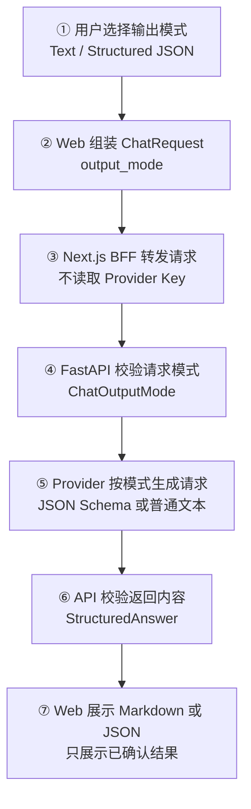
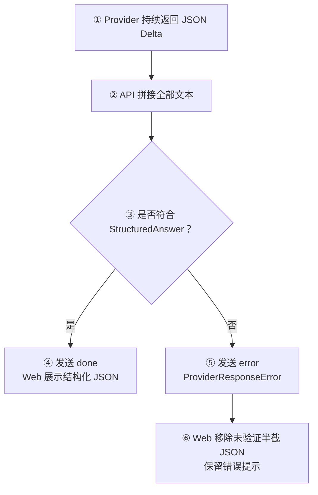

# Day 18：建立 Structured Output 输出契约

## 今日目标

1. 理解 Structured Output（结构化输出）与普通自由文本的区别。
2. 使用 Pydantic 定义 `StructuredAnswer`，把模型响应变成可校验的运行时数据。
3. 让 `ChatRequest` 支持 `text` 与 `structured_answer` 两种输出模式。
4. 让 OpenAI-compatible Provider 按输出模式发送 JSON Schema，并在非流式、流式结束后校验响应。
5. 在 Web 中选择输出模式，并对结构化回答与未通过校验的流式结果提供明确状态。

本日是 Web/API/Provider 闭环日。实现只扩展现有 Chat 契约，不新增数据库、用户、会话持久化或 Tool Calling；真实 Provider 仍不调用，所有验证使用 Fake Provider。

## 必备理论

### 1. Structured Output（结构化输出）

**专业解释：**

Structured Output 要求模型按照预先定义的数据结构返回结果，例如固定的 JSON 字段、类型和必填项。它把模型输出从“供人阅读的自由文本”变成“程序可以继续处理的数据”。

**大白话：**

普通 Chat 像让模型写一篇文章；Structured Output 像给模型一张表格，要求它把摘要、要点、例子和项目作用分别填进对应的格子。

**举例：**

```json
{
  "summary": "Provider Registry 是集中选择表。",
  "key_points": ["使用稳定 ID", "只在后端读取配置"],
  "example": "openrouter -> OpenAICompatibleProvider",
  "project_role": "让 Chat 页面不感知密钥细节。"
}
```

**在 Jack AI Studio 中的作用：**

Day 18 使用 `output_mode=structured_answer` 选择固定的 `StructuredAnswer`，为后续 Agent、Workflow 和 Tool 结果提供可靠的数据入口。

### 2. JSON Schema（JSON 数据结构约束）

**专业解释：**

JSON Schema 是描述 JSON 字段、类型、必填项和约束的机器可读规范。Provider 可以把它放进 `response_format`，向模型声明期望的返回结构。

**大白话：**

它像一份接口字段说明书，但不只是给人看的，程序也可以拿它自动检查数据。

**举例：**

`StructuredAnswer.model_json_schema()` 描述 `summary`、`key_points`、`example` 和 `project_role` 四个必填字段。

**在 Jack AI Studio 中的作用：**

`build_response_format()` 将 Pydantic Schema 放进 OpenAI-compatible 请求；当前只在后端生成，不把密钥或服务端配置暴露给 Web。

### 3. Response Validation（响应校验）

**专业解释：**

Response Validation 是收到外部服务响应后，再根据运行时 Schema 检查内容是否满足业务契约。HTTP 200 只能说明传输层成功，不能证明业务数据正确。

**大白话：**

供应商说“我填好了”，后端还要逐项验收；少字段、错类型或非法 JSON 都不能直接交给下一层。

**举例：**

```python
StructuredAnswer.model_validate_json(content)
```

缺少 `project_role` 时会抛出校验错误，Provider 适配器把它转换成统一的 `ProviderResponseError`。

**在 Jack AI Studio 中的作用：**

非流式响应在返回 `ChatMessage` 前校验；流式响应在所有 Delta 拼接完成后校验，失败时发送 SSE `error`。

### 4. Output Contract（输出契约）

**专业解释：**

Output Contract 是调用方、Provider 和业务层共同遵守的输出格式约定，包含输出模式、字段结构和失败处理方式。

**大白话：**

前端、后端和模型都按同一张交付验收单工作，不能前端以为会收到 JSON，后端却只接受一段普通文字。

**举例：**

Web 发送 `structured_answer`，FastAPI 校验模式，Provider 请求 JSON Schema，API 校验四个字段后才认为回答成功。

**在 Jack AI Studio 中的作用：**

它把 `ChatRequest`、Provider 请求参数、Pydantic 响应校验和 Web 展示状态串成同一个跨层契约。

### 5. Free-form Text（自由文本）与 Structured JSON（结构化 JSON）

**专业解释：**

Free-form Text 只要求返回可展示的非空文本；Structured JSON 还要求内容是合法 JSON，并满足指定 Schema。两者的成功条件不同。

**大白话：**

普通回答只要“说得出来”；结构化回答还要“按格式说对”。

**在 Jack AI Studio 中的作用：**

Text 模式继续使用 Markdown 展示；Structured JSON 模式以代码块展示，并且未通过校验的半截结果不会被当成成功消息保留。

## Python 学习

### Pydantic Schema 与 TypeScript 类型的分工

- TypeScript `ChatOutputMode` 约束 Web 编译时只能选择 `text` 或 `structured_answer`。
- Python `ChatOutputMode` 约束 FastAPI 运行时请求，未知值在 API 边界返回 `422`。
- `StructuredAnswer` 进一步校验 Provider 实际返回的 JSON；这不是 TypeScript interface 可以完成的工作。
- `model_json_schema()` 生成给 Provider 的机器可读格式；`model_validate_json()` 校验返回内容。

可以把它类比成前端的 `type` + Zod：前者帮助开发时不写错，后者在真实网络边界再次检查。

## 项目实战

### 输出模式主流程

一句话先看懂：**用户选择输出模式，Web 发送模式，Provider 请求对应格式，API 在展示前验证响应。**



### 流式结构校验异常流程



### 分层职责

```text
apps/api/app/schemas/chat.py
├── ChatOutputMode：限制 text / structured_answer
├── StructuredAnswer：定义四个必填输出字段
└── ChatRequest：携带 output_mode

apps/api/app/providers/openai_compatible.py
├── build_response_format：生成 JSON Schema 请求参数
├── validate_structured_answer：校验 JSON 响应
└── generate / stream：分别处理非流式和流式校验

apps/web/src/lib/chat-api.ts
└── 共享 ChatOutputMode 与 ChatRequest TypeScript 契约

apps/web/src/components/chat-workspace.tsx
├── 提供输出模式选择
├── 把 output_mode 放入请求
└── 结构化模式使用 JSON 展示，失败时清除半截结果
```

## 关键代码说明

- `ChatOutputMode` 是跨 Web、BFF、FastAPI 和 Provider 的稳定枚举值，不使用展示文案作为协议。
- `StructuredAnswer` 同时承担 Provider JSON Schema 的来源和后端最终响应校验。
- `build_response_format()` 只在结构化模式附加 `json_schema`，文本模式保持原有请求参数不变。
- 非流式 `generate()` 在返回 `ChatMessage` 前校验；流式 `stream()` 在所有有效 Delta 拼接后校验。
- 流式结构化响应即使前面已经发出 Delta，最终校验失败仍会发送 `error`；Web 不把半截 JSON 当成功数据。
- Fake Provider 测试验证请求参数和错误边界，不读取真实 API Key、不访问外部模型。

## 今日英文术语

1. **Structured Output**
   - 翻译：结构化输出。
   - 当前语境解释：要求模型按固定 JSON 字段返回结果，而不是只返回自由文本。
2. **JSON Schema**
   - 翻译：JSON 数据结构约束。
   - 当前语境解释：`StructuredAnswer.model_json_schema()` 生成并传给 Provider 的字段规范。
3. **Response Validation**
   - 翻译：响应校验。
   - 当前语境解释：API 收到模型返回后，用 `model_validate_json()` 检查字段、类型和必填项。
4. **Output Contract**
   - 翻译：输出契约。
   - 当前语境解释：Web 的 `output_mode`、Provider 的 `response_format` 和 API 的 Schema 校验共同组成的跨层约定。
5. **Free-form Text**
   - 翻译：自由文本。
   - 当前语境解释：Text 模式只要求返回非空内容，继续由 Markdown 展示。
6. **Structured JSON**
   - 翻译：结构化 JSON。
   - 当前语境解释：Structured Answer 模式下必须是满足 `StructuredAnswer` 的 JSON 文本。
7. **JSON Object**
   - 翻译：JSON 对象。
   - 当前语境解释：由花括号包裹的键值结构；仅是合法 JSON 还不够，还必须通过业务 Schema。
8. **Schema Validation**
   - 翻译：Schema 校验。
   - 当前语境解释：用 Pydantic 在服务端确认 Provider 返回了完整且符合类型的字段。
9. **Partial Response**
   - 翻译：部分响应。
   - 当前语境解释：SSE 尚未结束时已经收到的 JSON 片段，不能在最终校验前当成完整结果。
10. **Provider Response Error**
    - 翻译：Provider 响应错误。
    - 当前语境解释：Provider 返回空文本或不符合结构化 Schema 时，适配器抛出的统一异常。

## 今日练习

1. Structured Output 和在 Prompt 中写“请返回 JSON”有什么区别？
2. 为什么 TypeScript interface 不能替代 `StructuredAnswer.model_validate_json()`？
3. 为什么 HTTP 200 不能直接证明 Structured Output 成功？
4. 为什么流式结构化响应必须等所有 Delta 拼接完成后再做最终校验？
5. Text 模式和 Structured JSON 模式的展示组件为什么可以不同？

## 验收问答

### 1. Structured Output 和 Prompt 中要求返回 JSON 的区别

**我的回答：** Structured Output 是 Web、BFF、FastAPI、Provider 等层共同遵守的约束。

**验收补充：** 方向正确。完整的 Structured Output 不只是自然语言要求，而是由 Web 输出模式、FastAPI 请求类型、Provider `response_format`、JSON Schema 和服务端运行时校验共同组成的输出契约。只在 Prompt 中写“请返回 JSON”属于软约束，模型仍可能返回解释文字、缺少字段或使用错误类型。

### 2. TypeScript interface 为什么不能代替 Pydantic 校验

**我的回答：** TypeScript 只在开发和编译阶段校验，运行时已经是 JavaScript。

**验收结论：** 正确。TypeScript 类型在编译后会被擦除，无法证明真实网络响应符合类型；Pydantic 会在 Python 运行时检查 Provider 返回的数据。

### 3. HTTP 200 为什么不代表结构化响应正确

**我的回答：** `200` 只代表请求成功，最终还要判断返回的数据是否包含错误。

**验收补充：** 基本正确。`200` 只表示 HTTP 传输和请求处理成功，响应内容仍可能是非法 JSON、缺少必填字段或字段类型错误，因此还必须执行 JSON 解析和 Pydantic Schema 校验。

### 4. 流式 JSON 为什么要等所有 Delta 拼接完成

**我的回答：** 流式数据是一段一段返回的，某个阶段也可能出错。

**验收补充：** 需要明确核心原因：单个 Delta 通常只是残缺的 JSON 片段，本身不是完整对象，无法进行最终解析和 Schema 校验。API 可以持续转发片段，但只有收到全部 Delta 并完成拼接后，才能确认整个结果是否有效；失败时发送 SSE `error`，Web 清除未验证的半截 JSON。

### 5. Markdown 与 JSON 展示为什么不同

**我的回答：** JSON 既方便机器读取，也方便人查看。

**验收补充：** 方向正确但需要补全。普通文本主要面向人阅读，Markdown 适合表达标题、列表、引用和代码；Structured JSON 还要保留字段名、类型和层级，使用 JSON/代码形式能让程序继续处理，也方便开发者核对真实结构。

**最终结论：** 五题已完成。核心方向正确，经过补充后已能区分软提示与运行时契约、编译时类型与运行时校验、HTTP 成功与业务数据正确，以及部分响应与完整 JSON，Day 18 概念验收通过。

## 验收标准

- [x] `ChatRequest` 支持 `text` 与 `structured_answer`，未知模式返回 `422`。
- [x] `StructuredAnswer` 定义 `summary`、`key_points`、`example`、`project_role` 四个必填字段。
- [x] Structured 模式向 Provider 传递 JSON Schema；Text 模式不增加 `response_format`。
- [x] 非流式 Provider 响应通过 `StructuredAnswer` 校验后才能返回。
- [x] 流式 Provider 响应在结束后校验；失败时发送 SSE `error`。
- [x] Web 可以选择输出模式，结构化回答以 JSON 文本展示。
- [x] 流式结构化校验失败时，Web 清除未验证的半截 JSON 并显示错误。
- [x] Fake Provider 测试覆盖正常结构、无效结构、流式结构和请求模式。
- [x] `pnpm check:foundation` 和 `git diff --check` 通过。
- [x] 桌面端与 `390×844` 移动端完成输出模式选择和布局检查。
- [x] 完成 Day 18 五道核心概念问答。
- [x] `PROGRESS.md` 在最终验收后更新为 Day 18 已完成。

## 遇到的问题

`pnpm check:foundation` 已通过，包含 Web lint、TypeScript、Production Build、Python compile、uv lock 检查和 35 个 API 测试；仅保留已有 Starlette `TestClient` deprecation warning。

浏览器已验证默认桌面视口 `1280×720` 无横向溢出；输出模式可切换到 `Structured JSON` 并显示 `PYDANTIC SCHEMA`；Prompt Template 应用后能写入 Chat Prompt。移动端 `390×844` 下 `scrollWidth=390`，控制台无 error/warn。未调用真实模型。

概念验收中容易混淆的是：HTTP 成功不等于响应 Schema 正确，以及流式 Delta 不能逐段作为完整 JSON 校验。已在验收问答中补充正确边界。

## 今日总结

Day 18 已完成 Structured Output 的 Web/API/Provider 闭环：Web 选择输出模式，BFF 转发统一请求，FastAPI 校验输入，Provider 按 JSON Schema 请求模型，后端在非流式返回前或流式结束后执行 Pydantic 校验，Web 最终展示 Markdown 或已验证的 Structured JSON。代码、浏览器和五道概念问答均已通过验收。

## Git Commit

建议提交：

```text
feat(chat): add structured output contract for day 18
```

## 下一天预告

Day 19 将根据 Structured Output 的验收结果确定，可能继续加强结构化响应展示或进入 Tool Calling 前的工具契约准备，不提前实现。
