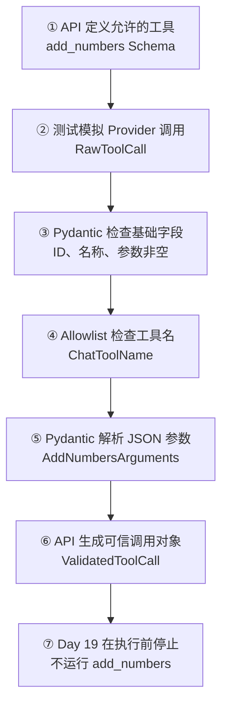
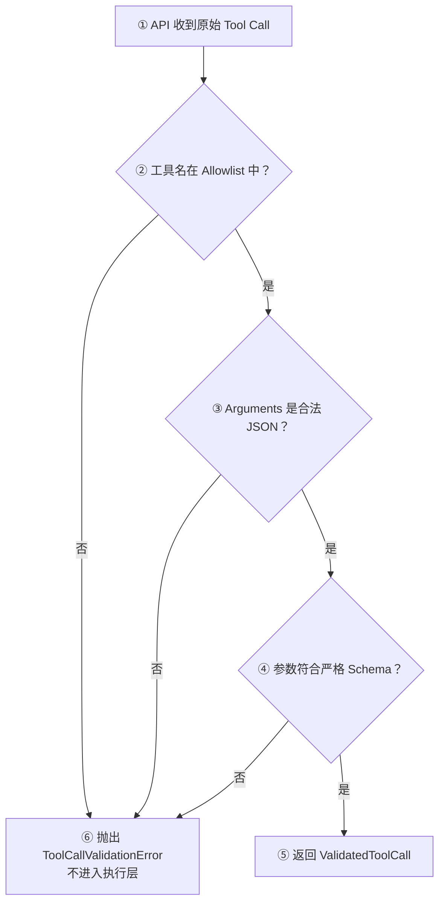

# Day 19：建立 Tool Calling 工具契约

## 今日目标

1. 理解 Tool Calling（工具调用）不是模型直接执行代码，而是模型提出结构化调用请求。
2. 使用服务端 Tool Definition（工具定义）声明稳定工具名与参数 Schema。
3. 区分 Provider 原始 `arguments` JSON 字符串与 Pydantic 校验后的参数对象。
4. 为 `add_numbers` 建立 allowlist、严格参数校验和稳定 Tool Call ID。
5. 用正常与异常测试验证工具请求在进入执行层前能够被可靠拒绝或接受。

本日是后端契约专项日，沿用 Day 11“先契约、后接入”的学习节奏。只建立 Tool Calling 数据边界，不修改现有 Chat API、Provider、SSE、Web Chat 功能或请求链路；Web 只同步首页当前 Day 标识。Day 20 在 Day 19 验收后再接 Provider Tool Call；今天不执行工具、不做第二次模型请求，也不提前实现 Agent、Tool Registry、MCP、数据库或审计日志。

## 必备理论

### 1. Tool Calling（工具调用）

**专业解释：**

Tool Calling 是模型根据应用提供的工具定义，返回工具名、调用 ID 和参数的一种结构化响应机制。模型负责提出调用请求，应用负责校验、授权、执行和返回结果。

**大白话：**

模型只是填写一张“请调用哪个工具、带什么参数”的申请单。它不会因为写了 `add_numbers` 就自动运行 Python 函数。

**举例：**

```json
{
  "id": "call_123",
  "name": "add_numbers",
  "arguments": "{\"a\":12,\"b\":30}"
}
```

**在 Jack AI Studio 中的作用：**

未来 Chat 会让模型在需要外部能力时提出 Tool Call。Day 19 先保证这张申请单只有通过服务端校验后，才有资格进入后续执行阶段。

### 2. Tool Definition（工具定义）与 Function Schema（函数结构约束）

**专业解释：**

Tool Definition 描述工具类型、稳定名称、用途和参数 JSON Schema。Function Schema 是其中约束参数字段、类型、必填项和额外字段的机器可读部分。

**大白话：**

它像后端给模型的一份接口文档：只能调用 `add_numbers`，必须传整数 `a` 和 `b`，不能临时增加 `operation` 等字段。

**举例：**

`AddNumbersArguments.model_json_schema()` 生成 `a`、`b` 两个必填整数，并通过 `additionalProperties: false` 禁止额外参数。

**在 Jack AI Studio 中的作用：**

工具定义由 API 服务端维护。Web 不能上传任意工具名或 Schema，避免客户端扩大模型可请求的能力范围。

### 3. Raw Tool Call（原始工具调用）与 Validated Tool Call（已校验工具调用）

**专业解释：**

Raw Tool Call 是来自 Provider 的不可信外部数据，其中 `arguments` 仍是 JSON 字符串；Validated Tool Call 已经过工具 allowlist、JSON 解析和 Pydantic Schema 校验。

**大白话：**

Raw 数据像刚收到的快递，外包装写了什么都不能直接相信；Validated 数据才是拆包、核对品类和数量后的验收结果。

**举例：**

`validate_tool_call()` 把 `"{\"a\":12,\"b\":30}"` 转换为 `AddNumbersArguments(a=12, b=30)`；`"12"` 这种字符串不会被偷偷转换成整数。

**在 Jack AI Studio 中的作用：**

Provider Adapter 后续只能把已校验 Tool Call 交给执行层，不能直接把模型生成的字符串当作函数参数。

### 4. Tool Call ID（工具调用标识）

**专业解释：**

Tool Call ID 是一次模型工具请求的稳定关联标识。应用执行工具并把结果交回模型时，需要用它把 Tool Result 与原始 Tool Call 对应起来。

**大白话：**

它像工单号。即使连续出现多个调用，也能知道结果属于哪一张申请单。

**举例：**

`call_123` 不能为空；未来 Tool Result 必须继续携带同一个 ID。

**在 Jack AI Studio 中的作用：**

Day 19 先保证 ID 非空。真正的结果关联与第二次模型请求留到后续 Day。

### 5. Allowlist（允许列表）与不可信输入

**专业解释：**

Allowlist 只允许预先注册的工具名通过；Tool Arguments 即使由模型生成，也属于不可信外部输入，必须执行运行时校验。

**大白话：**

模型不能说“请删除项目”，应用就去寻找并执行同名函数。只有服务端明确允许的工具才能继续。

**举例：**

`delete_project` 会被 `ChatToolName` 拒绝；`{"a":12,"b":30,"operation":"multiply"}` 会因额外字段被拒绝。

**在 Jack AI Studio 中的作用：**

这是未来文件、HTTP、数据库和高风险 Tool 的第一层权限边界，但它不能代替后续的授权、Human in the Loop 和审计。

## Python 学习

### StrEnum、ConfigDict 与 model_validate_json

- `ChatToolName(StrEnum)` 把服务端允许的工具名限制为稳定枚举值。
- `ConfigDict(extra="forbid", strict=True)` 同时拒绝额外字段和隐式类型转换。
- `AddNumbersArguments.model_json_schema()` 生成未来发送给 Provider 的参数 Schema。
- `AddNumbersArguments.model_validate_json()` 在运行时解析 Provider 返回的 JSON 字符串。
- `raise ... from error` 保留内部错误因果链，同时让上层只依赖稳定的 `ToolCallValidationError`。

可以把它类比成 TypeScript + Zod：TypeScript 类型帮助开发时写对代码，Pydantic 负责在真实 Provider 数据到达时再次验收。

## 项目实战

### Tool Call 校验主流程

一句话先看懂：**服务端定义工具，测试模拟 Provider 原始调用，只有工具名和参数都通过后才生成可信调用对象；今天到此停止，不执行工具。**



### Tool Call 异常流程



### 分层职责

```text
apps/api/app/tools/catalog.py
├── ChatToolName：服务端工具 allowlist
├── AddNumbersArguments：严格参数 Schema
├── RawToolCall：Provider 原始数据边界
├── ValidatedToolCall：应用可信数据
├── get_chat_tool_definitions：构建服务端工具定义
└── validate_tool_call：完成名称与参数校验

apps/api/tests/test_chat_tools.py
├── 正常：严格 Tool Definition、合法参数
└── 异常：空 ID、未知名称、非法 JSON、缺失/错误/额外参数
```

## 关键代码说明

- `RawToolCall.name` 暂时保留普通字符串，因为未知名称也需要先被接收，再由 allowlist 给出统一拒绝结果。
- `ValidatedToolCall.name` 使用 `ChatToolName`，表示工具名已经获得应用信任。
- `arguments` 在原始边界是 JSON 字符串，在可信边界是 `AddNumbersArguments` 对象，两者不能混用。
- Tool Definition 只能由 API 服务端构建；当前 `ChatRequest` 不接受客户端传入 `tools`。
- `validate_tool_call()` 是纯校验函数，不执行加法，也不使用 `eval`。
- 当前不修改 `ChatMessage.content`，因为 Provider 尚未接入 Tool Call，不能提前放宽现有消息契约。

## 今日英文术语

1. **Tool Calling**
   - 翻译（Translation）：工具调用。
   - 当前语境解释（Context Explanation）：模型返回一个结构化工具请求，应用校验后才决定是否执行。
2. **Tool Definition**
   - 翻译（Translation）：工具定义。
   - 当前语境解释（Context Explanation）：API 服务端声明工具名称、说明和参数 Schema 的数据。
3. **Function Schema**
   - 翻译（Translation）：函数结构约束。
   - 当前语境解释（Context Explanation）：`AddNumbersArguments` 生成的 JSON Schema，限制 `a`、`b` 两个必填整数。
4. **Tool Call**
   - 翻译（Translation）：工具调用请求。
   - 当前语境解释（Context Explanation）：Provider 返回的工具名、调用 ID 和参数集合，不代表工具已经执行。
5. **Tool Arguments**
   - 翻译（Translation）：工具参数。
   - 当前语境解释（Context Explanation）：Provider 先返回 JSON 字符串，API 再解析为 Pydantic 对象。
6. **Tool Call ID**
   - 翻译（Translation）：工具调用标识。
   - 当前语境解释（Context Explanation）：未来用于把 Tool Result 与原始 Tool Call 关联起来的稳定 ID。
7. **Allowlist**
   - 翻译（Translation）：允许列表。
   - 当前语境解释（Context Explanation）：`ChatToolName` 只允许服务端预先声明的工具名通过。
8. **Strict Validation**
   - 翻译（Translation）：严格校验。
   - 当前语境解释（Context Explanation）：拒绝字符串数字等隐式类型转换，也拒绝多余字段。
9. **Untrusted Input**
   - 翻译（Translation）：不可信输入。
   - 当前语境解释（Context Explanation）：模型生成的 Tool Call 仍属于外部数据，不能直接进入执行层。
10. **Execution Boundary**
    - 翻译（Translation）：执行边界。
    - 当前语境解释（Context Explanation）：Validated Tool Call 与真正运行函数之间的分界；Day 19 明确停在边界之前。

## 今日练习

1. 为什么 Tool Calling 不等于模型已经执行了 Python 函数？
2. 为什么 Tool Definition 应由 API 服务端维护，而不是让 Web 随请求上传任意 Schema？
3. `RawToolCall.arguments` 与 `ValidatedToolCall.arguments` 的数据形态和可信程度有什么区别？
4. Tool Call ID 在后续第二次模型请求中有什么作用？
5. 为什么 allowlist 和 Pydantic 参数校验都需要，为什么不能直接使用 `eval`？

## 验收问答

### 1. Tool Calling 为什么不等于已经执行函数

**我的回答：** Tool Calling 相当于申请单，需要真正通过校验后才会往下走。

**验收补充：** 正确。模型只生成结构化 Tool Call，应用还要依次完成校验、授权和显式执行；模型不能直接运行 Jack AI Studio 服务端的 Python 函数。

### 2. Tool Definition 为什么由 API 服务端维护

**我的回答：** Tool Definition 放在后端能够确定能力边界；如果放在 Web，前端数据不可控。

**验收补充：** 正确。服务端拥有 Definition 才能固定 allowlist、参数 Schema 和权限范围，防止客户端随请求增加危险工具。Web 只负责表达用户意图，不能决定服务端开放什么能力。

### 3. Raw 与 Validated Arguments 的区别

**我的回答：** `RawToolCall` 是没有经过校验的初始参数，`ValidatedToolCall` 是运行时经过校验的参数。

**验收补充：** 正确。还需要记住数据形态不同：Raw Arguments 是 Provider 返回的不可信 JSON 字符串；Validated Arguments 是经过 JSON 解析、allowlist 和 Pydantic 严格校验后的类型化对象。

### 4. Tool Call ID 的作用

**我的回答：** ID 需要一直带着，相当于唯一标识。

**验收补充：** 正确。未来把 Tool Result 交回模型时，要携带同一个 ID，将结果与原始 Tool Call 对应起来；多个或并行调用时尤其重要。

### 5. Allowlist、Pydantic 与 eval 的安全边界

**初次回答：** 不清楚。

**讲解后回答：** `delete_project` 由工具校验拦截；`add_numbers` 参数类型错误或包含额外字段由 Pydantic 拦截。

**验收补充：** 正确。Allowlist 判断“这个工具能不能调用”，Pydantic 判断“已允许工具的参数是否符合契约”。`eval` 会把模型生成的不可信字符串直接当作 Python 代码执行，可能造成任意代码执行；未来必须使用显式 Handler 映射调用已注册函数。

**最终结论：** 五题已完成。用户已经能够区分 Tool Call 与工具执行、服务端与 Web 的能力所有权、Raw 与 Validated 数据、调用关联 ID，以及工具 allowlist 与参数 Schema 的不同安全职责。Day 19 概念验收通过。

## 验收标准

- [x] 新增服务端 `add_numbers` Tool Definition，名称与 Schema 不由 Web 提供。
- [x] 新增 Raw Tool Call 与 Validated Tool Call 两层数据边界。
- [x] 参数 Schema 要求 `a`、`b` 为整数，并禁止隐式类型转换和额外字段。
- [x] `validate_tool_call()` 完成 allowlist、JSON 解析和 Pydantic 校验，但不执行工具。
- [x] 聚焦测试覆盖合法调用、空 ID、未知工具、非法 JSON、缺失/错误/额外参数。
- [x] `pnpm check:foundation` 和 `git diff --check` 通过，API 44 个测试全部通过。
- [x] 完成 Python 运行时正常/异常演示。
- [x] 首页桌面端与 `390×844` 移动端回归正常，Chat 页面仍准确表达 Day 18 产品能力。
- [x] 完成 Day 19 五道核心概念问答。
- [x] `PROGRESS.md` 在最终验收后更新为 Day 19 已完成。

## 遇到的问题

- 开始 Day 19 时发现 `PROGRESS.md` 仍写“创建 Day 18 本地 Commit”，但 Git 实际已处于 `bb650e7 feat(chat): add structured output contract for day 18`，本日按仓库事实修正。
- 第一次聚焦测试直接按模块名运行，未设置 `apps/api` import boundary，出现 `ModuleNotFoundError: No module named 'app'`。改用项目既有 `unittest discover -s apps/api/tests -t apps/api` 入口后，8 个测试通过；没有为错误命令修改源码。
- `pnpm check:foundation` 已通过，包含 Web lint、TypeScript、Production Build、`uv lock --check`、Python compile 和 44 个 API 测试；仅保留已有 Starlette `TestClient` deprecation warning。
- Python 运行时演示确认 `add_numbers` 合法参数可生成 `ValidatedToolCall`，`delete_project` 会被 allowlist 拒绝；演示没有执行工具。
- 浏览器确认桌面端 `1280×720` 与移动端 `390×844` 首页显示 Day 19，学习/产品视图切换正常；两个视口均无横向溢出。Chat 页面继续显示 `STRUCTURED OUTPUT · DAY 18`，没有误报 Tool Calling 已接入，控制台无 warning/error。

## 今日总结

Day 19 已完成代码、质量门禁、Python 运行时、页面回归和五道概念问答：服务端拥有 `add_numbers` 工具定义，Provider 原始 JSON 参数必须经过严格原始边界、allowlist 和 Pydantic 参数校验后，才能变成 `ValidatedToolCall`。当前没有连接 Provider 或执行函数；Web 只同步首页当前 Day 标识。用户已理解 Tool Call、执行边界和两层校验职责，本日验收完成。

## Git Commit

验收通过后建议提交：

```text
feat(tools): add tool calling contract for day 19
```

## 下一天预告

Day 20 将在 Day 19 验收完成后，让 OpenAI-compatible Provider 发送服务端 Tool Definition，并校验模型返回的 Tool Call；仍会根据验收结果确定最小范围，不提前实现工具执行循环。
