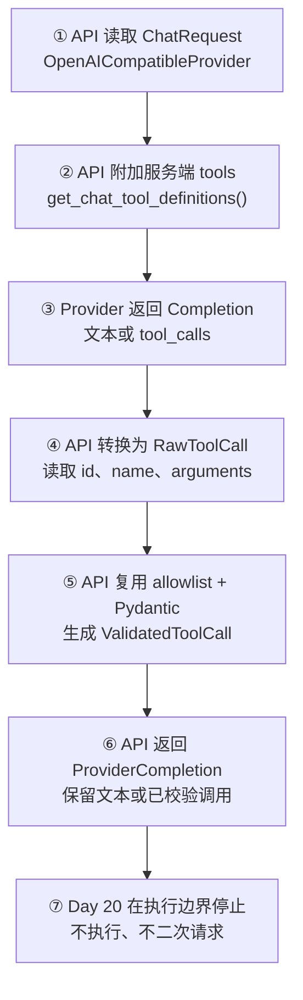
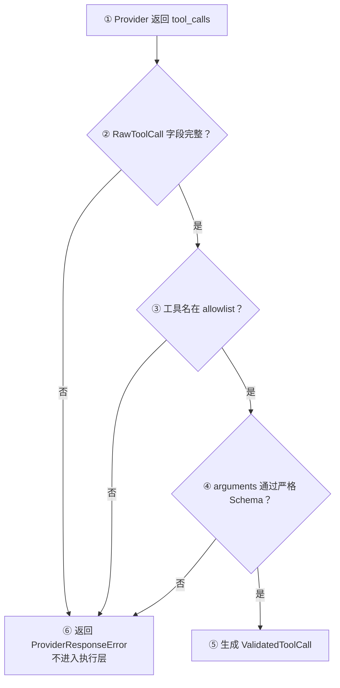

# Day 20：把 Tool Definition 接入 Provider

## 今日目标

1. 理解 Provider 请求中的 `tools` 与模型返回的 `tool_calls` 是一条请求链路的两端。
2. 让 OpenAI-compatible Provider 自动发送服务端维护的 Tool Definition。
3. 复用 Day 19 的 allowlist 和严格参数 Schema，把 Provider Tool Call 转换为 `ValidatedToolCall`。
4. 保留现有 `/chat` 文本响应契约：工具请求只被识别和校验，不执行、不发起第二次模型请求。
5. 用 Fake Provider 测试验证正常文本、合法 Tool Call 和非法 Tool Call 三条边界。

本日是 Provider/API 专项日。现有 Web Chat 依赖文本 SSE 契约，本日不改变 Web 输入、`ChatMessage`、SSE 事件或页面交互；这是为了先完成 Provider 边界，再根据验收结果决定后续 Chat 如何展示工具请求。下一阶段再讨论执行循环、Tool Result 和 Agent，不提前实现。

## 必备理论

### 1. Tool Definition（工具定义）与 `tools` 请求参数

**专业解释：**

Tool Definition 是应用发送给模型的能力声明，包含工具类型、稳定名称、用途和参数 JSON Schema。OpenAI-compatible API 使用 `tools` 数组接收这些定义，模型只能在这个能力范围内提出工具请求。

**大白话：**

它像后端给模型的一份“可用接口目录”。目录由服务端发出，模型可以选择其中一个接口，但不能临时创造一个服务端没有注册的接口。

**举例：**

```json
{
  "type": "function",
  "function": {
    "name": "add_numbers",
    "parameters": {"type": "object", "required": ["a", "b"]}
  }
}
```

**在 Jack AI Studio 中的作用：**

`OpenAICompatibleProvider._build_completion_request()` 在非流式请求中附加 `get_chat_tool_definitions()` 的结果。Web 不上传工具定义，服务端继续拥有能力边界。

### 2. Tool Call（工具调用请求）与 Completion Response（完成响应）

**专业解释：**

模型完成一次 Chat Completion 后，响应可能包含普通文本，也可能包含一个或多个 `tool_calls`。Tool Call 包含调用 ID、函数名和序列化参数；它是模型的结构化意图，不是函数执行结果。

**大白话：**

模型回复的不一定是“答案”，也可能是“请按这张工单调用 `add_numbers`，参数是 12 和 30”。工单送到 API 后，还要验收和授权。

**举例：**

```text
message.content = null
message.tool_calls[0].function.arguments = "{\"a\":12,\"b\":30}"
```

**在 Jack AI Studio 中的作用：**

`ProviderCompletion` 暂时把文本和已校验工具请求放在一个内部结果中。现有 `generate()` 遇到工具请求会抛出 `ProviderToolCallRequested`，防止工具请求被误当成普通 Assistant 文本。

### 3. Provider Adapter（服务适配器）与 Execution Boundary（执行边界）

**专业解释：**

Provider Adapter 负责把项目请求转换成供应商协议，并把供应商响应转换成项目内部契约。Execution Boundary 是“已校验调用”与“真正运行工具”之间的边界；跨过它必须有显式 Handler、权限判断和错误处理。

**大白话：**

Provider Adapter 像 Axios response interceptor：负责把外部格式整理好，但不会因为响应里写了一个函数名就自动执行代码。

**举例：**

```text
Provider tool_calls -> RawToolCall -> ValidatedToolCall -> （本日停止）
```

**在 Jack AI Studio 中的作用：**

Day 20 只完成 Provider 到 `ValidatedToolCall` 的转换。`add_numbers` 的实际执行、Tool Result、第二次模型请求和 Agent Loop 都不在本日范围内。

### 4. ProviderCompletion（Provider 内部响应）

**专业解释：**

`ProviderCompletion` 是适配器内部使用的结果类型，允许 `content` 为空而 `tool_calls` 非空，也允许普通文本结果。它不直接替代对外 HTTP 的 `ChatMessage`，避免当前 Web 契约被提前放宽。

**大白话：**

它像一个分拣箱：文本回答放在 `content`，工具申请放在 `tool_calls`。现在网页只收文本箱，工具申请先留在后端等待后续 Day 设计。

**在 Jack AI Studio 中的作用：**

`generate_completion()` 供 Provider 层和测试使用；`generate()` 继续服务现有 `/chat`，遇到 Tool Call 明确失败，而不是伪造一段文本。

## Python 学习

- `@dataclass(frozen=True)` 用来表达 Provider 层不可变的内部结果，类似 TypeScript 的只读数据结构。
- `getattr()` 读取 OpenAI SDK 对象的可选 `tool_calls` 字段，兼容普通文本响应中没有工具调用的情况。
- `tuple[ValidatedToolCall, ...]` 表示解析结果只读，避免执行层偷偷修改 Provider 结果。
- `raise ... from error` 保留原始 Pydantic 错误原因，但向上层暴露稳定的 `ProviderResponseError`。

## 项目实战

### Tool Call 接入主流程

一句话先看懂：**服务端把工具目录发给 Provider，Provider 返回工单，API 复用 Day 19 校验；校验成功后本日停在执行边界前。**



### Tool Call 异常流程



### 分层职责

```text
apps/api/app/tools/catalog.py
├── get_chat_tool_definitions：构建服务端 tools
└── validate_tool_call：复用 Day 19 的 allowlist 与参数 Schema

apps/api/app/providers/openai_compatible.py
├── _build_completion_request：按需附加 tools
├── _parse_tool_calls：读取 Provider tool_calls 并转换为 RawToolCall
├── generate_completion：返回 ProviderCompletion
└── generate：保持现有 ChatMessage 文本边界，拒绝未执行 Tool Call

apps/api/tests/test_openai_compatible_provider.py
├── 正常：文本请求携带服务端 tools
├── 正常：合法 tool_calls 变成 ValidatedToolCall
└── 异常：非法参数被 Provider 边界拒绝
```

## 关键代码说明

- `get_chat_tool_definitions()` 只在 API Provider 侧调用，Web 不能扩大工具列表。
- `generate_completion()` 是 Provider 内部能力，不是新的 HTTP Endpoint，因此没有提前改变 `/chat` 和 Web 的响应类型。
- `RawToolCall` 仍是 Provider 不可信数据；`ValidatedToolCall` 才允许后续执行层消费。
- `generate()` 遇到合法 Tool Call 会抛出 `ProviderToolCallRequested`，这个异常携带已校验调用，但没有执行逻辑。
- 当前 `stream()` 保持文本 SSE 请求，不附加工具解析；流式 Tool Call 的分片组装留到后续明确设计后再实现。
- 没有使用 `eval`、动态导入或按模型生成的函数名反射执行。

## 今日英文术语

1. **Tool Definition**
   - 翻译（Translation）：工具定义。
   - 当前语境解释（Context Explanation）：API 服务端发送给 Provider 的工具名称、描述和参数 Schema。
2. **Tool Call**
   - 翻译（Translation）：工具调用请求。
   - 当前语境解释（Context Explanation）：Provider 返回的结构化工单，不代表 Python 工具已经运行。
3. **Tool Calls**
   - 翻译（Translation）：工具调用集合。
   - 当前语境解释（Context Explanation）：一次 Completion 中可能包含的一个或多个调用请求。
4. **Completion Response**
   - 翻译（Translation）：完成响应。
   - 当前语境解释（Context Explanation）：Provider 返回的消息对象，可能包含文本，也可能包含 `tool_calls`。
5. **Provider Adapter**
   - 翻译（Translation）：服务适配器。
   - 当前语境解释（Context Explanation）：把项目 Chat 契约转换为 OpenAI-compatible 请求，并规范化外部响应的后端模块。
6. **ProviderCompletion**
   - 翻译（Translation）：Provider 内部响应。
   - 当前语境解释（Context Explanation）：API 内部同时承载文本和已校验 Tool Call 的不可变结果类型。
7. **Execution Boundary**
   - 翻译（Translation）：执行边界。
   - 当前语境解释（Context Explanation）：`ValidatedToolCall` 与实际 Handler 之间的安全分界，本日停在这里。
8. **Tool Result**
   - 翻译（Translation）：工具结果。
   - 当前语境解释（Context Explanation）：工具真正执行后准备交回模型的结果，本日尚未实现。

## 今日练习

1. 为什么 `tools` 应由 Provider Adapter 自动附加，而不是让 Web 把工具列表放进 `ChatRequest`？
2. 为什么 Provider 返回 `content = null`、`tool_calls` 非空时，不能直接构造现有 `ChatMessage`？
3. `ProviderCompletion` 与对外 `ChatMessage` 的职责边界有什么不同？
4. `generate()` 为什么要抛出 `ProviderToolCallRequested`，而不是执行 `add_numbers`？
5. 如果 Provider 返回未知工具名或 `{"a":"12","b":30}`，哪一层负责拒绝，为什么？

## 验收问答

### 1. 为什么 `tools` 由 Provider Adapter 自动附加

**我的回答：** Web 端上传的内容只通过了 Web 自己的类型定义，而且也不一定可靠。

**验收补充：** 正确。TypeScript 类型主要约束开发阶段，不能阻止用户通过 DevTools、脚本或直接 HTTP 请求发送任意 JSON。工具能力必须由服务端维护，并在 Provider 返回时再次进行运行时校验。

### 2. 为什么 Tool Call 不能直接构造 `ChatMessage`

**我的回答：** 有可能不是一个结果，而是可以继续往下执行的请求，所以不应该直接构造 `ChatMessage`。

**验收补充：** 正确。Provider 响应可能是文本，也可能包含一个或多个 Tool Call；Tool Call 还需要校验、授权、执行，并可能产生 Tool Result 和第二次模型请求。现有 `ChatMessage` 要求可展示的 `content`，无法表达 `content = null` 的工具请求。

### 3. `ProviderCompletion` 与 `ChatMessage` 的职责

**我的回答：** `ProviderCompletion` 是适配器的结果，`ChatMessage` 是 HTTP 的结果。

**验收补充：** 正确。`ProviderCompletion` 是 API 内部承接 Provider 文本或已校验 Tool Call 的结果；`ChatMessage` 是当前 HTTP/Web 文本链路对外暴露的 Assistant Message。两者不能因为字段相似就混用。

### 4. `ProviderToolCallRequested` 的作用

**我的回答：** `ProviderToolCallRequested` 也相当于一个验证。

**验收补充：** 需要区分。真正的验证发生在 `_parse_tool_calls()`：它先构造 `RawToolCall`，再由 `validate_tool_call()` 执行 allowlist 和严格 Pydantic 参数校验。`ProviderToolCallRequested` 不是验证器，而是“验证已经通过、当前请求需要转交后续工具流程”的控制流信号；它携带已校验调用，同时阻止 `generate()` 把工具请求伪装成文本。

### 5. 未知工具名和错误参数分别由哪一层拒绝

**我的回答：** Tool Call 这一块不太清楚。

**验收补充：** `Tool Call` 是模型提出的请求，不是负责拒绝的层。未知工具名由 `ChatToolName` allowlist 在 `validate_tool_call()` 中拒绝；`{"a":"12","b":30}` 由 `AddNumbersArguments` 的 Pydantic 运行时校验拒绝，因为 `strict=True` 不允许把字符串数字隐式转换成整数。两层分别回答“能不能调用这个工具”和“这个工具的参数是否符合契约”。

**最终结论：** 五道题已完成。用户能够区分 Web 类型与服务端运行时校验、Tool Call 与 ChatMessage、Provider 内部结果与 HTTP 结果、验证逻辑与控制流信号，以及 allowlist 与 Pydantic 参数校验的不同职责。Day 20 学习验收通过。

## 验收标准

- [x] 非流式 OpenAI-compatible 请求携带服务端 `add_numbers` Tool Definition。
- [x] Provider 能把合法 `tool_calls` 转换为 `ValidatedToolCall`。
- [x] Provider 能拒绝缺失字段、未知工具和严格参数类型错误。
- [x] `generate()` 不执行工具、不发起第二次模型请求，并保留现有文本 `ChatMessage` 契约。
- [x] 现有文本生成、Structured Output、文本 SSE 和 HTTP Chat 测试未回归。
- [x] API 聚焦测试通过，完成 Python 编译检查和 `git diff --check`。
- [x] `pnpm check:foundation` 通过。
- [x] 完成五道核心概念问答。
- [x] 更新 `PROGRESS.md` 为 Day 20 已完成，并记录实际验证证据。

## 遇到的问题

- Provider 的普通文本响应没有 `tool_calls`，工具解析必须使用可选字段读取，不能假设每次响应都有工具调用；Fake Provider 已覆盖这一兼容路径。
- OpenAI-compatible Provider 可以返回工具请求，但现有 Web 文本协议还不能展示它；本日用 `ProviderCompletion` 保留内部信息，用 `ProviderToolCallRequested` 阻止误展示。
- 当前没有真实 API Key，所有 Provider 行为使用 Fake Client 验证，没有调用真实模型服务；运行时演示确认请求包含 `tools`、参数被校验为整数且没有执行。

## 今日总结

Day 20 已把服务端 Tool Definition 接入 Provider，并完成 Provider `tool_calls` 到 `ValidatedToolCall` 的安全转换。当前代码知道“模型请求了哪个工具、参数是否合规”，但还不会执行工具，也不会把 Tool Result 发回模型；这条执行边界被刻意保留给后续 Day。代码、基础质量门禁和五道概念问答均已完成，Web 未改动且构建回归通过。

## Git Commit

建议 Commit：

```text
feat(provider): connect tool calling for day 20
```

本轮未执行 Git Commit；验收已完成，是否提交仍按用户指示执行。

## 下一天预告

Day 21 将根据本日验收结果继续设计 Tool Call 的应用层承接方式，重点确认工具请求、Tool Result 和现有 Chat 响应之间的契约；不提前实现 Agent、MCP 或持久化。
