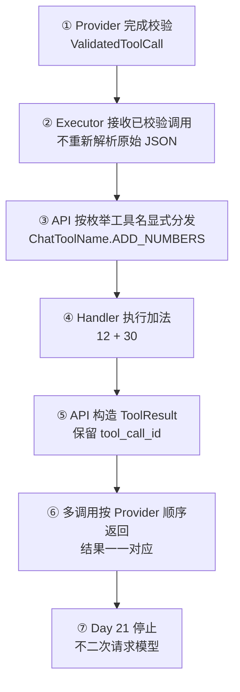
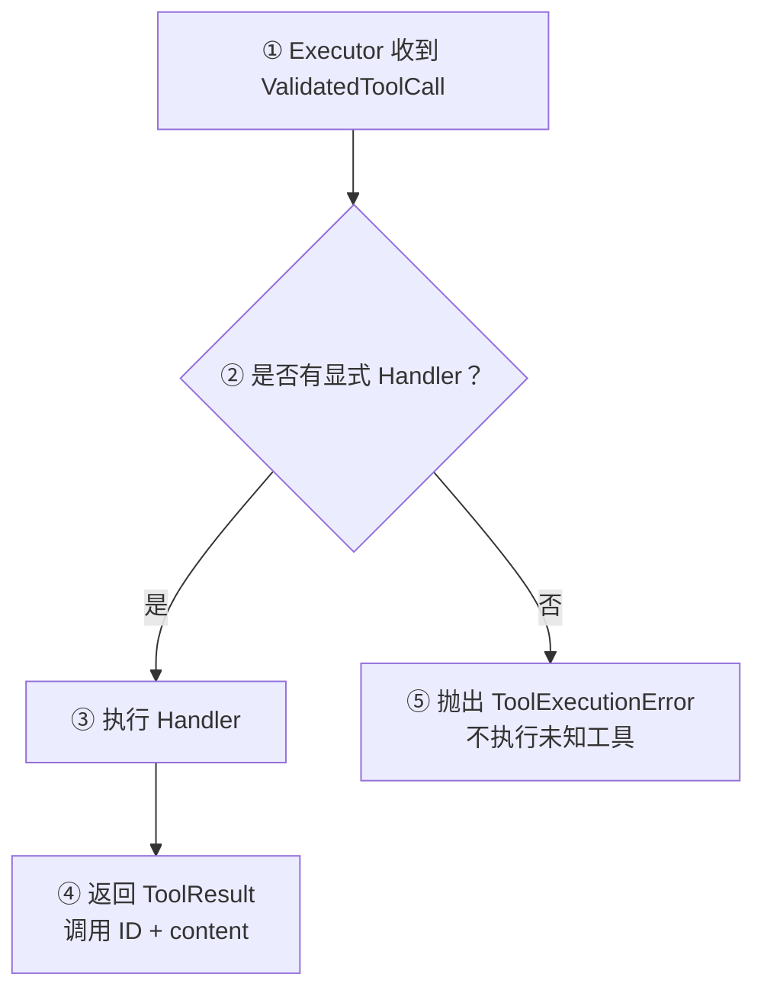

# Day 21：建立 Tool Executor 与 Tool Result 契约

## 今日目标

1. 理解 Tool Executor（工具执行器）只负责执行已校验调用，不负责决定模型是否应该调用工具。
2. 使用显式 Handler（处理函数）执行服务端允许的 `add_numbers`，不使用 `eval` 或动态反射。
3. 建立带有 `tool_call_id` 的 `ToolResult`，让结果可以和原始 Tool Call 稳定关联。
4. 支持多个已校验 Tool Call 按 Provider 返回顺序执行。
5. 明确执行器与 Orchestrator（编排器）的边界：本日不发起第二次模型请求，不实现 Agent Loop、MCP、数据库或审计日志。

本日是 API 工具执行专项日。Day 20 已完成 Provider `tool_calls` 到 `ValidatedToolCall` 的转换，本日只跨过一次明确的执行边界，验证工具执行和结果契约；现有 `/chat`、SSE 和 Web 页面不改动，因为它们还没有 Tool Result 的对外展示协议。

## 必备理论

### 1. Tool Executor（工具执行器）

**专业解释：**

Tool Executor 接收已经通过服务端 allowlist 和参数 Schema 校验的 `ValidatedToolCall`，找到对应的显式 Handler 并执行，最后返回内部 `ToolResult`。它不解析 Provider 原始 JSON，也不决定是否需要调用工具。

**大白话：**

它像仓库里的出库岗位：前面的审批单已经核对完成，执行器只按照明确的货号和数量出库，不重新相信外部手写内容，也不自己决定要不要审批。

**举例：**

```text
ValidatedToolCall(add_numbers, a=12, b=30)
    -> add_numbers Handler
    -> ToolResult(content="42")
```

**在 Jack AI Studio 中的作用：**

`apps/api/app/tools/executor.py` 是当前最小执行边界。它只认识服务端定义的 `add_numbers`，不接收 Web 上传的函数名或原始参数字符串。

### 2. Handler（处理函数）与显式 Dispatch（分发）

**专业解释：**

Handler 是一个工具对应的受控函数。Dispatch 根据已校验的枚举工具名选择 Handler。显式分发把“允许的工具名”和“实际执行函数”绑定在服务端代码中，避免把模型文本当作 Python 代码或任意属性名执行。

**大白话：**

它像前端明确写出的 `switch` 分支：`add_numbers` 只能进入加法分支，模型不能通过字符串拼出 `delete_project()`。

**举例：**

```python
if tool_call.name is ChatToolName.ADD_NUMBERS:
    return _execute_add_numbers(tool_call.arguments)
```

**在 Jack AI Studio 中的作用：**

当前只有 `_execute_add_numbers()` 一个 Handler。未来新增工具时，必须先增加服务端定义、参数模型、权限边界和显式 Handler，不能让模型直接决定 Python 调用目标。

### 3. Tool Result（工具结果）

**专业解释：**

Tool Result 是一次工具执行后的内部结果，至少需要保留原始 `tool_call_id` 和可传输的结果内容。它不是最终 Assistant Message，也不等于已经完成第二次模型请求。

**大白话：**

Tool Call 是工单，Tool Result 是工单处理回执。回执必须带原工单号，否则多个工具一起执行时无法知道哪条结果属于哪次请求。

**举例：**

```json
{
  "tool_call_id": "call_123",
  "name": "add_numbers",
  "content": "42"
}
```

**在 Jack AI Studio 中的作用：**

`ToolResult` 目前是 API 内部 Pydantic 模型。Day 21 只验证生成结果，暂不把它拼成 Provider 的 `role=tool` 消息，也不回传给模型。

### 4. Execution（执行）与 Orchestration（编排）

**专业解释：**

Execution 是对一个已决定的 Tool Call 执行 Handler；Orchestration 负责在模型文本、Tool Call、工具执行、Tool Result 和下一次模型请求之间循环。两者职责不同，不能把一个 `execute_tool_call()` 函数误称为完整 Agent。

**大白话：**

执行器像“把这张单做完”，编排器像“根据结果决定下一步是否继续问模型”。本日只做前者。

**举例：**

```text
Tool Call -> Executor -> Tool Result
                 本日停止
```

**在 Jack AI Studio 中的作用：**

Day 21 让工具真正执行一次，但不修改 Chat Route，不发起第二次 Provider 请求，也不实现 Agent State 或 ReAct 循环。

## Python 学习

- `Sequence[ValidatedToolCall]` 表示执行器可以接收列表或元组，并保持输入顺序。
- Pydantic `ToolResult` 负责运行时校验工具结果的调用 ID、工具名和内容。
- 显式 `if` 分发比 `eval`、`getattr(module, name)` 或动态导入更容易审计和限制权限。
- 将纯函数 `_execute_add_numbers()` 与边界函数 `execute_tool_call()` 分开，便于单测和后续替换真实工具。

## 项目实战

### Tool Executor 主流程

一句话先看懂：**Provider 先完成校验，Executor 再执行明确 Handler，结果带着原始调用 ID 返回；本日不继续请求模型。**



### 执行异常流程



### 分层职责

```text
apps/api/app/tools/catalog.py
├── ValidatedToolCall：已通过 Provider 边界的可信调用
└── ChatToolName：服务端工具 allowlist

apps/api/app/tools/executor.py
├── ToolResult：工具执行结果内部契约
├── _execute_add_numbers：受控纯函数 Handler
├── execute_tool_call：单个调用的显式分发与执行
└── execute_tool_calls：按输入顺序执行多个调用

apps/api/tests/test_tool_executor.py
├── 正常：计算结果为 "42" 并保留调用 ID
├── 正常：多个调用顺序与 ID 对应关系不变
└── 异常：没有注册 Handler 的工具被拒绝
```

## 关键代码说明

- Executor 的输入类型是 `ValidatedToolCall`，不接受 `RawToolCall`，避免执行器绕过 Day 19/20 校验。
- `ToolResult.tool_call_id` 必须继续使用原始 ID，这是未来构造 Provider `role=tool` 消息的关联依据。
- `content` 使用字符串，因为 OpenAI-compatible Tool Result 最终通常以可传输文本回到消息协议；当前还没有回传动作。
- `execute_tool_calls()` 只做顺序执行，不是并发 Agent 调度器，也不负责重试、超时或恢复。
- `ToolExecutionError` 只处理没有 Handler 的防御分支；高风险工具未来还需要权限、确认和审计。

## 今日英文术语

1. **Tool Executor**
   - 翻译（Translation）：工具执行器。
   - 当前语境解释（Context Explanation）：接收已校验 Tool Call 并调用服务端 Handler 的 API 模块。
2. **Handler**
   - 翻译（Translation）：处理函数。
   - 当前语境解释（Context Explanation）：`add_numbers` 对应的受控 Python 函数，不由模型动态生成。
3. **Dispatch**
   - 翻译（Translation）：分发。
   - 当前语境解释（Context Explanation）：根据 `ChatToolName` 选择允许的 Handler 分支。
4. **Tool Result**
   - 翻译（Translation）：工具结果。
   - 当前语境解释（Context Explanation）：携带 `tool_call_id` 和结果内容的内部执行回执。
5. **Execution**
   - 翻译（Translation）：执行。
   - 当前语境解释（Context Explanation）：运行一次已确定的工具 Handler，不包含下一次模型请求。
6. **Orchestration**
   - 翻译（Translation）：编排。
   - 当前语境解释（Context Explanation）：协调模型、工具和下一步请求的完整流程，本日尚未实现。
7. **Correlation ID**
   - 翻译（Translation）：关联标识。
   - 当前语境解释（Context Explanation）：`tool_call_id` 用来把 Tool Result 对应回原始 Tool Call。
8. **Explicit Allowlist**
   - 翻译（Translation）：显式允许列表。
   - 当前语境解释（Context Explanation）：只有源码中明确声明的工具名才有 Handler 和执行资格。

## 今日练习

1. 为什么 Executor 的输入必须是 `ValidatedToolCall`，不能直接接收 Provider 的 `RawToolCall`？
2. 为什么 `add_numbers` 使用显式 Handler 比 `eval(arguments)` 更安全？
3. `ToolResult.tool_call_id` 在多个工具调用时解决什么问题？
4. `execute_tool_calls()` 为什么保留 Provider 返回顺序？什么时候才需要讨论并发执行？
5. 为什么“能执行一次工具”仍然不等于已经实现 Agent 或 Orchestration？

## 验收问答

### 1. 为什么 Executor 不能接收 `RawToolCall`

**我的回答：** 不能绕过校验。

**验收补充：** 正确。`RawToolCall` 仍包含 Provider 返回的不可信工具名和 JSON 字符串；Executor 只接受经过基础字段、allowlist 和 Pydantic 参数 Schema 校验的 `ValidatedToolCall`，才能确保执行边界前没有跳过校验。

### 2. 为什么显式 Handler 比 `eval` 安全

**我的回答：** 方法是固定的，可以防止篡改。

**验收补充：** 正确。显式 Handler 把允许的工具名、参数模型和 Python 函数固定在服务端源码中。`eval` 会把模型生成的不可信字符串当作 Python 代码执行，攻击者可能注入任意表达式；显式分发只允许进入已经注册的 `add_numbers` 分支。

### 3. `tool_call_id` 解决什么问题

**我的回答：** 保证唯一性，让请求和响应一一对应。

**验收补充：** 正确。更准确地说，它是关联标识：多个 Tool Call 同时存在时，每个 Tool Result 继续携带原始 ID，后续 Provider 才能确定哪条执行结果属于哪次调用请求。

### 4. 为什么保持 Provider 返回顺序

**我的回答：** 调用之间可能有依赖顺序。

**验收补充：** 方向正确。保持顺序首先让执行结果可预测，并使结果列表与 Provider 的调用列表稳定对应。若两个调用真正存在数据依赖，通常不能把它们当作同一批独立调用并发执行，而应先执行前一个、把结果交回模型，再由模型生成下一步调用；Day 21 还没有这种编排能力。只有调用明确独立、Handler 支持并发且资源和错误策略已定义时，才适合讨论并发执行。

### 5. 为什么一次工具执行不等于 Agent

**我的回答：** 最终没有调用到 LLM。

**验收补充：** 正确但需要补全。当前流程只完成 `Tool Call -> Handler -> Tool Result`。Agent 或 Orchestration 还需要把 Tool Result 转换成 Provider 消息、再次调用 LLM、保存循环状态、根据模型结果决定继续或结束，并处理最大步数、失败和终止条件；因此一次函数执行不是完整 Agent。

**最终结论：** 五道题已完成。用户能够区分 Raw/Validated 执行边界、显式 Handler 与 `eval`、调用 ID 的关联职责、顺序执行与依赖调用，以及单次 Execution 与 Agent Orchestration 的范围。Day 21 学习验收通过。

## 验收标准

- [x] 新增显式 `Tool Executor`，输入只接受 `ValidatedToolCall`。
- [x] `add_numbers` Handler 返回字符串结果 `"42"`。
- [x] `ToolResult` 保留原始 `tool_call_id` 和工具名。
- [x] 多个调用按 Provider 顺序执行并保持结果对应关系。
- [x] 未注册 Handler 的工具被 `ToolExecutionError` 拒绝。
- [x] 不修改 HTTP、SSE、Web、Provider 第二次请求或 Agent Loop。
- [x] API 测试、Python 编译和 `git diff --check` 通过。
- [x] `pnpm check:foundation` 通过。
- [x] 完成五道核心概念问答。
- [x] 更新 `PROGRESS.md` 为 Day 21 已完成。

## 遇到的问题

- `ValidatedToolCall` 已经是 Pydantic 校验后的数据，Executor 不再重复解析 JSON；未知 Handler 仍保留防御性异常分支。
- 真实 Provider 和 Web 尚未拥有 Tool Result 的展示/回传协议，因此本日只做 API 内部执行结果。
- 当前没有真实 API Key，测试和运行时演示均不访问外部模型服务。

## 今日总结

Day 21 已建立最小 Tool Executor：服务端接收已校验的 `add_numbers` 调用，通过显式 Handler 得到带调用 ID 的 `ToolResult`，并能按顺序处理多个调用。代码、质量门禁、运行时演示和五道概念问答均已完成。当前仍没有第二次模型请求、Tool Result 回传、Agent 状态、权限确认或持久化，这些能力不在本日范围内。

## Git Commit

建议 Commit：

```text
feat(tools): add explicit executor for day 21
```

本轮未执行 Git Commit；验收已完成，是否提交按用户指示执行。

## 下一天预告

Day 22 将根据本日验收结果决定是否设计 Tool Result 到 Provider 消息的转换边界；不提前实现完整工具循环、Agent、MCP 或数据库能力。
