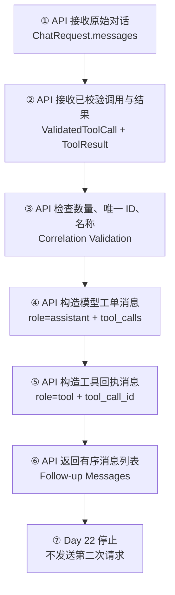
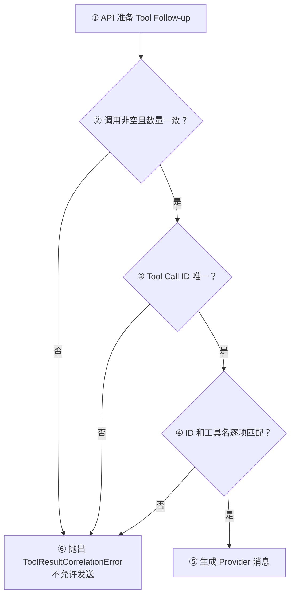

# Day 22：构造 Tool Result 回传消息

## 今日目标

1. 理解 OpenAI-compatible Tool Calling 的消息顺序：原始对话、Assistant Tool Call、Tool Result。
2. 把 `ValidatedToolCall` 和 `ToolResult` 转换为 Provider 可识别的消息结构。
3. 使用 `tool_call_id` 和工具名验证调用与结果一一对应。
4. 拒绝空调用、数量不一致、重复 ID 和错误关联，避免把结果回传给错误工单。
5. 明确本日只构造 Follow-up Messages（后续消息），不发送第二次 Provider 请求，也不实现 Agent Loop。

本日是 Provider 消息协议专项日。Day 20 得到已校验 Tool Call，Day 21 执行 Handler 并生成 Tool Result，Day 22 只负责把两者转换为下一次 OpenAI-compatible 请求需要的消息序列。现有 HTTP、SSE 和 Web Chat 请求链不改动，因为第二次 Provider 请求和最终 Assistant 回答尚未接入；Web 只同步首页 Day 22 进度标识。

## 必备理论

### 1. Provider Message Sequence（Provider 消息序列）

**专业解释：**

Provider Message Sequence 是模型读取的有序对话上下文。Tool Calling 场景中，原始用户消息之后必须保留模型发出的 Assistant Tool Call，再追加与每个调用 ID 对应的 Tool Message，Provider 才能理解工具为什么执行、结果属于哪次请求。

**大白话：**

不能只把“42”发给模型。要把“用户问了什么、模型申请调用什么工具、工具返回了什么”这三段历史一起交回去，模型才能继续组织最终回答。

**举例：**

```text
User: 12 加 30
Assistant: tool_calls(add_numbers, call_123)
Tool: tool_call_id=call_123, content=42
```

**在 Jack AI Studio 中的作用：**

`build_tool_follow_up_messages()` 按固定顺序生成这组消息，但本日不会把它发送给 Provider。

### 2. Assistant Tool Call Message（Assistant 工具调用消息）

**专业解释：**

Assistant Tool Call Message 表示模型上一轮提出的结构化调用请求。它使用 `role=assistant`、`content=null` 和 `tool_calls`，每个调用继续携带 ID、函数名和序列化参数。

**大白话：**

这是把模型上一轮开的“工具工单”原样放回对话历史。没有这张工单，后面的 Tool Result 就失去了来源。

**举例：**

```json
{
  "role": "assistant",
  "content": null,
  "tool_calls": [
    {
      "id": "call_123",
      "type": "function",
      "function": {
        "name": "add_numbers",
        "arguments": "{\"a\":12,\"b\":30}"
      }
    }
  ]
}
```

**在 Jack AI Studio 中的作用：**

Day 22 从 `ValidatedToolCall` 重新生成规范消息，只使用已校验的工具名和参数，不使用未校验的 Provider 原始字符串。

### 3. Tool Message（工具消息）

**专业解释：**

Tool Message 是应用把一次工具执行结果交回 Provider 的消息，使用 `role=tool`、`tool_call_id` 和字符串 `content`。它是 Provider 协议消息，不是最终 Assistant Message。

**大白话：**

它是工具执行回执：“工单 `call_123` 已处理，结果是 42”。模型收到后才能把结果转成面向用户的自然语言回答。

**举例：**

```json
{
  "role": "tool",
  "tool_call_id": "call_123",
  "content": "42"
}
```

**在 Jack AI Studio 中的作用：**

`ToolResult` 被转换成 Tool Message。当前只生成字典结构，不修改对外 `ChatMessage` Schema。

### 4. Correlation Validation（关联校验）

**专业解释：**

Correlation Validation 在构造 Provider 消息前检查 Tool Call 与 Tool Result 的数量、唯一 ID、相同调用 ID 和相同工具名，防止结果错配、遗漏或重复。

**大白话：**

像批量请求的对账：两张工单必须有两张回执，而且工单号和业务类型都要逐条对上，不能把第二张回执塞给第一张工单。

**举例：**

`call_first -> 3` 与 `call_second -> 30` 可以通过；`call_first -> tool_call_id=call_unknown` 会被拒绝。

**在 Jack AI Studio 中的作用：**

`ToolResultCorrelationError` 在任何网络请求之前阻止空调用、数量不一致、重复 ID 和 ID/名称错配。

### 5. Follow-up Messages（后续消息）与 Follow-up Request（后续请求）

**专业解释：**

Follow-up Messages 是第二次模型请求需要的消息数据；Follow-up Request 则是实际把这些消息连同 model、tools 等参数发送给 Provider。数据准备完成不代表网络请求已经发生。

**大白话：**

Day 22 只是把下一封邮件写好并核对收件内容，还没有点击发送。

**在 Jack AI Studio 中的作用：**

本日只返回消息列表。第二次 Provider 请求、最终文本解析、循环次数和异常处理留到后续 Day。

## Python 学习

- `Sequence[T]` 让函数能接收列表或元组，同时只依赖“可按顺序读取”的能力。
- `set(tool_call_ids)` 用于发现重复 ID；重复 ID 会让 Tool Result 的关联关系产生歧义。
- `zip(tool_calls, tool_results)` 在数量校验后逐项对账，确保 ID 和工具名同时匹配。
- `model_dump_json()` 把已经通过 Pydantic 校验的参数重新序列化为规范 JSON 字符串。
- 列表展开 `[*original_messages, assistant_message, *tool_messages]` 按 Provider 要求组织有序消息。

## 项目实战

### Tool Result 消息转换主流程

一句话先看懂：**API 先对账，再把模型工单和工具回执追加到原始对话；消息构造完成后本日停止。**



### 关联异常流程



### 分层职责

```text
apps/api/app/tools/catalog.py
└── ValidatedToolCall：模型提出且已通过服务端校验的工单

apps/api/app/tools/executor.py
└── ToolResult：Handler 执行后的内部回执

apps/api/app/providers/openai_compatible.py
├── ToolResultCorrelationError：关联关系不可信时拒绝转换
└── build_tool_follow_up_messages：生成 Provider 消息序列

apps/api/tests/test_openai_compatible_provider.py
├── 正常：原始消息 + Assistant Tool Call + Tool Messages
└── 异常：空调用、数量不等、重复 ID、ID/名称错配
```

## 关键代码说明

- Assistant Tool Call Message 必须出现在 Tool Messages 之前，这是 Provider 理解 Tool Result 来源的上下文。
- 参数使用 `ValidatedToolCall.arguments.model_dump_json()` 重新生成，避免把未经校验的原始 JSON 带回 Provider。
- `ToolResult.name` 不直接写入 OpenAI-compatible Tool Message，但在内部对账时仍必须和 Tool Call 名称一致。
- 当前采用顺序逐项关联，延续 Day 21 的确定性执行顺序；不会静默重排结果。
- `build_tool_follow_up_messages()` 是纯数据转换函数，没有网络 IO、工具执行或循环控制。
- 本日没有新增依赖，也没有改变 Web Chat 请求契约；首页只同步 Day 22 进度标识。

## 今日英文术语

1. **Provider Message Sequence**
   - 翻译（Translation）：Provider 消息序列。
   - 当前语境解释（Context Explanation）：按原始对话、Assistant Tool Call、Tool Result 排列的模型上下文。
2. **Assistant Tool Call Message**
   - 翻译（Translation）：Assistant 工具调用消息。
   - 当前语境解释（Context Explanation）：记录模型上一轮提出的调用 ID、工具名和参数。
3. **Tool Message**
   - 翻译（Translation）：工具消息。
   - 当前语境解释（Context Explanation）：使用 `role=tool` 把一次 Tool Result 放回 Provider 协议。
4. **Correlation Validation**
   - 翻译（Translation）：关联校验。
   - 当前语境解释（Context Explanation）：检查调用和结果的数量、ID、名称是否一一对应。
5. **Follow-up Messages**
   - 翻译（Translation）：后续消息。
   - 当前语境解释（Context Explanation）：已准备好供第二次 Provider 请求使用的消息数据。
6. **Follow-up Request**
   - 翻译（Translation）：后续请求。
   - 当前语境解释（Context Explanation）：真正发送 Follow-up Messages 的第二次网络请求，本日未实现。
7. **Serialization**
   - 翻译（Translation）：序列化。
   - 当前语境解释（Context Explanation）：把已校验参数转换为 Provider 需要的 JSON 字符串。
8. **Message Role**
   - 翻译（Translation）：消息角色。
   - 当前语境解释（Context Explanation）：`user`、`assistant`、`tool` 用来表示每条消息在对话中的职责。

## 今日练习

1. 为什么回传 Tool Result 时，不能只发送 `role=tool` 消息，还要保留前一条 Assistant Tool Call Message？
2. 为什么 Day 22 使用已校验参数重新序列化，而不是直接复用 Provider 返回的原始 `arguments` 字符串？
3. 为什么除了 `tool_call_id`，内部还要校验 Tool Result 的工具名？
4. 数量一致但出现重复 Tool Call ID，会造成什么问题？
5. 为什么已经生成 Follow-up Messages，仍不能说第二次 Provider 请求或 Agent Loop 已经完成？

## 验收问答

### 1. 为什么不能只发送 `role=tool`

**我的回答：** 需要让发送和响应一一对应。没有其他上下文，回传结果时就对不上是哪一次调用。

**验收补充：** 正确。`role=tool` 消息只有调用 ID 和结果，不包含模型为什么发起调用的完整工单。前一条 Assistant Tool Call Message 提供 ID、工具名和参数上下文，Tool Message 再通过同一个 `tool_call_id` 返回结果，Provider 才能继续这段对话。

### 2. 为什么重新序列化已校验参数

**我的回答：** 原始参数不确定是否可信，每个阶段都应该使用已经通过校验的数据，否则可能报错。

**验收补充：** 正确。Provider 原始 `arguments` 是不可信 JSON 字符串；Day 19/20 已将它转换为严格的 Pydantic 参数对象。跨过信任边界后应继续使用 `ValidatedToolCall.arguments`，再通过 `model_dump_json()` 生成规范 JSON，避免把非法类型、额外字段或畸形 JSON 带回 Provider。这里不是每层盲目重复校验，而是后续层只消费已经建立可信度的数据。

### 3. 为什么还要校验工具名

**我的回答：** 需要校验调用名称是否一样。

**验收补充：** 正确。调用 ID 对上只能说明“是哪张工单”，工具名对上还能确认“回执是否来自同一种业务处理”。两者同时匹配，可以防止相同 ID 下错误地把其他 Handler 的结果回传给原调用。

### 4. 重复 Tool Call ID 的问题

**我的回答：** 会导致一个请求出现两个不同的数据。

**验收补充：** 方向正确。更准确地说，两个 Tool Call 共用同一个关联 ID 后，Tool Result 无法唯一确定属于哪次调用；即使结果数量正确，也会出现归属歧义，Provider 可能关联错误或直接拒绝消息。因此 ID 不仅要非空，还必须在本批调用中唯一。

### 5. Follow-up Messages 为什么不等于已发送请求

**我的回答：** 还没有发起第二次请求，只是把发起请求的数据准备好了。

**验收补充：** 正确。Day 22 只完成纯数据转换，没有网络 IO。真正的 Follow-up Request 还要携带 model、messages 和 Provider 配置调用 API，并解析最终 Assistant 响应；Agent Loop 还需要状态、步数、继续/终止判断和错误控制。

**最终结论：** 五道题已完成。用户能够解释 Assistant Tool Call 上下文、可信参数重新序列化、ID 与工具名双重关联、重复 ID 歧义，以及消息准备、网络请求和 Agent Loop 的不同边界。Day 22 学习验收通过。

## 验收标准

- [x] 构造原始对话、Assistant Tool Call 和 Tool Messages 的有序序列。
- [x] 使用已校验参数生成规范 Tool Call JSON。
- [x] Tool Message 保留原始 `tool_call_id` 和字符串结果。
- [x] 空调用、数量不一致、重复 ID、ID/工具名错配会被拒绝。
- [x] 不修改 HTTP、SSE 或 Web Chat 请求链，只同步首页进度；不发送第二次 Provider 请求或实现 Agent Loop。
- [x] API 聚焦测试通过，完成 Python 编译检查和 `git diff --check`。
- [x] `pnpm check:foundation` 通过。
- [x] 完成五道核心概念问答。
- [x] 更新 `PROGRESS.md` 为 Day 22 已完成。

## 遇到的问题

- Provider 协议要求 Tool Result 前存在对应的 Assistant Tool Call 上下文，不能只回传结果字符串。
- 多个 Tool Call 即使数量相同，也可能因重复或错配 ID 产生歧义，因此必须逐项对账。
- 当前没有真实 API Key，所有消息转换使用本地类型和测试数据验证，没有访问外部模型服务；运行时演示确认消息顺序和关联 ID 正确。

## 今日总结

Day 22 已完成 Tool Result 回传消息的安全转换：原始对话后追加 Assistant Tool Call Message，再追加逐项关联的 Tool Messages。代码、基础质量门禁、运行时演示和五道概念问答均已完成，已经具备第二次 Provider 请求所需的消息数据，但尚未发送请求，也没有形成 Agent Loop。

## Git Commit

建议 Commit：

```text
feat(provider): build tool result messages for day 22
```

本轮未执行 Git Commit；验收已完成，是否提交按用户指示执行。

## 下一天预告

Day 23 将根据本日验收结果决定是否发送一次受控的 Follow-up Request 并解析最终 Assistant 文本；仍不提前实现可无限循环的 Agent。
