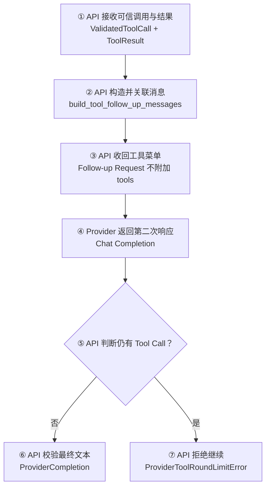
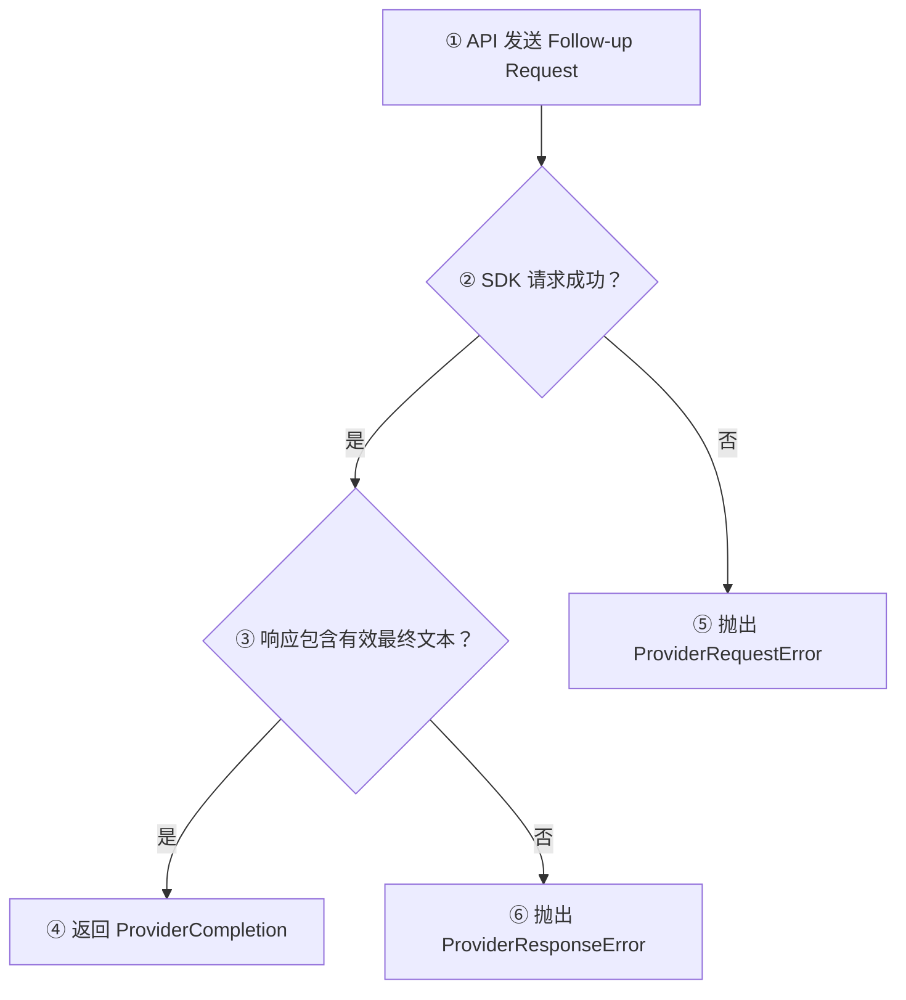

# Day 23：发送一次受控的 Tool Follow-up Request

## 今日目标

1. 使用 Day 22 构造的 Follow-up Messages 真正发起第二次 Provider 请求。
2. 解析第二次响应中的最终 Assistant 文本，并继续返回 Provider 内部的 `ProviderCompletion`。
3. 保留 Structured Output 的 `response_format` 和最终内容校验。
4. 把工具流程限制为一次 Tool Result 回传，拒绝 Provider 再次返回 Tool Call。
5. 明确本日不接 HTTP/Web Chat，不实现自动工具执行和多轮 Agent Loop。

本日是 Provider Follow-up Request 专项日。Day 20 负责识别并校验 Tool Call，Day 21 负责执行 Handler，Day 22 负责构造回传消息，Day 23 只补上“一次网络发送和最终 Provider 响应解析”。HTTP Route 目前没有负责串联这些步骤的 Orchestrator（编排器），因此 Web 只同步 Day 23 学习进度，不展示尚未接入的产品能力。

官方协议依据：[Function calling](https://developers.openai.com/api/docs/guides/function-calling)。OpenAI Docs 的 Chat Completions 示例会保留 Assistant `tool_calls`，再追加带相同 `tool_call_id` 的 `role=tool` 消息并发起后续请求。

## 必备理论

### 1. Follow-up Request（后续请求）

**专业解释：**

Follow-up Request 是应用把原始对话、Assistant Tool Call 和 Tool Result 作为完整消息历史，再次发送给 Provider 的模型请求。它让模型基于工具结果生成面向用户的最终文本。

**大白话：**

Day 22 已经把“原问题、工具工单、执行回执”装进信封；Day 23 才真正点击发送，让模型根据回执写最终答复。

**举例：**

```text
第一次响应：Assistant 请求 add_numbers(12, 30)
工具结果：42
第二次响应：Assistant 返回“12 加 30 的结果是 42。”
```

**在 Jack AI Studio 中的作用：**

`generate_tool_follow_up_completion()` 调用 OpenAI-compatible Chat Completions API 一次，并解析这一次的 Provider 响应。

### 2. Final Completion（最终完成响应）

**专业解释：**

Final Completion 是应用完成一次工具回传后期望得到的文本型 Provider 响应。它仍先经过 Provider Adapter 的空文本检查和 Structured Output 校验，再成为可信的内部结果。

**大白话：**

工具返回的 `42` 只是原材料；模型生成的“12 加 30 的结果是 42”才是本次 Provider 流程的最终答复。

**举例：**

Provider 若返回空字符串，不能把它当成已完成；若结构化模式返回缺字段 JSON，也不能直接交给 HTTP 层。

**在 Jack AI Studio 中的作用：**

Day 23 复用 `_parse_completion()`，最终仍返回 `ProviderCompletion`，没有提前构造对外 `ChatMessage`。

### 3. Single Tool Round（单轮工具调用）

**专业解释：**

Single Tool Round 是一次受控执行策略：第一轮 Provider 可以请求工具，应用执行并回传结果；第二轮必须返回最终文本，不允许继续请求新的工具。

**大白话：**

今天只允许“申请一次、执行一次、答复一次”。如果模型第二次还想开新工单，当前代码会停止，而不是自动循环。

**举例：**

第二次响应再次包含 `tool_calls=[add_numbers(...)]` 时，抛出 `ProviderToolRoundLimitError`。

**在 Jack AI Studio 中的作用：**

第二次请求不附加 `tools`，从请求侧收紧能力；响应侧仍检查 `tool_calls`，防止不完全兼容的 Provider 绕过预期。

### 4. Capability Restriction（能力限制）

**专业解释：**

Capability Restriction 是在每个请求中只向模型暴露当前允许使用的能力。本日第二次请求不携带 Tool Definitions，因此 Provider 不应继续选择工具。

**大白话：**

第一轮把工具菜单交给模型；工具已经执行完，第二轮就收回菜单，只让模型根据现有结果回答。

**举例：**

Follow-up payload 保留 `model`、`messages`、`temperature`，但不存在 `tools` 字段。

**在 Jack AI Studio 中的作用：**

它和响应侧的 Round Limit 校验形成两道边界，但不等于完整的权限系统或 Human in the Loop。

### 5. Agent Loop（Agent 循环）边界

**专业解释：**

Agent Loop 会根据模型响应反复执行“判断 Tool Call、调用工具、回传结果、再次请求”，还需要状态、最大步数、终止条件、错误恢复和审计。本日只有固定的一次 Follow-up Request，不具备这些控制能力。

**大白话：**

Day 23 是写死最多走一轮的流程；Agent Loop 像一个会判断是否继续、最多走几步、失败怎么办的流程引擎，两者不是同一件事。

**举例：**

模型第二轮再请求工具时，Day 23 报错停止；未来 Agent 才可能在步数限制内决定是否继续。

**在 Jack AI Studio 中的作用：**

本日为后续 Orchestrator 和 Agent 提供单次 Provider 能力，但不提前实现 Agent State、ReAct 或多步循环。

## Python 学习

- Keyword-only 参数 `messages=...` 让同一个请求构造器既能使用原始 `ChatRequest.messages`，也能使用 Day 22 生成的 Provider 消息。
- `Sequence[Mapping[str, object]]` 表示只依赖“有顺序且可读取的字典型消息”，不要求调用方必须传 `list`。
- 自定义异常继承 `ProviderResponseError`，既保留统一 Provider 错误边界，也能单独识别“超过单轮限制”。
- `parsed_completion.tool_calls` 使用空元组表示没有后续调用，适合用布尔判断终止当前流程。
- `try/except APIError` 把 SDK 网络异常转换为项目统一的 `ProviderRequestError`，避免外层依赖具体 SDK 异常。

## 项目实战

### 单次 Tool Follow-up 主流程

一句话先看懂：**API 使用已对账消息发起一次请求，Provider 返回最终文本后完成；若再次请求工具则停止。**



### 请求失败与响应失败



### 分层职责

```text
apps/api/app/tools/executor.py
└── ToolResult：工具 Handler 的可信执行结果

apps/api/app/providers/openai_compatible.py
├── build_tool_follow_up_messages：校验关联并构造消息
├── generate_tool_follow_up_completion：发送一次后续请求
├── _parse_completion：校验最终文本或结构化输出
└── ProviderToolRoundLimitError：拒绝第二次 Tool Call

apps/api/tests/test_openai_compatible_provider.py
├── 正常：完整消息、请求参数、最终文本
├── 正常：Structured Output 延续校验
└── 异常：再次 Tool Call、空最终文本
```

## 关键代码说明

- Follow-up Request 使用 Day 22 已通过数量、ID 和工具名校验的消息序列，不从原始 Provider 响应重新拼装不可信参数。
- `_build_completion_request()` 只新增可选 `messages` 覆盖点，原有文本生成和 SSE 请求路径保持不变。
- 第二次请求刻意不附加 `tools`；这是 Day 23 的单轮产品策略，不是 OpenAI-compatible 协议的强制要求。
- 即使请求未附加 `tools`，仍解析响应中的 `tool_calls`，因为外部 Provider 响应不能被默认信任。
- Structured Output 模式继续携带 `response_format`，最终内容仍经过 `StructuredAnswer` 的 Pydantic 运行时校验。
- 返回值保持 `ProviderCompletion`。HTTP Route、Web Chat、Executor 自动调用和 `ChatMessage` 转换都不属于本日范围。

## 今日英文术语

1. **Follow-up Request**
   - 翻译（Translation）：后续请求。
   - 当前语境解释（Context Explanation）：携带 Assistant Tool Call 和 Tool Result 发给 Provider 的第二次请求。
2. **Final Completion**
   - 翻译（Translation）：最终完成响应。
   - 当前语境解释（Context Explanation）：一次工具回传后期望得到的最终 Provider 文本结果。
3. **Single Tool Round**
   - 翻译（Translation）：单轮工具调用。
   - 当前语境解释（Context Explanation）：最多允许一次工具请求、执行和结果回传的控制策略。
4. **Round Limit**
   - 翻译（Translation）：轮次限制。
   - 当前语境解释（Context Explanation）：第二次响应再次请求工具时停止流程的边界。
5. **Capability Restriction**
   - 翻译（Translation）：能力限制。
   - 当前语境解释（Context Explanation）：第二次请求不发送 `tools`，不再向 Provider 暴露工具菜单。
6. **Response Validation**
   - 翻译（Translation）：响应校验。
   - 当前语境解释（Context Explanation）：检查最终文本非空，并在结构化模式校验 JSON Schema 对应的数据。
7. **ProviderCompletion**
   - 翻译（Translation）：Provider 内部响应。
   - 当前语境解释（Context Explanation）：Provider Adapter 输出的可信内部结果，本日不直接转换为 HTTP `ChatMessage`。
8. **Agent Loop**
   - 翻译（Translation）：Agent 循环。
   - 当前语境解释（Context Explanation）：带状态、终止条件和步数控制的多轮工具编排，本日未实现。

## 今日练习

1. 为什么 Day 23 的 Follow-up Request 必须使用 Day 22 构造并完成关联校验的消息，而不能只发送 Tool Result？
2. 为什么 `generate_tool_follow_up_completion()` 返回 `ProviderCompletion`，而不是直接返回 `ChatMessage`？
3. 第二次请求不附加 `tools` 后，为什么仍要检查 Provider 响应中的 `tool_calls`？
4. Structured Output 模式在 Follow-up Request 中需要保留哪两层约束？
5. 为什么“发起一次第二请求并拒绝继续”还不能称为 Agent Loop？

## 验收问答

### 1. Follow-up Request 需要哪些数据

**我的回答：** 需要加上 Follow-up Message。那里面携带了 Follow-up Request 必须要的数据，具体是什么不太清楚。

**验收补充：** 方向正确。第二次请求的 `messages` 必须包含原始对话、Assistant Tool Call Message 和与调用 ID 一一对应的 Tool Messages；此外还要携带 `model`、`temperature`，Structured Output 模式下继续携带 `response_format`。Day 23 为限制单轮流程，不再携带 `tools`。

### 2. 为什么返回 `ProviderCompletion`

**我的回答：** 首先要给 Provider 的，也是需要通过 Provider 校验的，然后才能通过转换成 `ChatMessage`。机器看的和人看的不是一个事。

**验收补充：** 正确，表述上再区分输入和输出：Follow-up Messages 是发给 Provider 的协议输入；`ProviderCompletion` 是 Provider Adapter 校验外部响应后产生的内部结果；未来 HTTP/Chat 编排层确认得到可展示文本后，才把它转换为面向 Web 的 `ChatMessage`。两者字段可能相似，但职责和信任边界不同。

### 3. 为什么仍检查 `tool_calls`

**我的回答：** 那是通用行为。

**验收补充：** 需要补充原因。解析和校验外部 Provider 响应确实是 Adapter 的通用行为；更重要的是“不发送 `tools`”只能表达应用意图，不能证明所有 OpenAI-compatible Provider 都一定遵守。响应仍是不可信输入，所以必须检查 `tool_calls`，并用 `ProviderToolRoundLimitError` 阻止流程越过单轮边界。

### 4. Structured Output 的两层约束

**我的回答：** 继续携带 `response_format`，最终内容仍经过 `StructuredAnswer`。具体为什么不太清楚。

**验收补充：** 两层判断正确。`response_format` 是请求约束，用 JSON Schema 告诉模型应该生成什么结构；`StructuredAnswer` 是响应端的 Pydantic 运行时校验，用来确认 Provider 实际返回的数据确实满足结构。前者降低错误概率，后者建立可信边界，不能只依赖其中一层。

### 5. 为什么不是 Agent Loop

**我的回答：** 因为第二次请求会被阻断，并没有真正发起。

**验收补充：** 这里需要修正：第二次 Follow-up Request 已经真实发出，只有当第二次响应再次包含 Tool Call 时，后续工具执行和第三次请求才会被阻断。它不是 Agent Loop，是因为代码只执行固定的一次回传，没有循环判断、Agent State、最大步数、终止条件、错误恢复或审计控制。

**最终结论：** 五道题已完成。用户已能说明 Follow-up Request 的主要数据、ProviderCompletion 与 ChatMessage 的分层、外部响应持续校验、Structured Output 的请求和响应双层约束；同时已修正“第二次请求没有发出”的理解，明确被阻断的是再次 Tool Call 及其后续流程。Day 23 学习验收通过。

## 验收标准

- [x] Follow-up Request 携带原始消息、Assistant Tool Call 和 Tool Result。
- [x] 第二次请求保留 model、temperature 和可选 `response_format`，不附加 `tools`。
- [x] 最终文本返回 `ProviderCompletion`，空文本和非法 Structured Output 被拒绝。
- [x] 第二次响应再次包含合法 Tool Call 时抛出 `ProviderToolRoundLimitError`。
- [x] 不修改 HTTP、SSE 或 Web Chat 工具请求链，只同步首页 Day 23 标识。
- [x] Provider 聚焦测试 22 项通过。
- [x] 完成 Python 编译、59 个全量 API 测试、Web lint/typecheck/build 和 `git diff --check`。
- [x] 完成五道核心概念问答。
- [x] 更新 `PROGRESS.md` 为 Day 23 已完成。

## 遇到的问题

- OpenAI-compatible 协议允许在后续请求继续提供工具，但本日没有 Agent Loop 的状态和步数控制，因此主动收回 `tools`，并在响应端再次限制。
- 当前没有真实 API Key，不调用外部模型；使用 Fake Client 检查实际请求 payload 和响应分支。
- HTTP/Web Chat 还缺少串联 Provider、Executor 和 Follow-up Request 的 Orchestrator，本日按后端专项边界不提前接入。
- `pnpm check:foundation` 已通过，保留既有 Starlette `TestClient` deprecation warning，不是本日改动引入的失败。

## 今日总结

Day 23 已完成代码开发、基础质量门禁和学习验收：Day 22 的消息现在可以被发送为一次受控 Follow-up Request，Provider 最终文本和 Structured Output 会继续校验，第二次 Tool Call 会被明确拒绝。当前只实现固定单轮流程，没有提前实现 HTTP/Web Chat 编排或 Agent Loop。

## Git Commit

建议 Commit：

```text
feat(provider): add single tool follow-up for day 23
```

本轮不会自动执行 Git Commit；完成验收后按用户指示处理。

## 下一天预告

Day 24 将在 Day 23 验收后根据 Sprint 2 剩余目标确定，可能承接 Tool Calling 的 HTTP/Chat 编排边界；不会在本日提前实现。
