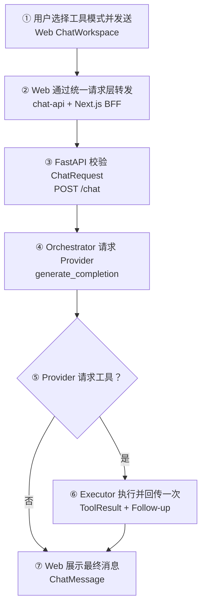
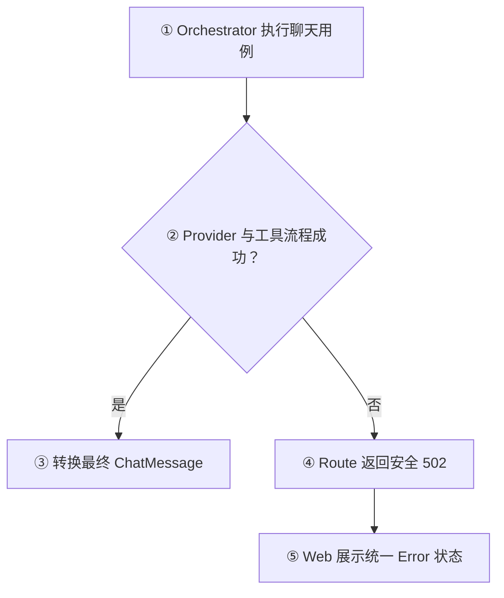

# Day 24：接通 HTTP/Web Tool Calling 单轮闭环

## 今日目标

1. 新增 Chat Orchestrator，串联第一次 Provider 响应、Tool Executor 和一次 Follow-up Request。
2. 把最终 `ProviderCompletion` 转换为 HTTP/Web 可展示的 `ChatMessage`。
3. 让 FastAPI 非流式 `POST /chat` 支持普通文本和固定单轮 Tool Calling。
4. 让 Web 通过统一请求层选择“流式对话”或“工具调用”，覆盖 Loading、Success 和 Error 状态。
5. 保持 `POST /chat/stream` 的文本 SSE 行为，不提前实现流式 Tool Calling 或 Agent Loop。

本日完成 Day 19～23 能力的第一次产品闭环。官方 OpenAI 文档在 [Function calling](https://developers.openai.com/api/docs/guides/function-calling) 中展示了“Assistant Tool Call → 执行函数 → Tool Message → 再次请求 → 最终文本”的顺序；Jack AI Studio 使用同样的消息关联规则，但继续执行 Day 23 的固定单轮限制。

## 必备理论

### 1. Chat Orchestrator（聊天编排器）

**专业解释：**

Chat Orchestrator 是应用服务层中的流程协调函数。它读取 Provider 的内部结果，按固定条件决定是否执行工具和发送 Follow-up，最后把可信文本转换为 HTTP 契约需要的 `ChatMessage`。

**大白话：**

它像前端项目中的业务 action：页面只调用“完成一次聊天”，action 内部再安排请求、数据转换和下一步，不让 Route 或组件到处拼流程。

**举例：**

```text
普通回答：ProviderCompletion(text) -> ChatMessage
工具回答：ProviderCompletion(tool_calls) -> ToolResult -> Follow-up -> ChatMessage
```

**在 Jack AI Studio 中的作用：**

`orchestrate_chat_completion()` 位于 FastAPI Route 与 Provider/Executor 之间，只处理一次固定工具分支。

### 2. Application Service（应用服务）

**专业解释：**

Application Service 表达一个完整用例，协调多个领域或基础设施模块，但不负责 HTTP 解析、Provider 协议细节或具体工具计算。

**大白话：**

Route 像 Koa Controller，只管接请求和回响应；Provider 像第三方 SDK Adapter；Application Service 则负责把它们组织成“完成一次聊天”这个业务动作。

**举例：**

`apps/api/app/services/chat.py` 调用 Provider 和 Executor，但不会自己解析 OpenAI `tool_calls` JSON，也不会自己计算加法。

**在 Jack AI Studio 中的作用：**

它避免 `/chat` Route 直接包含 Tool Calling 的多段业务逻辑，并为后续测试提供清晰边界。

### 3. Conditional Orchestration（条件编排）

**专业解释：**

Conditional Orchestration 根据已校验状态选择一条固定分支。Day 24 只判断 `completion.tool_calls` 是否为空，不使用循环或模型自主规划。

**大白话：**

它就是一个明确的 `if`：没有工具工单就直接回复；有工单就执行一次、回传一次，然后结束。

**举例：**

```python
if completion.tool_calls:
    tool_results = execute_tool_calls(completion.tool_calls)
    completion = await provider.generate_tool_follow_up_completion(...)
```

**在 Jack AI Studio 中的作用：**

它把普通文本和 Tool Calling 合并到同一个 `/chat` 对外契约，同时保持可预测的单轮上限。

### 4. Response Translation（响应转换）

**专业解释：**

Response Translation 是在边界间转换可信数据结构。Provider Adapter 返回 `ProviderCompletion`，Application Service 确认存在最终文本后，再创建对外 `ChatMessage`。

**大白话：**

Provider 返回的是系统内部处理单；Web 需要的是可以直接展示的 Assistant 消息。Orchestrator 负责最后一次换单，但不会绕过 Provider 校验。

**举例：**

Tool Call 不能直接变成 `ChatMessage`；只有普通文本 Completion 或完成 Follow-up 后的最终文本可以转换。

**在 Jack AI Studio 中的作用：**

它落实 Day 20 学到的 `ProviderCompletion` 与 `ChatMessage` 职责区别。

### 5. Tool Mode 与 Streaming Mode（工具模式与流式模式）

**专业解释：**

Tool Mode 使用非流式 `/chat` 完成可能包含两次 Provider 请求的固定流程；Streaming Mode 使用 `/chat/stream` 按 SSE Delta 持续返回文本。两条链路共享 `ChatRequest`，但响应时序不同。

**大白话：**

流式模式是一边生成一边显示；工具模式要先拿工单、执行工具、再拿最终回答，所以今天等待完整结果后一次展示。

**举例：**

Web 的“流式对话”调用 `streamChatCompletion()`；“工具调用”调用 `createChatCompletion()`，两者都通过现有 `chat-api.ts` 和 Next.js BFF。

**在 Jack AI Studio 中的作用：**

Day 24 提供明确模式切换，不把尚未实现的流式 Tool Call 伪装成 SSE 能力。

### 6. 它为什么还不是 Agent Loop

**专业解释：**

Agent Loop 需要根据每一步结果反复决定是否继续，并管理 State、最大步数、终止条件、恢复和审计。Day 24 只有一次条件分支和一次 Follow-up。

**大白话：**

Orchestrator 按写好的两条路线走；Agent 才像会根据路况多次重新规划的执行者。

**举例：**

第二次 Provider 响应再次要求工具时，Day 23 的 Round Limit 会报错，Day 24 不会进入第三次请求。

**在 Jack AI Studio 中的作用：**

当前只完成 AI Chat V1 的可控工具闭环，Agent State 和多步循环仍留在后续 Sprint。

## Python 学习

- `async def` Orchestrator 可以按顺序 `await` 第一次 Provider 请求和可选 Follow-up Request，适合网络 IO 编排。
- `if completion.tool_calls` 利用空元组为 False 的特性表达固定条件分支。
- `try/except ToolExecutionError` 把 Executor 异常转换为 `ChatOrchestrationError`，避免 Route 依赖具体 Handler 错误。
- `raise ... from error` 保留内部异常链供服务端调试，同时 HTTP 只返回安全错误文案。
- Python 模块职责通过目录表达：`routes/` 管 HTTP、`services/` 管用例、`providers/` 管外部协议、`tools/` 管执行。

## 项目实战

### 用户到最终回答主流程

一句话先看懂：**Web 选择工具模式后，API 用固定分支完成一次工具执行和回传，最终仍返回同一个 ChatMessage 契约。**



### 异常流程



### 代码职责

```text
apps/api/app/services/chat.py
└── orchestrate_chat_completion：固定单轮用例编排

apps/api/app/routes/chat.py
└── POST /chat：依赖注入、HTTP 成功和错误映射

apps/api/app/providers/openai_compatible.py
├── generate_completion：第一次 Provider 请求
└── generate_tool_follow_up_completion：一次 Tool Result 回传

apps/api/app/tools/executor.py
└── execute_tool_calls：执行已校验 Tool Call

apps/web/src/components/chat-workspace.tsx
└── 选择流式或工具模式，展示 Loading/Success/Error

apps/web/src/lib/chat-api.ts
├── streamChatCompletion：SSE 文本请求
└── createChatCompletion：非流式工具请求
```

## 关键代码说明

- Orchestrator 只消费 `ProviderCompletion.tool_calls` 中已经通过 Provider Adapter 校验的数据，不接触原始 JSON。
- 普通文本与 Tool Calling 最终都返回 `ChatMessage`，所以 HTTP、BFF 和 Web 不需要新增另一套响应 Schema。
- Executor 保持同步纯计算；Provider 请求保持异步网络 IO，职责没有混合。
- Route 捕获 `ProviderError` 和 `ChatOrchestrationError`，统一映射为不泄露内部信息的 HTTP 502。
- Web 复用 `createChatCompletion()`，没有在组件中新增散落的 `fetch`。
- 工具模式当前不显示内部 Tool Call 步骤，只显示最终 Assistant Message；步骤可视化属于未来 Agent Center。
- `/chat/stream` 不发送工具定义、不执行工具，继续保持 Day 14 的 SSE 契约。

## 今日英文术语

1. **Chat Orchestrator**
   - 翻译（Translation）：聊天编排器。
   - 当前语境解释（Context Explanation）：协调一次 Provider 请求、可选工具执行和一次 Follow-up 的应用服务。
2. **Application Service**
   - 翻译（Translation）：应用服务。
   - 当前语境解释（Context Explanation）：表达“完成一次聊天”用例并协调 Route、Provider 和 Executor 的服务层。
3. **Conditional Orchestration**
   - 翻译（Translation）：条件编排。
   - 当前语境解释（Context Explanation）：根据 `tool_calls` 是否为空选择文本或固定工具分支。
4. **Response Translation**
   - 翻译（Translation）：响应转换。
   - 当前语境解释（Context Explanation）：把最终 ProviderCompletion 转换为 HTTP ChatMessage。
5. **Tool Mode**
   - 翻译（Translation）：工具模式。
   - 当前语境解释（Context Explanation）：Web 通过非流式 `/chat` 使用固定单轮 Tool Calling。
6. **Streaming Mode**
   - 翻译（Translation）：流式模式。
   - 当前语境解释（Context Explanation）：Web 通过 `/chat/stream` 按 SSE Delta 展示普通文本。
7. **Error Mapping**
   - 翻译（Translation）：错误映射。
   - 当前语境解释（Context Explanation）：把内部 Provider 或编排错误转换为安全、稳定的 HTTP 502。
8. **End-to-End Flow**
   - 翻译（Translation）：端到端流程。
   - 当前语境解释（Context Explanation）：从 Web 操作经过 BFF、FastAPI、Provider 和 Executor，再回到页面展示的完整链路。

## 今日练习

1. 为什么 Tool Calling 的条件分支应该放在 Application Service，而不是 FastAPI Route 或 Provider Adapter？
2. 为什么第一次 `ProviderCompletion` 没有 Tool Call 时，Orchestrator 不应该执行 Executor 或发起 Follow-up？
3. 为什么 Tool Call 必须先经过 Provider Adapter 校验，再由 Orchestrator 交给 Executor？
4. 为什么 Web 工具模式复用非流式 `/chat`，而不是直接复用现有 SSE `/chat/stream`？
5. Chat Orchestrator 已经协调 Provider 和工具，为什么仍不能称为 Agent Loop？

## 学习验收

### 1. 为什么条件分支放在 Application Service

**我的回答：** 隔离开，Tool Calling 是在用户选择那里。

**验收补充：** “隔离开”是正确方向，但需要修正 Tool Call 的来源。Web 用户选择的是“流式对话”或“工具调用”请求模式；真正是否产生 Tool Call，是 Provider/LLM 响应决定的。Route 只处理 HTTP，Provider Adapter 只处理外部协议，Application Service 才负责根据已校验的 Provider 结果选择普通文本或工具分支。

### 2. 为什么没有 Tool Call 时不能执行 Executor 或 Follow-up

**我的回答：** 需要选择工具，Tool 是处理不同类型的，有一些基础数据的封装。

**验收补充：** 不同 Tool 确实负责不同能力，但本题关键是执行条件。没有 Tool Call 时，第一次 `ProviderCompletion` 已经是最终文本，同时也不存在可执行的 `ValidatedToolCall`、`tool_call_id` 或 Tool Result。此时调用 Executor 没有合法输入，发送 Follow-up 也没有结果可回传，还会制造一次无意义的 Provider 请求。

### 3. 为什么必须先经过 Provider Adapter 校验

**我的回答：** Web 传入过来的并不一定可靠，没有进行运行时类型校验。

**验收补充：** “外部数据不可靠，需要运行时校验”是正确的；这里的 Tool Call 不是 Web 传入，而是 Provider/LLM 响应返回的。Provider Adapter 必须先校验工具名白名单、参数 Schema 和调用标识，再把 `ValidatedToolCall` 交给 Executor，避免 Executor 直接处理不可信 JSON。

### 4. 为什么工具模式不直接复用 SSE

**我的回答：** 两种不同，一个是 SSE，一个是普通的 HTTP 请求，相当于一次性的。

**验收补充：** 正确。现有 SSE 契约只处理文本 Delta；工具模式需要等待 Tool Call、执行工具、发送 Follow-up，再一次性返回最终 `ChatMessage`。流式 Tool Calling 还需要额外的 Tool Call Delta 拼接和事件状态协议，不属于 Day 24。

### 5. 为什么仍不是 Agent Loop

**我的回答：** 还是没有长度、终止、状态等。

**验收补充：** 正确。当前只有写死的一次条件分支和一次 Follow-up，没有循环决策、Agent State、最大步数、终止条件、恢复策略或连续多工具轮次，因此只是固定单轮编排。

**最终结论：** 五道题已完成。用户已经理解 Application Service 的隔离作用、非流式与 SSE 的差异，以及 Agent Loop 所需的状态和终止控制；同时修正了 Tool Call 的来源，明确 Web 只选择请求模式，真正的 Tool Call 来自 Provider/LLM 响应。Day 24 学习验收通过。

## 验收标准

- [x] 新增固定单轮 Chat Orchestrator，并保持 Route、Provider、Executor 职责分离。
- [x] 普通文本直接转换为 ChatMessage，不执行工具或 Follow-up。
- [x] Tool Call 执行后携带关联结果发送一次 Follow-up，并返回最终 ChatMessage。
- [x] Provider 和工具编排错误映射为安全 HTTP 502。
- [x] Web 通过统一请求层支持“流式对话 / 工具调用”模式。
- [x] Loading、Success、Error 和 Structured Output 展示继续复用现有状态模型。
- [x] Endpoint 聚焦测试 10 项和 Web lint/typecheck 通过。
- [x] 完成 Web production build、Python 编译、60 个全量 API 测试和 `git diff --check`。
- [x] 完成桌面与移动端浏览器验收。
- [x] 完成五道核心概念问答。
- [x] 更新 `PROGRESS.md` 为 Day 24 已完成。

## 遇到的问题

- 官方 Chat Completions 示例在 Follow-up 中继续携带 `tools`；Jack AI Studio 当前为了固定单轮流程，沿用 Day 23 的“不再暴露 tools + 响应侧 Round Limit”策略。
- SSE Tool Calling 需要解析流式 Tool Call Delta、执行工具后切换或继续事件流，不属于 Day 24 的最小闭环。
- 当前没有真实 API Key，工具闭环由 Fake Provider 和真实 Executor 验证，不产生外部网络调用或费用。
- 浏览器在 `1280×720` 和 `390×844` 下均无横向溢出，模式文案与 `aria-pressed` 正确切换；无 Key 时即使填写 Model/Prompt，工具提交仍保持禁用，控制台无错误。
- Next dev 验收使用 `localhost:3001`；使用 `127.0.0.1` 会被 Next.js dev resource origin 限制阻止 hydration，这不是应用接口失败。
- 浏览器未提交真实 Tool Calling 请求；完整 Executor、Follow-up 和 HTTP ChatMessage 由 10 项 Endpoint 聚焦测试覆盖。

## 今日总结

Day 24 已完成代码开发、全量质量门禁、浏览器验收和五道概念问答：非流式 `/chat` 已能通过 Chat Orchestrator 完成普通文本或固定单轮 Tool Calling，Web 也能在流式与工具模式之间切换。当前仍使用 Fake Provider 验证工具闭环，真实模型端到端验收由 Day 25 承接。

## Git Commit

建议 Commit：

```text
feat(chat): orchestrate single-round tool calling
```

本轮不会自动执行 Git Commit；完成验收后按用户指示处理。

## 下一天预告

Day 25 将通过服务端环境变量配置真实 API Key，完成 AI Chat V1 的真实模型端到端验收，并补充 Sprint 2 总结、复盘和复习问答；不会提前实现 Sprint 3 数据持久化能力。
