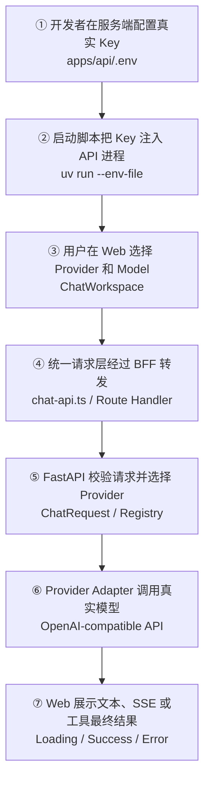

# Day 25：真实 Provider 验证与 AI Chat V1 收尾

## 今日目标

1. 明确 Mock Validation 与 Real Provider Validation 的证据边界。
2. 让本地 API 开发命令可选加载被 Git 忽略的服务端 `.env`。
3. 使用真实 Provider 验证 Text、SSE、Structured Output 和固定单轮 Tool Calling。
4. 完成 Sprint 2 AI Chat 总结与阶段复习问答。
5. 真实链路和复习题通过前，不把 Day 25 或 Sprint 2 标记为完成。

Day 25 不新增 AI Chat 功能，而是确认 Day 11～24 构建的能力能否和真实外部服务协同工作。OpenAI 官方文档的 [Production best practices](https://developers.openai.com/api/docs/guides/production-best-practices) 明确建议不要把 API Key 写入代码或公开仓库，而应通过环境变量或 Secret Management Service 注入应用。

## 必备理论

### 1. Real Provider Validation（真实 Provider 验证）

**专业解释：**

Real Provider Validation 是通过真实鉴权、网络和模型响应验证完整产品链路。它覆盖 Mock 无法证明的 Provider 协议兼容性、模型能力、账户额度、限流和真实流式行为。

**大白话：**

Mock 像前端联调时自己写的固定接口数据，能证明页面逻辑没写错；真实 Provider 验证才像连接测试环境，确认地址、权限和真实返回都能配合。

**举例：**

Fake Provider 返回预先写好的 Tool Call，只能证明 Orchestrator 会执行；真实模型主动返回 `add_numbers` Tool Call，才证明工具定义和外部协议真的兼容。

**在 Jack AI Studio 中的作用：**

Day 25 用真实 Provider 为 AI Chat V1 提供最终运行证据，当前必须完成。

### 2. Secret Injection（机密注入）

**专业解释：**

Secret Injection 是由运行环境把 API Key 等敏感配置提供给服务端进程，代码只读取变量名，不保存机密值。开发环境可以使用被 Git 忽略的 `.env`，生产环境应使用部署平台的 Secret Manager。

**大白话：**

API Key 像后端保险柜钥匙。浏览器和 Git 仓库都不该拿到它，只在启动 FastAPI 时交给服务端进程。

**举例：**

`pnpm dev:api` 检测到 `apps/api/.env` 后，通过 `uv run --env-file` 把 `AI_PROVIDER_API_KEY` 注入 Uvicorn；`GET /providers` 只返回 `configured: true`，不会返回 Key。

**在 Jack AI Studio 中的作用：**

它让真实调用可运行，同时保持 API Key 不进入 Web Bundle、HTTP Response 或 Git 历史。

### 3. Capability Validation（能力验证）

**专业解释：**

Capability Validation 是逐项确认指定 Provider 和 Model 是否支持项目使用的协议能力。能生成文本，不代表一定支持 JSON Schema、SSE 或 Function Calling。

**大白话：**

同一个第三方接口能登录，不代表它所有菜单都能用；模型也要分别检查普通回答、流式回答、结构化输出和工具调用。

**举例：**

某个 OpenAI-compatible Model 可能通过普通文本请求，却拒绝 `response_format=json_schema`，这应记录为模型能力不兼容，而不是伪装成整个产品通过。

**在 Jack AI Studio 中的作用：**

Day 25 使用四项验收矩阵记录真实结果，避免用单条成功请求代替 AI Chat V1 验收。

### 4. Smoke Test（冒烟测试）

**专业解释：**

Smoke Test 是用少量、低成本、可观察的请求确认关键链路能够运行。它不替代自动化测试，而是补充外部依赖的运行证据。

**大白话：**

自动化测试检查每个零件，Smoke Test 是装好后真正通一次电，确认主功能没有在真实环境中断开。

**举例：**

在 Web 发送简短 Prompt，观察 SSE 是否逐段出现；再要求模型调用 `add_numbers` 计算 `19 + 23`，最终答案应基于工具返回的 `42`。

**在 Jack AI Studio 中的作用：**

Day 25 只执行覆盖核心能力的最小请求，控制费用，不做压力测试或模型质量评测。

### 5. 它不等于什么

- 真实调用成功不等于自动化测试可以删除；外部模型输出有波动，核心分支仍需要 Fake/Mock 稳定回归。
- 本地 `.env` 不等于生产 Secret Manager；它只服务本机开发。
- Sprint 2 验收不等于生产发布；登录、持久化、日志、配额和监控仍在后续 Sprint。

## Python 学习

- `os.environ` 是服务端进程的环境变量映射，Provider Registry 在请求到达时读取它。
- Pydantic `SecretStr` 避免配置对象在 `repr()` 中直接展示 Key，但它不能替代 Git 忽略和日志约束。
- `uv run --env-file` 负责解析本地 `.env` 并在启动 Uvicorn 前注入变量，不需要项目自己拼接或解析文本。
- `async` Provider 请求仍是网络 IO；真实验收需要同时观察正常响应、超时、鉴权失败和协议错误。

## 项目实战

### 1. 本地配置加载

```text
apps/api/.env.example
└── 只保留空变量名，不包含可误用的示例 Key

scripts/dev-api.sh
├── apps/api/.env 存在：uv run --env-file 后启动 Uvicorn
└── apps/api/.env 不存在：保持无 Provider 配置模式启动
```

### 2. 真实请求主流程



### 3. 真实能力验收矩阵

| 能力 | 最小输入 | 通过条件 | 当前状态 |
| --- | --- | --- | --- |
| Text | 简短中文问题 | Web 收到非空 Assistant Message | 已通过，返回 `OK` |
| SSE | 依次输出三个词 | 页面出现多个 Delta，最终正常结束 | 已通过，7 个 Delta、1 个 Done |
| Structured Output | 选择 `Structured JSON` | 最终内容通过 `StructuredAnswer` 校验并展示四个字段 | 已通过，四个字段完整 |
| Tool Calling | 明确要求调用 `add_numbers` 计算 `19 + 23` | Provider 请求工具，Executor 返回 `42`，Follow-up 生成最终回答 | 已通过，最终回答为 `42` |

## 关键代码说明

- `scripts/dev-api.sh` 只在本地 `.env` 存在时加载它，未配置 Key 时仍可启动 Health 和 Provider Catalog。
- `.env.example` 的 Key 默认留空，复制后不会把占位字符串误判为有效配置。
- `ProviderConfig` 使用 `SecretStr`，Provider Catalog 只公开 `id`、`label` 和 `configured`。
- Web 根据 Provider Catalog 动态显示 `SERVER KEY READY` 或 `NO SERVER KEY`，不再使用固定 Demo 文案，也不读取 Key 内容。
- Kaizo 模型目录确认 `gpt-5.6-luna`、`gpt-5.6-sol`、`gpt-5.6-terra` 均存在；Chat Workspace 使用三项 Model 下拉框并默认选择已完成四项真实验收的 `gpt-5.6-luna`。
- `StructuredAnswer` 使用 `ConfigDict(extra="forbid")`，使 strict JSON Schema 生成 `additionalProperties: false`，响应侧也拒绝额外字段。
- 真实 Provider 请求仍经过现有 Adapter、Pydantic 校验、Orchestrator 和统一 HTTP/BFF/Web 链路，没有测试专用捷径。
- 自动化测试继续使用 Fake Provider，避免 CI 读取 Key、产生费用或受到模型输出波动影响。

## 今日英文术语

1. **Real Provider Validation**
   - 翻译（Translation）：真实模型服务验证。
   - 当前语境解释（Context Explanation）：使用真实鉴权、网络和模型响应验证 AI Chat V1 的外部集成。
2. **Secret Injection**
   - 翻译（Translation）：机密注入。
   - 当前语境解释（Context Explanation）：在启动 FastAPI 时通过环境变量提供 Key，而不是写入源码或 Web。
3. **Environment File**
   - 翻译（Translation）：环境变量文件。
   - 当前语境解释（Context Explanation）：`apps/api/.env` 是仅供本地 API 进程读取、被 Git 忽略的开发配置文件。
4. **Secret Manager**
   - 翻译（Translation）：机密管理服务。
   - 当前语境解释（Context Explanation）：未来部署时保存和注入生产 Key 的平台能力，不是本地 `.env`。
5. **Capability Validation**
   - 翻译（Translation）：能力验证。
   - 当前语境解释（Context Explanation）：分别验证指定模型是否支持 Text、SSE、JSON Schema 和 Tool Calling。
6. **Smoke Test**
   - 翻译（Translation）：冒烟测试。
   - 当前语境解释（Context Explanation）：用少量真实请求确认 AI Chat V1 关键路径可运行。
7. **Credential Leak**
   - 翻译（Translation）：凭据泄露。
   - 当前语境解释（Context Explanation）：Key 出现在 Git、日志、响应或浏览器代码中的安全事故。
8. **End-to-End Evidence**
   - 翻译（Translation）：端到端证据。
   - 当前语境解释（Context Explanation）：从 Web 操作到真实 Provider 再回到页面展示的完整运行结果。

## 今日练习

Day 25 与 Sprint 2 共用以下阶段复习题，避免重复验收：

1. 为什么浏览器不能直接持有 Provider API Key？Web、BFF、FastAPI 和 Provider Adapter 分别承担什么职责？
2. TypeScript 类型、Pydantic Runtime Validation 和 Provider Adapter 响应校验分别保护哪一段边界？
3. 非流式 JSON 与 SSE 在 HTTP 时序、Web 状态更新和错误处理上有什么区别？
4. Structured Output 为什么同时需要请求侧 `response_format`、`additionalProperties: false` 和响应侧 `StructuredAnswer` 校验？
5. Tool Definition、ValidatedToolCall、Tool Executor、Tool Result 和 Follow-up Request 的执行顺序是什么？
6. 固定单轮 Chat Orchestrator 为什么不是 Agent Loop？如果模型再次请求工具，当前系统如何处理？
7. Mock/Fake 测试与真实 Provider Smoke Test 各自能证明什么，又分别不能证明什么？

## 学习验收

### 1. API Key 与各层职责

**我的回答：** 私密的，防泄漏，只能放在服务端。Web 负责页面展示，是用户输入信息的入口。BFF 是中间层，负责接收 Web 传来的接口信息并调用 API。FastAPI 负责处理接口入参，组装数据调用 Provider，再把 Provider 返回的信息组装成接口需要的数据。Provider Adapter 负责组装调用 LLM 的信息。

**验收补充：** 核心正确。再精确区分当前代码职责：Web 负责交互和页面状态；Next.js BFF 接收浏览器请求并转发给 FastAPI，不直接持有 Key 或调用外部 Provider；FastAPI Route 用 Pydantic 校验 HTTP 输入并交给 Chat Orchestrator；Provider Adapter 读取服务端配置，把内部请求转换为 OpenAI-compatible 协议，真正调用外部服务并校验响应。Key 只存在于服务端环境变量，不能进入浏览器 Bundle、HTTP Response 或 Git。

### 2. 三层类型与运行时校验边界

**我的回答：** TypeScript 在 Web 端开发时校验；Pydantic Runtime Validation 在进入 FastAPI 时进行运行时校验；Provider Adapter 校验 LLM 返回的信息，也校验调用大模型之前的信息。

**验收补充：** 方向正确。TypeScript 主要保护开发和编译阶段，编译后类型会被擦除，不能证明网络数据可信；Pydantic 在 FastAPI 运行时校验 HTTP 请求及项目 Schema；Provider Adapter 把已经可信的内部对象序列化为外部协议，并重点校验 Provider 返回的文本、Structured Output 和 Tool Call。不能因为 Web 有 TypeScript 或请求已通过 Pydantic，就跳过 Provider 响应校验。

### 3. 非流式 JSON 与 SSE

**我的回答：** 非流式就是传统的、立即响应的，一次请求一次响应，错误立马响应。SSE 是流式的，一次请求可以多次返回数据，直到获取结束标识或错误才结束。

**验收补充：** “一次响应”和“持续事件”区分正确，但非流式不一定立即返回：服务端要等待模型生成完整结果，再一次性返回 JSON，Web 通常只在结束时写入最终 Assistant Message。SSE 仍然只有一次 HTTP 请求和一次 HTTP Response，只是 Response Body 持续传输多个 `delta`，Web 会逐段更新同一条消息。SSE 错误还要区分建连前 HTTP 错误和建连后流内 `error` Event，最后都必须结束 Loading 状态。

### 4. Structured Output 的三层约束

**我的回答：** 不知道。

**验收补充：** `response_format` 是请求侧的生成约束，告诉模型必须按指定 JSON Schema 输出，而不是自由返回 Markdown；`additionalProperties: false` 是 Schema 内的严格字段约束，明确禁止返回未声明字段，也是部分 strict Provider 的必需条件；`StructuredAnswer.model_validate_json()` 是响应侧运行时校验，确认真实返回确实是合法 JSON，且必填字段、类型和额外字段都符合约定。三者分别解决“要求怎么生成”“允许哪些字段”“实际结果是否可信”，任何一层都不能替代另外两层。可以类比为：接口文档约定返回结构、严格 Schema 禁止多余字段、最后再用 Zod/Pydantic 对真实响应执行 `parse`。

### 5. Tool Calling 执行顺序

**我的回答：** 工具定义、验证工具调用、工具执行、工具结果、带着结果发起请求。

**验收补充：** 顺序正确。完整链路是：服务端把 Tool Definition 随第一次请求发送给 Provider；Provider 返回 Raw Tool Call；Adapter 校验工具名、参数和 ID，得到 `ValidatedToolCall`；Orchestrator 交给 Tool Executor；Executor 返回带相同 `tool_call_id` 的 Tool Result；最后用原始消息、Assistant Tool Call Message 和 Tool Message 构造 Follow-up Request，获取最终文本。

### 6. 固定单轮编排与 Agent Loop

**我的回答：** Agent Loop 应该包含状态、长度、什么时候结束、是否重试、上次的结果等等。

**验收补充：** 对 Agent Loop 的组成理解正确。当前 Orchestrator 只有写死的“第一次请求 → 最多一次工具执行 → 一次 Follow-up”分支，没有循环状态、最大步数、终止策略、重试和恢复。如果 Follow-up 响应再次请求 Tool Call，Adapter 会抛出 `ProviderToolRoundLimitError`，Route 映射为安全的 HTTP 502；系统不会执行第二轮工具。

### 7. Mock/Fake 与真实 Provider 证据边界

**我的回答：** Mock 只能证明入参、出参和接口定义是正确的，不能证明真实场景的字段约束。真实调用标识整个链路是通的。

**验收补充：** 核心正确。Mock/Fake 还能稳定证明内部条件分支、错误映射和边界校验符合预期，但不能证明真实鉴权、网络、Provider 协议兼容性、额度或模型能力。真实 Smoke Test 能证明某个 Provider、Model 和测试时刻的关键链路真实跑通，但不能证明所有 Prompt、所有模型、长期稳定性、性能、安全性或未来回归，因此不能替代自动化测试。

**最终结论：** 七道题已完成。第 1、2、5、7 题核心正确；第 3 题补全了非流式等待和 SSE 双重错误边界；第 4 题补清了 Structured Output 的三层约束；第 6 题补全了再次 Tool Call 会被拒绝并映射为安全错误。Day 25 与 Sprint 2 学习验收通过。

## 验收标准

- [x] `apps/api/.env.example` 不包含可被误判为已配置的占位 Key。
- [x] `pnpm dev:api` 可选加载被 Git 忽略的 `apps/api/.env`，无文件时仍可启动。
- [x] Web 根据安全 Provider Catalog 展示服务端 Key 配置状态，不展示 Key 内容。
- [x] 无 Key 时 Health/Catalog 正常、Chat 返回安全 `503`，桌面与移动端无横向溢出。
- [x] 本地配置真实 Provider Key，`GET /providers` 只显示配置状态且不泄露 Key。
- [x] 真实 Text 请求从 Web 到 Provider 再返回 Web。
- [x] 真实 SSE 请求产生 7 个 Delta 和 1 个 Done，并正常结束。
- [x] 真实 Structured Output 通过服务端 Schema 校验并展示四个字段。
- [x] 真实 Tool Calling 完成 Tool Call、Executor、Follow-up 和最终回答。
- [x] `pnpm check:foundation`、脚本语法和 `git diff --check` 通过，61 个 API 测试通过。
- [x] 完成桌面与移动端浏览器验收，页面无横向溢出或可见错误。
- [x] 完成 `docs/learning/sprint-02-summary.md`。
- [x] 完成 Day 25 与 Sprint 2 共用的七道复习题。
- [x] 更新 `PROGRESS.md` 为 Day 25 与 Sprint 2 已完成。

## 遇到的问题

- 真实服务是 Kaizo 提供的第三方 OpenAI-compatible API，不是 OpenAI 官方服务；其示例响应会注入服务端 `instructions`，当前只用于非敏感学习验收，不作为生产 Provider 结论。
- 首次 Structured Output 返回 HTTP `400`：strict JSON Schema 缺少 `additionalProperties: false`。为 `StructuredAnswer` 增加 `extra="forbid"` 后，真实请求和新增回归测试均通过。
- 能生成普通文本不代表同时兼容 SSE、JSON Schema 和 Tool Calling，因此四项能力分别进行了真实请求验证。
- 自动化测试仍使用 Fake/Mock，不读取真实 Key；真实 Smoke Test 作为外部兼容性证据单独记录。

## 今日总结

Day 25 已完成安全本地配置、无 Key 回归、真实 Provider 四项能力、严格 Structured Output 修复、完整质量门禁、响应式浏览器验收和七道阶段复习题。Day 25 与 Sprint 2 已完成，AI Chat V1 具备自动化回归和真实外部链路两类证据。

## Git Commit

建议 Commit：

```text
feat(chat): complete real provider validation
```

本轮不会自动执行 Git Commit；真实链路与学习验收完成后按用户指示处理。

## 下一天预告

Day 26 将进入 Sprint 3，开始后端与数据持久化能力；数据库、用户或会话存储没有在 Day 25 提前实现。
