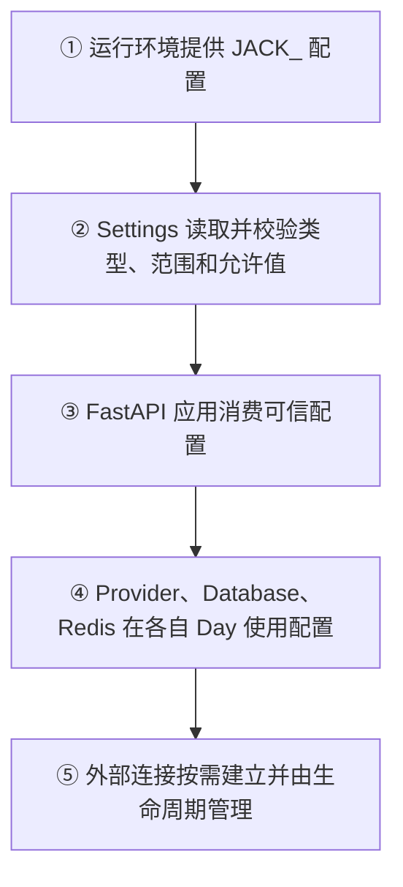

# Day 26：FastAPI 配置边界与 Sprint 3 启动

## 今日目标

1. 理解为什么后端需要独立的配置边界，而不是在各模块里直接读取环境变量。
2. 使用 `pydantic-settings` 把应用配置转换为经过运行时校验的 `Settings`。
3. 为未来 PostgreSQL 和 Redis 预留可选连接配置，但今天不建立网络连接、不建表。
4. 保持已有 Chat API 和 Web 页面行为不变，先完成 Sprint 3 的基础设施准备。

今天是后端专项基础日。没有新增 HTTP Endpoint，因此不需要修改 Web 请求链路；数据库、用户、登录、会话、消息持久化和 Redis 客户端会在后续 Day 按顺序实现。

## 必备理论

### 1. Application Settings（应用配置）

**专业解释：**

Application Settings 是描述服务运行方式的配置集合，例如应用名称、运行环境、监听端口和外部服务连接地址。它应由运行环境注入，并在应用边界统一读取。

**大白话：**

配置像后台系统的“部署参数表”。开发环境、测试环境和生产环境使用不同地址，但代码逻辑不需要跟着复制三份。

**举例：**

```text
JACK_ENVIRONMENT=development
JACK_API_PORT=8000
JACK_DATABASE_URL=postgresql+asyncpg://...
```

**在 Jack AI Studio 中的作用：**

今天的 `Settings` 统一承接 API 基础配置，并为后续数据库和 Redis 配置提供明确入口。

### 2. `pydantic-settings`（基于 Pydantic 的配置加载）

**专业解释：**

`pydantic-settings` 的 `BaseSettings` 会从环境变量等来源读取数据，再使用 Pydantic 的类型和字段约束进行运行时校验。

**大白话：**

它像“读取配置文件 + Zod/Pydantic parse”合在一起：不仅拿到值，还会确认端口是合法数字、运行环境属于允许范围。

**举例：**

```python
class Settings(BaseSettings):
    api_port: int = Field(default=8000, ge=1, le=65535)
```

当环境变量写成 `JACK_API_PORT=70000` 时，服务启动配置会被拒绝，而不是带着错误端口运行。

**在 Jack AI Studio 中的作用：**

`apps/api/app/core/config.py` 是 API 配置的单一入口，避免路由、Provider 和未来数据库模块各自用 `os.environ` 拼装配置。

### 3. Configuration Boundary（配置边界）

**专业解释：**

Configuration Boundary 是应用读取和校验外部配置的明确模块边界。业务代码消费已经校验的配置对象，不直接依赖环境变量名称。

**大白话：**

前端页面不会在每个按钮里重复拼接 API 地址；后端也不应该让每个模块自己猜环境变量名。

**举例：**

```text
环境变量 → Settings 校验 → Provider / Database / Redis 使用
```

**在 Jack AI Studio 中的作用：**

今天只接入 FastAPI 应用名称和版本，数据库/Redis URL 先保留为 `None`，避免未安装客户端或未启动服务时导入即失败。

### 4. Lazy Connection（惰性连接）

**专业解释：**

Lazy Connection 指应用启动或模块导入时只保存连接配置，不立即打开外部网络连接；真正使用资源时才建立连接，并由后续生命周期管理释放。

**大白话：**

把数据库地址写进通讯录，不等于现在就拨通电话。今天先把号码和格式管好，Day 27 再学习真正拨号和断开。

**在 Jack AI Studio 中的作用：**

Day 26 不因本机没有 PostgreSQL 或 Redis 而无法运行既有 Health/Chat 测试。

## Python 学习

### `Literal`、`Field` 和缓存

- `Literal["development", "test", "production"]` 把允许的字符串限制为固定集合。
- `Field(ge=1, le=65535)` 为整数配置增加范围约束。
- `@lru_cache(maxsize=1)` 让同一个 API 进程复用一份不可变配置读取结果；测试通过 `cache_clear()` 隔离环境。
- `str | None` 表示数据库或 Redis 尚未配置，不代表连接已经成功。

这和 TypeScript 的区别是：TypeScript `type Environment = ...` 只保护编译阶段；`Settings` 会在 Python 进程运行时真正拒绝非法环境变量。

## 项目实战

### 配置读取流程



### 本日代码边界

```text
apps/api/app/core/config.py
├── Settings                # 统一配置模型
└── get_settings()         # 进程级缓存入口

apps/api/app/main.py
└── 只使用 settings.app_name / settings.app_version 创建 FastAPI

apps/api/tests/test_config.py
└── 默认值、环境变量、空连接配置和非法输入测试
```

今天没有实现：

- PostgreSQL Engine、SQLAlchemy Model 或 Alembic Migration。
- Redis Client、缓存读写或连接池。
- User、Login、Conversation、Message 数据表和 HTTP API。
- Web 页面或 Chat 请求契约修改。

## 关键代码说明

- `Settings` 使用 `JACK_` 前缀，避免和其他 Provider 环境变量混在一起。
- `database_url` 和 `redis_url` 是可选字符串；空字符串会被转换为 `None`。
- `get_settings()` 只缓存配置对象，不缓存数据库连接。
- `main.py` 继续保留现有 Health 和 Chat 路由，今天只替换应用元数据的来源。
- `pydantic-settings` 不是 Secret Manager；生产 Key 仍应由部署平台注入，且 Provider Key 继续由 Provider Registry 管理。

## 今日英文术语

1. **Application Settings**
   - 翻译（Translation）：应用配置。
   - 当前语境解释（Context Explanation）：描述 API 运行环境、端口及未来外部服务地址的统一配置对象。
2. **pydantic-settings**
   - 翻译（Translation）：Pydantic 配置加载工具。
   - 当前语境解释（Context Explanation）：从环境变量读取 `JACK_` 配置并在 FastAPI 启动边界做运行时校验。
3. **Configuration Boundary**
   - 翻译（Translation）：配置边界。
   - 当前语境解释（Context Explanation）：`app/core/config.py` 对外部环境变量的集中读取和校验边界。
4. **Environment**
   - 翻译（Translation）：运行环境。
   - 当前语境解释（Context Explanation）：`development`、`test`、`production` 等决定服务运行方式的配置值。
5. **Lazy Connection**
   - 翻译（Translation）：惰性连接。
   - 当前语境解释（Context Explanation）：Day 26 只保存数据库/Redis URL，不在导入或 Health 请求时建立外部连接。
6. **Validation**
   - 翻译（Translation）：校验。
   - 当前语境解释（Context Explanation）：Pydantic 在 API 进程运行时检查配置类型、范围和允许值。
7. **Cache**
   - 翻译（Translation）：缓存。
   - 当前语境解释（Context Explanation）：`lru_cache` 复用进程级 Settings 对象，不代表缓存业务数据。
8. **Dependency**
   - 翻译（Translation）：依赖。
   - 当前语境解释（Context Explanation）：本日新增的 `pydantic-settings` Python 包，以及未来数据库/Redis 客户端依赖的统称。

## 今日练习

1. 为什么 API 配置应该集中在 `Settings`，而不是让每个模块直接读取 `os.environ`？
2. `JACK_API_PORT=70000` 为什么应该在启动配置阶段失败？这和 TypeScript 类型有什么区别？
3. 为什么 `database_url` 存在不等于 PostgreSQL 已经连接成功？
4. 为什么 Day 26 只保存 PostgreSQL/Redis 配置，不在模块导入时建立连接？
5. `get_settings()` 的缓存和未来 Redis 的业务缓存有什么区别？

## 学习验收

### 1. 为什么配置集中在 `Settings`

**我的回答：** 首先需要校验配置的正确性。再者就是配置组装了之后都用这一份就行。

**验收补充：** 正确。集中配置可以在一个边界完成类型、范围和允许值校验，业务模块只消费同一份已经校验的 `Settings` 对象，不重复读取环境变量或各自解释变量名。这样也更容易测试和替换开发、测试、生产配置。

### 2. 为什么非法端口要在配置加载时失败

**我的回答：** 字段定义了边界，最大和最小，读取配置验证不过。TS 是编写时的。而这个在编译获取配置的时候就验证了。

**验收补充：** 核心正确。`Field(ge=1, le=65535)` 定义端口边界，`Settings` 读取环境变量时在 Python 运行时校验，`70000` 会被拒绝。TypeScript 类型主要在开发和编译阶段生效，编译后类型会被擦除；`Settings` 的校验发生在服务进程启动/读取配置时，因此能阻止错误配置真正进入运行环境。

### 3. 为什么 URL 存在不等于数据库已连接

**我的回答：** 这是给配置定义好了。可能赋值了也可能没赋值，也可能是个错的。没有真正连接。

**验收补充：** 正确。`database_url` 只是连接信息的配置值，可能为空、格式错误、凭证错误，或者目标服务不可达。只有创建数据库 Engine/Connection 并完成实际连接或查询，才能证明 PostgreSQL 可用；Day 26 没有做这一步。

### 4. 为什么采用惰性连接

**我的回答：** 需要的时候再连接。

**验收补充：** 正确。模块导入时不连接，可以让 Health、配置测试和没有数据库的开发环境继续启动，也避免导入副作用。后续真正使用数据库或 Redis 时再建立连接，并由应用生命周期统一管理连接池和释放。

### 5. 两种 Cache 的区别

**我的回答：** `get_settings` 是只获取一次配置生成，之后都用这一份。Redis 缓存是数据类的缓存。

**验收补充：** 正确。`get_settings()` 的 `lru_cache` 缓存的是当前进程内、低频变化的配置对象，服务重启后会重新读取；Redis 是独立进程/服务中的业务数据缓存，可被多个 API 实例共享，通常有 Key、TTL、失效和淘汰策略。配置缓存不是业务缓存，也不能替代 Redis。

**最终结论：** 五道题已完成。用户已经理解配置集中校验、TypeScript 编译期与 Python 运行时边界、配置值与真实连接的区别、惰性连接的目的，以及 Settings 缓存与 Redis 业务缓存的差异。Day 26 学习验收通过。

## 验收标准

- [x] 新增 `Settings`，统一读取 `JACK_` 前缀的 API 配置。
- [x] 应用名称和版本由 `Settings` 提供，现有 Health/Chat 路由保持不变。
- [x] 可选 `database_url`、`redis_url` 支持空值归一化，不建立外部连接。
- [x] 测试覆盖默认值、环境变量读取和非法配置拒绝。
- [x] 未新增 HTTP Endpoint、数据库表、用户/会话业务或 Web 请求逻辑。
- [x] 完成五道核心概念问答。
- [x] 更新 `PROGRESS.md` 为 Day 26 已完成。

## 遇到的问题

- 第一次执行 `uv add` 时 shell 将未加引号的版本约束解释为重定向，命令未产生修改；改用引号后成功添加 `pydantic-settings` 和其 `python-dotenv` 依赖。
- 今天没有启动 PostgreSQL 或 Redis，因此只验证配置边界，不把连接配置误报为外部服务可用。

## 今日总结

Day 26 已完成配置边界代码、依赖锁定、65 个 API 测试、Web 质量检查和五道概念问答。今天没有建立 PostgreSQL 或 Redis 连接，相关持久化能力留给后续 Day。

## Git Commit

建议 Commit：

```text
feat(api): add validated application settings for day 26
```

本轮不会自动执行 Git Commit；完成学习验收后按用户指示处理。

## 下一天预告

Day 27 将引入 SQLAlchemy/PostgreSQL 的连接和会话边界；不会在 Day 26 提前实现持久化业务。
