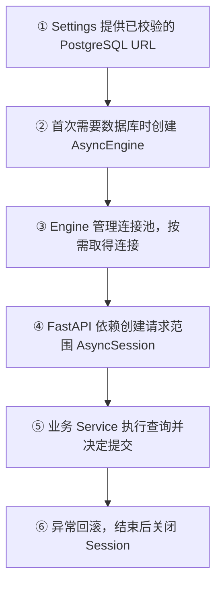

# Day 27：SQLAlchemy PostgreSQL 连接与 Session 边界

## 今日目标

1. 理解 SQLAlchemy AsyncEngine、连接池和 AsyncSession 的职责区别。
2. 使用 Day 26 的 `Settings` 创建 PostgreSQL `asyncpg` Engine，但不在模块导入时连接数据库。
3. 建立 FastAPI 可复用的请求范围 Session 依赖，异常时回滚并在请求结束后关闭。
4. 用不依赖真实 PostgreSQL 的测试验证 Engine 配置、未配置失败和 Session 生命周期。

今天是数据库基础设施专项日。只建立连接和 Session 边界，不创建 User、Conversation、Message 表，不添加迁移、不实现登录，也不修改 Web 页面或 Chat 请求链路。

## 必备理论

### 1. SQLAlchemy（Python ORM/数据库工具）

**专业解释：**

SQLAlchemy 是 Python 的数据库工具包，提供 SQL 表达、Engine、连接池、事务和 ORM 能力。ORM（Object Relational Mapping）可以把 Python 对象映射到数据库表，但今天暂不创建业务 Model。

**大白话：**

它像后端统一的数据库访问层：业务代码不需要在每个函数里手写连接、释放和原始 SQL 的基础管理。

**举例：**

```python
engine = create_async_engine(database_url)
session_factory = async_sessionmaker(engine)
```

**在 Jack AI Studio 中的作用：**

Day 27 用 SQLAlchemy 建立未来用户、会话和消息持久化所需的数据库入口，业务表会在后续 Day 再加入。

### 2. AsyncEngine（异步数据库引擎）

**专业解释：**

AsyncEngine 是应用与数据库之间的异步资源管理入口，负责根据 URL 创建连接池并提供异步连接能力。创建 Engine 本身不等于已经完成数据库连接。

**大白话：**

Engine 像数据库服务的“总调度台”，先知道该去哪、如何建立连接；真正执行查询时才会从连接池取一条连接。

**举例：**

```text
postgresql://...
      ↓ URL 适配
postgresql+asyncpg://...
      ↓
AsyncEngine + connection pool
```

**在 Jack AI Studio 中的作用：**

`get_database_engine()` 只在第一次需要数据库依赖时创建进程级 Engine，并启用 `pool_pre_ping` 检查连接是否仍然可用。

### 3. AsyncSession（异步会话）

**专业解释：**

AsyncSession 是一次业务操作使用的数据库工作单元，负责执行查询、跟踪事务状态、提交或回滚。它不是连接池，也不是全局单例。

**大白话：**

Session 像一次后台表单编辑：在这个请求里读取和修改数据，成功就提交，失败就撤销，处理结束后关掉这次工作空间。

**举例：**

```python
async with session_factory() as session:
    result = await session.execute(statement)
```

**在 Jack AI Studio 中的作用：**

`get_db_session()` 为未来 FastAPI Route 提供请求范围 Session，异常时执行 `rollback()`，请求结束由上下文关闭。

### 4. Connection Pool（连接池）

**专业解释：**

Connection Pool 是由 Engine 管理的可复用数据库连接集合，减少每个请求重复建立 TCP/认证连接的成本。连接池中的连接仍受数据库可用性、超时和释放规则影响。

**大白话：**

它像公司车辆池，请求来了借一辆，用完归还，而不是每次都重新买车；车辆池存在不代表每辆车当前都能正常上路。

**在 Jack AI Studio 中的作用：**

今天只配置连接池，不执行真实查询；后续需要在应用关闭时调用 Engine dispose，释放池中资源。

### 5. Transaction（事务）

**专业解释：**

Transaction 把一组数据库操作作为一个原子工作单元，成功时 commit，异常时 rollback，避免只完成一半的数据修改。

**大白话：**

订单创建和库存扣减要么一起成功，要么一起撤销，不能只写入订单却没扣库存。

**在 Jack AI Studio 中的作用：**

Day 27 的 Session 依赖在请求内发生未处理异常时回滚；具体什么时候 commit 由未来业务 Service 决定，今天不擅自自动提交。

## Python 学习

### 异步生成器与 FastAPI Dependency

- `async def get_db_session() -> AsyncIterator[AsyncSession]` 可以在 `yield` 前准备资源、`yield` 后清理资源。
- FastAPI 会把这种异步生成器作为请求依赖，在处理请求结束时退出上下文。
- `async with` 保证 Session 即使遇到异常也会关闭。
- `await session.rollback()` 只处理当前事务回滚，不会删除数据库中已经提交的历史数据。

这和 Koa 中的 `try/finally` 中间件类似：请求进入时取得资源，请求处理后释放资源；但数据库事务的 commit/rollback 仍由业务边界决定。

## 项目实战

### 数据库依赖流程



### 本日代码边界

```text
apps/api/app/core/config.py
└── database_url 只允许 postgresql:// 或 postgresql+asyncpg://

apps/api/app/db/session.py
├── create_database_engine()  # URL 适配与 Engine 创建
├── get_database_engine()     # 按需缓存进程级 Engine
├── get_session_factory()     # 创建 AsyncSession 工厂
├── get_db_session()          # 请求范围依赖、异常回滚
└── dispose_database_engine() # 释放 Engine 并清缓存

apps/api/tests/test_database_session.py
└── Engine 创建、未配置失败、Session 关闭与回滚测试
```

今天没有实现：

- PostgreSQL 真实连接、查询或迁移。
- SQLAlchemy Declarative Base、User/Conversation/Message Model。
- Alembic Migration、Repository 或持久化 Service。
- Redis 客户端、缓存读写。
- Web 页面、Chat API 或新的 HTTP Endpoint。

## 关键代码说明

- `postgresql://` 会被适配为 `postgresql+asyncpg://`，明确使用异步驱动。
- `create_async_engine()` 创建资源管理入口，但测试证明它不会因为创建 Engine 就发起网络请求。
- 未配置 `JACK_DATABASE_URL` 时，`get_database_engine()` 抛出 `DatabaseConfigurationError`，不伪造“数据库可用”。
- Session 工厂按进程复用 Engine，但每个请求得到独立 Session，避免跨请求共享事务状态。
- `dispose_database_engine()` 为 FastAPI shutdown/lifespan 接入预留，今天不改变现有应用生命周期。

## 今日英文术语

1. **SQLAlchemy**
   - 翻译（Translation）：Python 数据库工具包。
   - 当前语境解释（Context Explanation）：为 Jack AI Studio 提供 Engine、连接池、事务和未来 ORM Model 能力。
2. **AsyncEngine**
   - 翻译（Translation）：异步数据库引擎。
   - 当前语境解释（Context Explanation）：使用 `asyncpg` 管理 PostgreSQL 异步连接和连接池的进程级入口。
3. **AsyncSession**
   - 翻译（Translation）：异步数据库会话。
   - 当前语境解释（Context Explanation）：单个 FastAPI 请求使用的数据库工作单元，负责事务状态和查询执行。
4. **Connection Pool**
   - 翻译（Translation）：连接池。
   - 当前语境解释（Context Explanation）：Engine 管理的可复用数据库连接集合，减少重复建连成本。
5. **Transaction**
   - 翻译（Translation）：事务。
   - 当前语境解释（Context Explanation）：由 Session 管理的 commit/rollback 工作单元，保证一组修改的一致性。
6. **Dependency**
   - 翻译（Translation）：依赖。
   - 当前语境解释（Context Explanation）：FastAPI Route 可以声明并获取 `get_db_session()` 提供的请求范围 Session。
7. **Connection String**
   - 翻译（Translation）：连接字符串。
   - 当前语境解释（Context Explanation）：`JACK_DATABASE_URL` 中描述 PostgreSQL 地址、驱动和认证信息的配置值。
8. **Dispose**
   - 翻译（Translation）：释放资源。
   - 当前语境解释（Context Explanation）：应用关闭时释放 AsyncEngine 连接池，避免数据库连接泄漏。

## 今日练习

1. AsyncEngine、Connection Pool 和 AsyncSession 分别负责什么？为什么不能把 Session 做成全局单例？
2. 为什么创建 `AsyncEngine` 不等于 PostgreSQL 已经连接成功？怎样的操作才算真实连接验证？
3. 为什么每个请求应使用独立 Session？如果多个请求共享同一个 Session，可能有什么问题？
4. 为什么请求异常时需要 rollback，但今天不在 `get_db_session()` 中自动 commit？
5. `dispose_database_engine()` 为什么属于应用生命周期管理，而不是业务 Service？

## 学习验收

### 1. AsyncEngine、Connection Pool 与 AsyncSession 的职责

**我的回答：** AsyncEngine 用来管理异步连接、连接池。Connection Pool 管理可复用的连接。AsyncSession 用于单个请求。

**验收补充：** 核心正确。`AsyncEngine` 是进程级数据库访问入口，负责异步驱动、连接池和连接获取；Connection Pool 保存并复用底层数据库连接；`AsyncSession` 是一次请求或业务操作的工作单元，管理查询和事务状态。Session 不能做成全局单例，因为 `AsyncSession` 不是并发安全的；多个请求共享它会混用未提交数据和事务状态，一个请求的 commit 或 rollback 还可能影响另一个请求。

### 2. 为什么创建 Engine 不等于真实连接成功

**我的回答：** 它只是用来管理的，并没有真正触发连接；AsyncSession 会触发。

**验收补充：** 前半部分正确，但“创建 AsyncSession 就会触发连接”需要修正。创建 `AsyncEngine` 和 `AsyncSession` 通常都只是准备资源；执行 `session.execute(...)`、flush、commit，或者进入 `async with engine.connect()` 后执行 `SELECT 1`，才会真正从连接池取得连接并与 PostgreSQL 通信。能够成功完成这类数据库操作，才能证明当时的地址、网络、认证和数据库服务可用。

### 3. 为什么每个请求使用独立 Session

**我的回答：** 会有事务问题。

**验收补充：** 方向正确，需要补全具体风险。Session 会保存当前事务、待写入对象和查询状态；多个并发请求共享同一个 Session，可能出现数据串扰、并发操作冲突，以及一个请求提交或回滚另一个请求修改的问题。每个请求独立 Session，才能让事务边界与请求一一对应，并在结束时可靠释放资源。

### 4. 为什么异常 rollback，但不自动 commit

**我的回答：** 异常需要关闭。

**验收补充：** 关闭资源是必要的，但 `close` 和 `rollback` 不是同一件事。`rollback` 明确撤销当前尚未提交的事务，并清理失败事务状态；`close` 负责结束 Session、归还底层连接。今天不在依赖中自动 commit，是因为通用依赖不知道业务操作是否真的应该落库，也不知道一组操作的完整事务边界；未来应由业务 Service 在所有规则通过后显式 commit，依赖只负责异常回滚和资源关闭。

### 5. 为什么 dispose 属于应用生命周期

**我的回答：** 不清楚。

**验收补充：** `AsyncEngine` 和连接池是整个 API 进程复用的基础设施资源，不属于某个用户请求或某项业务。`dispose_database_engine()` 应在应用 shutdown/lifespan 阶段统一释放池中连接；业务 Service 只负责用户、会话、消息等领域操作和对应事务，不应决定何时销毁整个进程的数据库连接池。

**最终结论：** 五道题已完成。第 1 题核心正确；第 2 题修正为“创建 Session 也不代表已连接，真实数据库操作才触发连接验证”；第 3 题补全了共享 Session 的并发和事务风险；第 4、5 题补清了 rollback、close、commit 及进程级资源生命周期的职责边界。Day 27 学习验收通过。

## 验收标准

- [x] 新增 SQLAlchemy 异步依赖和 `asyncpg` 驱动。
- [x] PostgreSQL URL 经过 Settings 校验并适配为 `postgresql+asyncpg`。
- [x] Engine 按需创建并启用连接池健康检查，不在模块导入时建立连接。
- [x] 提供请求范围 AsyncSession、异常回滚和资源关闭边界。
- [x] 未配置数据库时明确抛出 `DatabaseConfigurationError`。
- [x] 测试覆盖 Engine 创建、未配置失败、Session 关闭和异常回滚。
- [x] 未新增数据库表、迁移、用户/会话业务或 Web 请求逻辑。
- [x] 完成五道核心概念问答。
- [x] 更新 `PROGRESS.md` 为 Day 27 已完成。

## 遇到的问题

- 第一次 Session 回滚测试直接在 `async for` 消费者中抛异常，异常不会按 FastAPI 依赖生命周期注入生成器；改为显式调用 `dependency.athrow()` 后正确验证回滚。
- 本机未启动 PostgreSQL，因此本日没有声称真实数据库连通；测试只验证 SQLAlchemy Engine 配置和 Session 生命周期。
- 保留已有 Starlette `TestClient` deprecation warning。

## 今日总结

Day 27 已完成 SQLAlchemy/PostgreSQL 连接与 Session 边界、自动化测试和五道概念问答。当前只验证 Engine 配置与 Session 生命周期，没有建立真实 PostgreSQL 连接，也没有提前实现数据库业务模型。

## Git Commit

建议 Commit：

```text
feat(api): add async database session boundary for day 27
```

本轮不会自动执行 Git Commit；完成学习验收后按用户指示处理。

## 下一天预告

Day 28 将在本日验收通过后建立最小数据库 Model/Repository 边界；不会在 Day 27 提前实现用户、会话或消息持久化业务。
