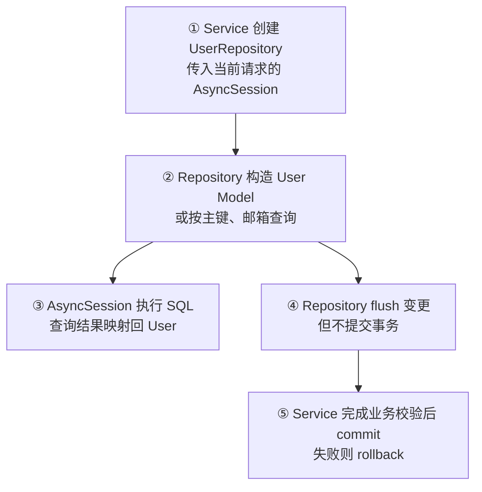

# Day 28：最小数据库 Model 与 Repository 边界

## 今日目标

1. 理解 SQLAlchemy ORM Model、数据库表约束和 Declarative Base 的关系。
2. 建立最小 `User` Model，为后续登录和会话归属保留稳定的数据库实体。
3. 建立 `UserRepository`，封装按主键、邮箱查询和加入当前事务的操作。
4. 明确 Repository、Service、Session 的职责边界，并用不依赖真实 PostgreSQL 的测试验证。

本日是后端专项日。只建立 ORM Model/Repository 边界，不创建 HTTP Endpoint，不实现登录、密码处理、会话/消息持久化、迁移或真实数据库连接。

## 必备理论

### 1. ORM Model（Object Relational Mapping，对象关系映射模型）

**专业解释：** ORM Model 使用 Python 类声明数据库表、列、类型和约束，并让 SQLAlchemy 在对象与 SQL 之间完成映射。

**大白话：** 它像一份“带数据库落点的 TypeScript 类型”：不只说明字段，还说明字段属于哪张表、是否必填、是否唯一。

**举例：** `User.email` 映射 `users.email`，并声明为非空、唯一的字符串列。

**在 Jack AI Studio 中的作用：** `User` 是未来登录和会话归属使用的数据库实体；今天只声明它，不提供注册接口。

### 2. Declarative Base（声明式基类）

**专业解释：** `DeclarativeBase` 是 SQLAlchemy ORM Model 的共同基类，集中持有所有已导入 Model 的 `MetaData`，供后续迁移和建表工具读取。

**大白话：** 它像数据库模型的总目录，所有表的定义都登记在同一份目录里。

**举例：** `class User(Base)` 声明后，`Base.metadata.tables` 可以找到 `users` 表。

**在 Jack AI Studio 中的作用：** `app/db/base.py` 提供唯一的元数据入口；Day 28 不执行 `create_all()`，也不把元数据声明误认为已经建表。

### 3. Repository（仓储层）

**专业解释：** Repository 封装针对某类实体的查询与写入操作，为上层 Service 提供稳定的数据访问接口。

**大白话：** 它类似统一的 `user-api.ts`：业务层只说“按邮箱找用户”，不需要每次自己拼 `select(User)`。

**举例：** `UserRepository.get_by_email(email)` 构造查询并返回 `User | None`。

**在 Jack AI Studio 中的作用：** 今天的 Repository 只负责数据访问，不负责注册规则、密码哈希、权限判断或事务提交。

### 4. Flush 与 Commit（刷新与提交）

**专业解释：** `flush()` 把当前 Session 中的变更发送到数据库，使约束和数据库生成值尽早生效，但仍处于当前事务；`commit()` 才会提交事务并使变更持久化。

**大白话：** `flush` 像把表单送到后厨开始处理，`commit` 像最终盖章出单；盖章前仍可以整体撤销。

**举例：** Repository `add()` 调用 `flush()` 获取数据库生成信息，但由 Service 在完成整组业务操作后统一 `commit()`。

**在 Jack AI Studio 中的作用：** 保持“一个业务操作一个事务”的边界，避免 Repository 偷偷提交，导致未来用户、会话和消息写入无法整体回滚。

## Python 学习

### 类型标注与异步 Repository

- `Mapped[str]` 和 `Mapped[UUID]` 同时表达 Python 属性类型与 ORM 映射意图。
- `async def` Repository 方法与 Day 27 的 `AsyncSession` 配合，数据库 IO 不阻塞 FastAPI 事件循环。
- `User | None` 明确查询可能没有结果；调用方必须处理“用户不存在”，不能把空值当成异常以外的成功对象。
- `Mock(spec=AsyncSession)` 让测试保留 Session 的公开形状，`AsyncMock` 用于验证异步 `flush/get/execute` 调用。

## 项目实战

### 本日请求与事务边界



### 新增代码边界

```text
apps/api/app/db/base.py
└── Base：集中持有 ORM Model metadata

apps/api/app/models/user.py
└── User：users 表、UUID 主键、唯一邮箱、展示名和创建时间

apps/api/app/repositories/user.py
└── UserRepository：add、get_by_id、get_by_email

apps/api/tests/test_user_repository.py
└── Model 映射、查询构造、flush 不 commit 的边界测试
```

### 本日非目标

- 不执行真实 PostgreSQL 查询；创建 Model 和测试 Fake Session 不代表数据库已连通。
- 不运行 Alembic、不生成 Migration、不调用 `Base.metadata.create_all()`。
- 不实现密码哈希、注册/登录、JWT、用户 HTTP Endpoint。
- 不建立 Conversation、Message Model，也不修改 Chat API 的请求链路。

## 关键代码说明

- `Base` 是统一的 ORM 元数据入口，后续 Migration 必须导入所有 Model 才能看到完整表集合。
- `User.id` 使用应用侧 UUID 默认值，`email` 使用数据库唯一约束；约束声明不等于已经在数据库中生效，仍需未来 Migration/建表。
- `created_at` 使用数据库 `CURRENT_TIMESTAMP` 默认值，避免由客户端传入不可信创建时间。
- `UserRepository.add()` 只 `add + flush`，由上层 Service 决定完整事务何时提交。
- `get_by_email()` 使用 `scalar_one_or_none()`，正常情况下只接受零条或一条结果；若唯一约束已被破坏，应让异常暴露而不是静默返回任意一条。

## 今日英文术语

1. **ORM Model**
   - 翻译（Translation）：对象关系映射模型。
   - 当前语境解释（Context Explanation）：`User` Python 类与 `users` 数据库表之间的映射声明。
2. **Declarative Base**
   - 翻译（Translation）：声明式基类。
   - 当前语境解释（Context Explanation）：`Base` 集中管理 ORM Model 的 metadata，供未来 Migration 使用。
3. **Metadata**
   - 翻译（Translation）：元数据。
   - 当前语境解释（Context Explanation）：SQLAlchemy 记录表、列、主键和约束定义的集合，不等于数据库中的实际表。
4. **Repository**
   - 翻译（Translation）：仓储层。
   - 当前语境解释（Context Explanation）：`UserRepository` 提供用户查询/写入方法，隔离 Service 与 SQLAlchemy 查询细节。
5. **Flush**
   - 翻译（Translation）：刷新事务变更。
   - 当前语境解释（Context Explanation）：把 Session 中的 User 变更发送给数据库，但保留在当前事务内，不执行最终提交。
6. **Commit**
   - 翻译（Translation）：提交事务。
   - 当前语境解释（Context Explanation）：未来 Service 在一组用户/会话业务操作完成后统一确认持久化。
7. **Unique Constraint**
   - 翻译（Translation）：唯一约束。
   - 当前语境解释（Context Explanation）：`users.email` 不允许重复，用于保障邮箱身份的唯一性。
8. **Metadata vs Database Schema**
   - 翻译（Translation）：模型元数据与数据库结构。
   - 当前语境解释（Context Explanation）：代码中的 `Base.metadata` 只是结构描述，真实 PostgreSQL 表仍需 Migration 或建表操作。

## 今日练习

1. 为什么 `User` ORM Model 不能直接代替 FastAPI 的 Pydantic Request/Response Schema？
2. `Base.metadata` 有哪些表定义？为什么导入 Model 会影响 Migration 能否发现它？
3. 为什么 `UserRepository.add()` 调用 `flush()`，但不调用 `commit()`？
4. `get_by_id()` 和 `get_by_email()` 分别适合什么查询场景？邮箱唯一约束被破坏时，`scalar_one_or_none()` 应该如何表现？
5. 为什么本日的 Mock Session 测试不能证明 PostgreSQL 真实可用？还缺什么验证？

## 验收标准

- [x] 建立共享 `DeclarativeBase` 和最小 `User` ORM Model。
- [x] `User` 包含 UUID 主键、唯一非空邮箱、非空展示名和数据库默认创建时间。
- [x] 建立 `UserRepository` 的新增、主键查询和邮箱查询边界。
- [x] Repository 测试验证 `flush`，并明确不自动 `commit`。
- [x] 未新增 Endpoint、Migration、真实数据库连接、登录或 Chat 持久化。
- [x] 完成五道核心概念问答，并修正唯一约束与真实连接验证的边界。

## 验证记录

- `UV_CACHE_DIR=/tmp/jack-ai-studio-uv-cache uv run python -m unittest discover -s apps/api/tests -t apps/api -p 'test_user_repository.py' -v`：5 项通过。
- `UV_CACHE_DIR=/tmp/jack-ai-studio-uv-cache pnpm check:foundation`：Web lint、TypeScript、Next.js production build、`uv lock --check`、Python compileall 和完整 API 测试均通过，共 74 项 API 测试。
- `git diff --check`：通过。
- 未启动 PostgreSQL；没有执行真实数据库连接、查询或 Migration。

## 学习验收

### 1. ORM Model 与 Pydantic Schema 的区别

**我的回答：** 是数据库字段的描述映射，和最终请求和响应的不一定一样。

**验收补充：** 正确。ORM Model 描述数据库表、列、关系和持久化约束；Pydantic Request/Response Schema 描述 HTTP 边界的数据契约。两者字段可能部分相同，但职责不同，不能因为数据库有 `created_at` 就要求客户端提交它，也不能把密码哈希等数据库字段直接返回给 Web。

### 2. `Base.metadata` 与 Model 导入

**我的回答：** 数据库数据类型。

**验收补充：** 方向正确但不完整。`Base.metadata` 保存已注册 ORM Model 的表、列、数据类型、主键、索引和约束定义。Migration 工具读取这份元数据生成结构差异；如果 `User` 没有被导入，`users` 表可能不会登记到元数据中，Migration 就无法发现它。元数据仍只是代码描述，不等于 PostgreSQL 中已经存在表。

### 3. `flush()` 与 `commit()` 的职责

**我的回答：** 业务层触发 `add`，服务层最终才执行提交。

**验收补充：** 正确。Repository 把 User 加入当前 Session，并通过 `flush()` 让 SQL 和数据库约束尽早执行；Service 可以在完成多步业务后统一 `commit()`，任一步失败则整体 `rollback()`。这样 Repository 不会偷偷结束上层事务。

### 4. 主键查询、邮箱查询与唯一约束

**我的回答：** `get_by_id` 根据 id 请求用户数据，例如用户更新前先查询基本信息；`get_by_email` 可用于用户创建前检查 email 是否重复。唯一约束被破坏时暂时不清楚。

**验收补充：** 查询场景正确。`get_by_id()` 适合已知稳定主键的精确查询；`get_by_email()` 适合登录、注册前检查或按身份查找。`scalar_one_or_none()` 允许零条或一条结果；如果返回多条，应该抛出异常而不是静默取第一条，因为这说明唯一约束没有生效或历史数据已经不一致，需要让数据问题暴露并处理。

### 5. Mock 测试与真实 PostgreSQL 验证

**我的回答：** Mock 测试并没有真实连接数据库，可能缺少执行 `commit`。

**验收补充：** 前半句正确，后半句需要修正。证明真实连接不要求先 `commit`；执行 `SELECT 1`、真实查询或进入连接上下文并完成数据库通信，就可以验证地址、网络、认证和数据库服务。当要验证事务时，才进一步执行插入、`commit`、`rollback` 或约束冲突测试。Day 28 未启动 PostgreSQL，因此只证明 Model/Repository 的代码契约和 Session 调用边界。

## 遇到的问题

- 当前本机未启动 PostgreSQL，因此只验证 Model/Repository 声明和 Session 调用边界，不声称真实数据库可用。
- 五道概念问答已完成；真实 PostgreSQL 连接与事务验证仍作为后续环境验收，不阻塞本日代码边界完成。

## 今日总结

Day 28 建立了从 SQLAlchemy `Base` 到 `User` ORM Model，再到 `UserRepository` 的最小数据访问边界，并完成五道概念问答。Repository 不拥有事务提交，后续 Service 可以在同一 Session 中组合用户、会话和消息操作。真实 PostgreSQL、Migration、登录和持久化 HTTP 链路留到后续 Day。

## Git Commit

建议 Commit：

```text
feat(api): add user model and repository boundary for day 28
```

五道学习验收已完成，已创建本地 Commit `0a48db6`。本日没有执行真实 PostgreSQL 连接或 Migration。

## 下一天预告

Day 29 将继续数据库结构演进或迁移边界；不会在本日提前实现登录和完整用户业务。
