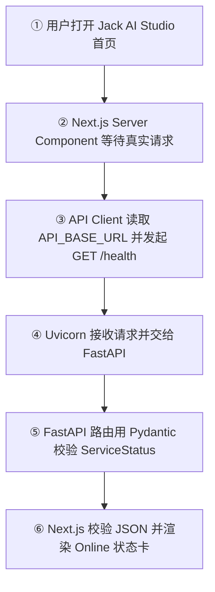
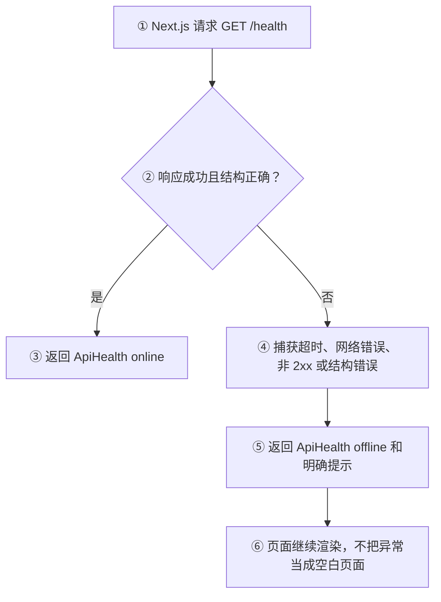

# Sprint 1：项目启动与基础能力总结

## 1. 阶段目标与完成范围

Sprint 1 的目标是建立 Jack AI Studio 的最小可运行基础，让 Web、Python API、运行时数据校验、前后端联调和质量门禁形成第一条完整链路。

- 完成范围：Day 1～Day 10。
- 阶段状态：已完成，进入 Sprint 2 · AI Chat。
- 主要产出：Next.js Web 工作区、React 首页与 Chat 页面骨架、Python/FastAPI API、`GET /health`、Pydantic Schema、Next.js 服务端请求封装、Online/Offline 降级和统一质量检查。
- 明确边界：本 Sprint 没有接入真实模型、Provider、流式响应、数据库、用户登录或会话持久化，这些内容从 Sprint 2 或后续 Sprint 承接。

## 2. 每日学习串联

| Day | 学习与实现 | 阶段作用 |
| --- | --- | --- |
| Day 1 | AI 应用、LLM、Prompt、Token、Context Window、Inference | 建立模型请求和产品边界的基本心智模型 |
| Day 2 | pnpm Monorepo、Workspace、Next.js App Router | 建立 Web 与 API 的仓库边界 |
| Day 3 | React Component、JSX、Props、State、Server/Client Component | 把默认页面改成可交互的产品首页 |
| Day 4 | Event、Controlled Component、单向数据流、Derived State | 用前端熟悉的表单模式理解 React 交互 |
| Day 5 | Route、File-system Routing、Link、Client-side Navigation | 建立 `/` 与 `/chat` 页面骨架 |
| Day 6 | Python Module、list、dict、Function、Type Hints、Entry Point | 建立可运行的 Python 服务入口 |
| Day 7 | Runtime Validation、Pydantic、Schema、ValidationError | 给 Python 数据加上运行时可信边界 |
| Day 8 | HTTP、Endpoint、GET、ASGI、Uvicorn、FastAPI | 把 Python 程序暴露为真实 HTTP API |
| Day 9 | Server-side Fetch、API Client、Environment Variable、Type Guard、Graceful Degradation | 让 Next.js 服务端读取 FastAPI，并在 API 不可用时保持页面可用 |
| Day 10 | Automated Test、Unit Test、Integration Test、Regression、Quality Gate | 把每日验证固化为可重复执行的工程检查 |

## 3. 核心概念与前端类比

### 3.1 AI 应用基础

| 概念 | 是什么 | 为什么需要 | 在 Jack AI Studio 中的位置与类比 |
| --- | --- | --- | --- |
| LLM（Large Language Model） | 根据上下文生成文本的模型 | 是 Chat 的生成能力来源 | 后续由 Provider Adapter 调用；可类比一个外部业务服务 |
| Prompt | 给模型的任务、约束和上下文 | 决定模型本次要做什么 | 由 Chat 输入和后续 Prompt Library 产生；类似提交给后端的业务参数 |
| Token | 模型处理文本的基本单位 | 影响上下文容量和成本 | 后续需要在会话和模型请求中关注；不等同于前端字符串长度 |
| Context Window | 单次请求可使用的 Token 范围 | 过长对话必须截断、摘要或筛选 | 后续由 Chat 会话上下文管理；类似请求 DTO 的容量边界 |
| Inference | 使用已训练模型生成结果 | 区分“调用模型”与“训练模型” | Sprint 2 才接入真实推理；本 Sprint 只建立基础链路 |

### 3.2 Web 与 Python 基础

| 概念 | 是什么 | 为什么需要 | 在 Jack AI Studio 中的位置与类比 |
| --- | --- | --- | --- |
| Monorepo / Workspace | 一个仓库管理多个应用和依赖 | 保持 Web、API 和未来包的边界清晰 | 根 `package.json` 与 `pnpm-workspace.yaml`；类似一个前端多包工作区 |
| Component / Props / State | React 的 UI 单元、只读输入和可变状态 | 把页面拆成可复用、可交互的模块 | `apps/web/src/components`；分别对应 Vue 组件、Props 和响应式状态 |
| Controlled Component | 表单值完全由 React State 驱动 | 让输入、校验和提交使用同一个数据源 | Day 4 的 Prompt Composer；类似 Vue `v-model` 的显式拆分 |
| App Router | Next.js 按 `app` 目录生成路由 | 让 `/`、`/chat` 与文件结构一一对应 | `apps/web/src/app`；类似文件路由约定 |
| Type Hints | Python 中声明预期类型 | 提升可读性和静态检查能力 | `apps/api/app/main.py`；类似 TypeScript 类型，但本身不做运行时校验 |
| Entry Point | 程序开始执行的位置 | 区分导入模块和直接运行脚本 | `main()` 与 `if __name__ == "__main__"`；类似 Node CLI 入口 |

### 3.3 API 契约与质量

| 概念 | 是什么 | 为什么需要 | 在 Jack AI Studio 中的位置与类比 |
| --- | --- | --- | --- |
| Pydantic / Schema | 根据类型和约束校验真实数据的模型 | 防止未经验证的字典直接进入业务 | `ServiceStatus`；类似 TypeScript 类型加 Zod 运行时校验 |
| Endpoint | HTTP Method 与 Path 共同确定的接口 | 给客户端一个稳定的请求契约 | `GET /health`；类似 Koa 路由注册 |
| FastAPI / Uvicorn | FastAPI 负责应用和路由，Uvicorn 负责 ASGI 监听 | 分离业务处理与 HTTP Server 运行职责 | `apps/api/app/main.py`；类似 Koa 应用与启动脚本的分工 |
| Server-side Fetch / API Client | Next.js 服务端向 API 发请求，并集中处理响应 | 不把内部 API 地址和配置暴露给浏览器 | `apps/web/src/lib/api.ts`；类似统一 request client |
| Environment Variable | 由运行环境注入的配置 | 避免把 API 地址或密钥硬编码到代码 | `API_BASE_URL`；和前端 `NEXT_PUBLIC_` 配置有安全边界区别 |
| Graceful Degradation | 依赖失败时保留基础页面能力 | API 暂时不可用时仍能看到明确状态 | 首页显示 Online / Offline；类似后台列表的空态与错误态 |
| Quality Gate | 必须全部通过的一组自动检查 | 防止只验证了一个局部就误判整体可用 | `pnpm check:foundation`；类似提交前 CI 门禁 |

## 4. 主流程：从页面到健康状态展示

Sprint 1 没有真实模型调用，主流程先验证“页面能否读取可信 API 状态”。



## 5. 异常流程：API 不可用时的降级



## 6. 代码架构与职责

```text
jack-ai-studio/
├── apps/web/
│   └── src/
│       ├── app/page.tsx                 # 首页 Server Component 与产品布局
│       ├── app/chat/page.tsx             # Chat 页面骨架
│       ├── components/                   # FeatureCard、PromptComposer、状态卡等 UI
│       └── lib/api.ts                    # FastAPI Health 请求、响应校验、降级状态
├── apps/api/app/main.py                  # FastAPI 应用、GET /health、ServiceStatus
├── apps/api/tests/                       # API Schema、路由和运行时测试
├── package.json                          # Web/API 统一脚本与质量门禁编排
├── pnpm-workspace.yaml                   # pnpm 工作区边界
├── pyproject.toml / uv.lock              # Python 依赖声明与锁定
└── docs/learning/daily/                  # 每日学习、练习、验收与复盘证据
```

数据方向是：`Web Page → API Client → FastAPI Endpoint → Pydantic ServiceStatus → JSON → ApiHealth → UI`。Sprint 1 中 Provider、数据库和持久化层尚未进入这条链路。

## 7. 用户实际获得的产品能力

- 可以打开 Jack AI Studio 首页，看到产品定位、训练进度和模块路线图。
- 可以在首页与 Chat 页面之间导航，看到一个可继续扩展的 Chat 工作区。
- 可以在首页使用本地 Prompt Composer，体验受控输入、实时字数、清空、空白校验和本地提交预览。
- FastAPI 启动时，首页显示真实 API Online 状态和 Python 版本。
- FastAPI 停止、超时或返回异常数据时，首页显示 Offline 提示，而不是崩溃或假装在线。
- 开发者可以用统一命令运行 Web、API、测试、类型检查、构建和 Sprint 质量门禁。

## 8. 验证证据与边界

- `pnpm check:foundation` 已通过，覆盖 Web ESLint、TypeScript、Next.js Production Build、`uv lock --check`、Python `compileall` 和 API unittest。
- `pnpm test:api` 已验证 Health 返回模型和路由注册契约；Day 10 还验证了 API 真实 HTTP Online / Offline 回归。
- 浏览器已验证桌面 `1440×900` 和移动端 `390×844`，首页与 Chat 页面无横向溢出，控制台无阻塞错误。
- Swagger UI 的 `GET /health` Try it out 已验证 `200`、`application/json` 和完整 `ServiceStatus` 响应。
- 本 Sprint 没有调用真实模型，也没有把 API Key 放入 Web；模型 Provider、SSE、Markdown 和多 Provider 属于 Sprint 2 的后续能力。

## 9. Sprint 复习题

1. 为什么 Jack AI Studio 需要同时有 Web、API 和 Provider，而不是把模型请求直接写在浏览器里？
2. React 的 Props、State 和 Controlled Component 分别解决什么问题？它们与 Vue 的 Props、响应式状态和 `v-model` 如何对应？
3. Type Hints、TypeScript 类型和 Pydantic Runtime Validation 的职责边界有什么不同？
4. `GET /health` 请求中，Uvicorn、FastAPI、路由函数和 Pydantic 分别做了什么？
5. 为什么 `API_BASE_URL` 使用服务端环境变量，而不是 `NEXT_PUBLIC_API_BASE_URL`？
6. API 关闭时，`Graceful Degradation` 如何让首页继续提供有用反馈？
7. `pnpm check:foundation` 中任一步骤失败时，为什么不能把 Sprint 1 视为“整体通过”？

## 10. 遗留问题与 Sprint 2 承接

Sprint 1 有意留下以下未实现项：真实 Provider Adapter、API Key 与 Base URL 的后端维护、Chat 请求契约、SSE 流式输出、Markdown 渲染、多 Provider、Structured Output、Tool Calling 和 Prompt Library。

Sprint 2 从 Day 11 承接 Chat 请求契约，逐步建立 `Web → BFF → FastAPI → Provider → Web` 的真实对话链路。Sprint 1 的 `API Client`、Pydantic Schema、统一脚本和 Online/Offline 状态处理会作为后续功能的基础，不提前引入数据库、用户会话或持久化设计。

## 11. 阶段结论

Sprint 1 完成了“能运行、能联通、能校验、能降级、能回归”的基础工程闭环。它不是 AI Chat 成品，但为后续接入模型提供了清晰的前后端边界、可信数据契约和可重复验证入口。
