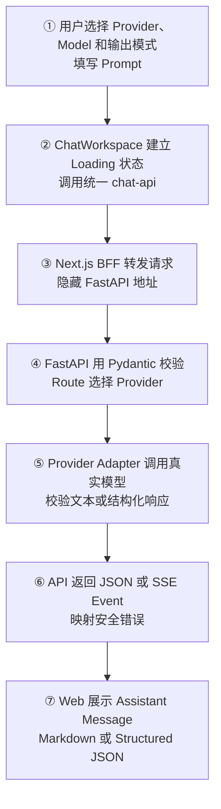
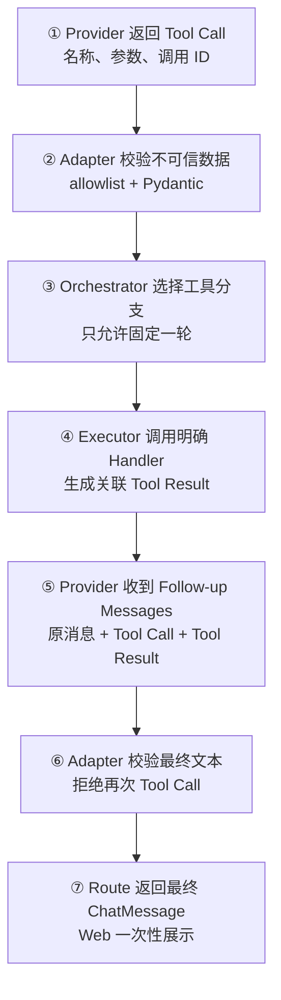
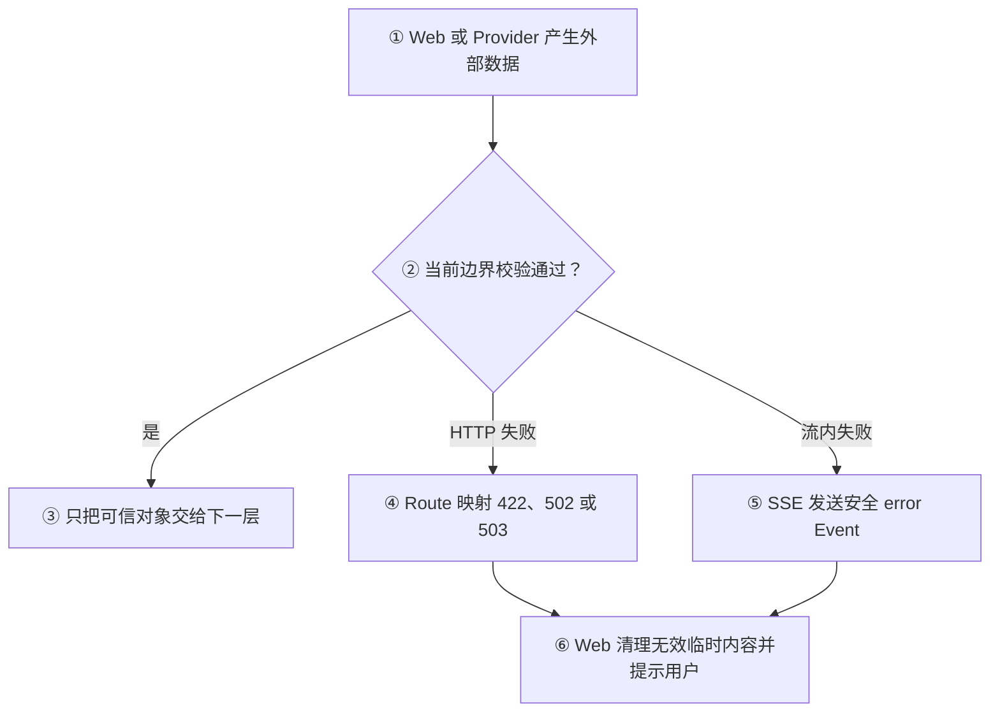

# Sprint 2：AI Chat 总结

## 1. 阶段目标与当前状态

Sprint 2 的目标是把 Sprint 1 的 Web/API 基础升级为可用的 AI Chat V1，建立安全、可替换、可验证的模型调用链路。

- 完成范围：Day 11～Day 25、真实 Provider 验证和七道阶段复习题均已完成。
- 阶段产出：Chat 契约、OpenAI-compatible Provider Adapter、非流式与 SSE、多 Provider、Markdown、Prompt Library、Structured Output、Tool Calling 固定单轮闭环。
- 当前边界：Sprint 2 已完成并通过学习验收；AI Chat V1 仍不等于具备持久化、Agent Loop 或生产运维能力。
- 未提前实现：数据库、用户、会话持久化、多轮 Agent Loop、流式 Tool Calling、MCP 和 Workflow。

## 2. 每日学习串联

| Day | 学习与实现 | 阶段作用 |
| --- | --- | --- |
| Day 11 | `ChatMessage`、`ChatRequest`、Role 与运行时校验 | 建立 Web/API/Provider 共享的 Chat 输入边界 |
| Day 12 | OpenAI-compatible Provider Adapter、SDK 与服务端 Key | 隔离外部模型协议和项目内部契约 |
| Day 13 | FastAPI `/chat`、Dependency Injection、Next.js BFF | 打通非流式 Web → API → Provider 链路 |
| Day 14 | `/chat/stream`、SSE Event、Web Stream Parser | 让 Assistant Message 随 Delta 增长 |
| Day 15 | 安全 Markdown 渲染 | 把模型文本变成可读且不执行原始 HTML 的内容 |
| Day 16 | Provider Registry 与 Provider Catalog | 支持稳定 ID、多 Provider 配置和安全状态展示 |
| Day 17 | 本地 Prompt Library | 让用户复用模板并在提交前编辑 Prompt |
| Day 18 | Structured Output 与 JSON Schema | 让模型输出同时经过请求约束和响应校验 |
| Day 19 | Raw/Validated Tool Call 与 Tool allowlist | 建立模型生成工具参数的信任边界 |
| Day 20 | Provider Tool Definition 与 Tool Call 解析 | 把服务端工具目录接入 Provider 请求 |
| Day 21 | Tool Executor 与 Tool Result | 显式执行已校验工具并保留关联 ID |
| Day 22 | Assistant Tool Call 与 Tool Message 序列 | 构造符合协议的 Tool Result 回传消息 |
| Day 23 | 单次 Tool Follow-up Request | 获取工具执行后的最终 Provider 文本 |
| Day 24 | Chat Orchestrator 与 Web 工具模式 | 完成固定单轮 Tool Calling 产品闭环 |
| Day 25 | 真实 Provider、AI Chat V1 验收与 Sprint 总结 | 区分 Mock 证据和真实外部集成证据 |

## 3. 核心概念总表

| 概念 | 是什么 | 为什么需要 | Jack AI Studio 中的位置 |
| --- | --- | --- | --- |
| Chat Contract | 用 Pydantic/TypeScript 表达消息、Provider、Model 与输出模式 | 让各层共享稳定边界并拒绝非法输入 | `schemas/chat.py`、`chat-api.ts` |
| Provider Adapter | 把项目请求转换成外部模型协议，再把响应转回内部结果 | 隔离 SDK、Base URL 和 Provider 差异 | `providers/openai_compatible.py` |
| Dependency Injection | Route 从外部获得 Provider 依赖 | 便于切换 Provider 和注入 Fake 测试 | `routes/chat.py` |
| BFF | Web 服务端代理浏览器与 FastAPI | 隐藏内部 API 地址并统一超时/错误边界 | Next.js `app/api/chat/*` |
| SSE | 服务端通过事件流持续发送文本 Delta | 降低首字等待时间并改善生成体验 | `/chat/stream`、`streamChatCompletion()` |
| Markdown Rendering | 把模型 Markdown 转换为受控 React 元素 | 提升可读性并避免原始 HTML 注入 | `markdown-message.tsx` |
| Provider Registry | 稳定 Provider ID 到私有环境变量的服务端映射 | 支持多个 Provider 且不向 Web 暴露 Key | `providers/registry.py`、`GET /providers` |
| Prompt Library | 带变量的本地提示词模板目录 | 复用高质量 Prompt，同时保留提交前编辑权 | `prompt-library.ts` 与组件 |
| Structured Output | 用 strict JSON Schema 约束请求并用 Pydantic 校验响应 | 让程序消费的回答具有确定字段，并拒绝额外字段 | `StructuredAnswer`、`response_format`、`additionalProperties: false` |
| Tool Calling | 模型返回工具名和 JSON 参数，由应用决定执行 | 让 LLM 使用确定性程序能力而不直接执行代码 | `tools/catalog.py` |
| Tool Executor | 显式映射已校验 Tool Call 到 Handler | 隔离执行权限并拒绝未知工具 | `tools/executor.py` |
| Tool Result Correlation | 用 `tool_call_id` 让请求和结果一一对应 | 防止多个工具结果错配 | Follow-up Message 构造逻辑 |
| Chat Orchestrator | 协调 Provider、Executor 和一次 Follow-up 的应用服务 | 让 Route、Provider 和工具保持单一职责 | `services/chat.py` |
| Real Provider Validation | 用真实鉴权、网络和模型能力验证产品链路 | Mock 无法证明外部兼容性、额度和真实时序 | Day 25 端到端验收矩阵 |

前端类比：Provider Adapter 类似封装第三方支付 SDK 的 Service；Pydantic 类似 TypeScript 加 Zod；Chat Orchestrator 类似组合多个请求和状态的业务 action；SSE 类似持续派发增量状态，而不是一次性 Promise JSON。

## 4. AI Chat 文本主流程



## 5. Tool Calling 固定单轮流程



## 6. 异常与信任边界



信任边界不是只存在于 Web 上传或 HTTP Request。Provider/LLM 返回的文本、JSON 和 Tool Call 同样属于外部数据，必须在 Adapter 中完成运行时校验后才能进入 Executor、Orchestrator 或 HTTP Response。

## 7. 代码与架构对应关系

```text
apps/web/src/
├── components/chat-workspace.tsx      # 输入、模式选择和 Loading/Success/Error
├── components/markdown-message.tsx    # 安全 Markdown 展示
├── components/prompt-library.tsx      # Prompt 模板交互
├── lib/chat-api.ts                    # 统一 Chat 请求与 SSE 解析
└── app/api/chat/                      # Next.js BFF Route Handler

apps/api/app/
├── routes/chat.py                     # HTTP/SSE 边界和安全错误映射
├── schemas/chat.py                    # Chat 与 Structured Output 契约
├── providers/registry.py              # Provider 目录与私有配置映射
├── providers/openai_compatible.py     # SDK 请求、响应、Tool Call 校验
├── services/chat.py                   # 固定单轮 Chat Orchestrator
└── tools/
    ├── catalog.py                     # Tool Definition、allowlist、参数 Schema
    └── executor.py                    # Handler 分发与 Tool Result
```

数据只沿受控方向流动：`Web ChatRequest → BFF → FastAPI Schema → Provider Adapter → ProviderCompletion/ValidatedToolCall → Orchestrator/Executor → ChatMessage/SSE → Web`。

## 8. 用户实际获得的产品能力

- 可以选择服务端已配置的 Provider，并明确看到未配置状态。
- 可以输入 Model ID 和 Prompt，使用 SSE 逐段查看普通回答。
- 可以把安全 Markdown 渲染为标题、列表、引用和代码块。
- 可以从本地 Prompt Library 选择模板、填写变量、应用后继续编辑。
- 可以选择 Structured JSON，让最终回答满足固定字段契约。
- 可以切换工具模式，让模型请求服务端 `add_numbers`，执行后返回最终 Assistant Message。
- Provider、Key、工具目录和 Handler 都留在服务端；浏览器不直接接触机密或执行模型生成代码。

当前产品仍没有会话历史、登录、数据库持久化、Token 用量展示、多轮 Agent、自定义工具管理或生产级 Secret Manager。

## 9. 验证证据

| 验证层 | 已有证据 | 边界 |
| --- | --- | --- |
| 自动化测试 | Day 25 修复后 61 个 API 测试通过 | 使用 Mock/Fake，不访问外部 Provider |
| Web 质量门禁 | ESLint、TypeScript、Next.js Production Build 通过 | 证明静态质量和构建，不证明真实模型能力 |
| API 质量门禁 | `uv lock --check`、Python `compileall` 通过 | 证明依赖锁和语法，不证明外部鉴权 |
| 浏览器 | 桌面 `1280×720`、移动端 `390×844` 的真实配置状态和布局通过 | `scrollWidth` 分别等于 `1280`、`390` |
| Text 真实调用 | `/chat` 返回 HTTP 200 和 `OK`，Web 普通文本可见 | Kaizo 第三方 API + `gpt-5.6-luna` |
| SSE 真实调用 | `/chat/stream` 返回 7 个 Delta、1 个 Done，Web 正常结束 Loading | 最终文本为“红色、绿色、蓝色” |
| Structured Output 真实调用 | 修复 strict Schema 后 HTTP 200，Web 展示四个字段 | 首次真实请求发现并修复 `additionalProperties: false` 缺口 |
| Tool Calling 真实调用 | 模型请求 `add_numbers(19, 23)`，Executor 返回 `42`，Follow-up 与 Web 最终回答通过 | 公开 `/chat` 返回“19 与 23 的和是 42。” |

真实调用不进入自动化测试和 CI，避免提交 Key、产生不可控费用以及受外部服务波动影响。官方 OpenAI 文档建议使用环境变量或 Secret Management Service 保存 API Key，不把 Key 暴露在代码或公开仓库中。

## 10. Sprint 复习验收

| 题目 | 用户回答要点 | 验收与纠正 |
| --- | --- | --- |
| API Key 与分层职责 | Key 私密且只能放服务端；Web、BFF、FastAPI、Adapter 分层处理 | 核心正确；补充 BFF 只转发 FastAPI，Adapter 才真正调用外部 Provider 并校验响应 |
| 三层校验边界 | TypeScript 负责 Web 开发期，Pydantic 负责 FastAPI 运行时，Adapter 校验 LLM 数据 | 核心正确；补充 TypeScript 会被擦除，Provider 响应始终是不可信外部数据 |
| JSON 与 SSE | JSON 一次返回，SSE 持续返回直到结束或错误 | 核心正确；补充非流式需等待完整结果，SSE 要区分建连前 HTTP 错误与建连后 `error` Event |
| Structured Output | 原回答不清楚 | 已补清：`response_format` 约束生成方式，`additionalProperties: false` 禁止额外字段，`StructuredAnswer` 验证真实响应 |
| Tool Calling 顺序 | 工具定义 → 校验调用 → 执行 → 结果 → 带结果再次请求 | 正确；补充 Raw/Validated 边界、`tool_call_id` 关联和 Follow-up Messages 内容 |
| 单轮编排与 Agent Loop | Agent Loop 需要状态、长度、终止、重试和历史结果 | 核心正确；补充再次 Tool Call 会触发 `ProviderToolRoundLimitError`，不会执行第二轮工具 |
| Mock 与真实调用 | Mock 证明内部入出参与接口，真实调用证明链路跑通 | 核心正确；补充 Smoke Test 只证明特定 Provider、Model 和时刻，不代表长期稳定、全模型或全部场景 |

**验收结论：** 七道复习题已回答并完成纠正。用户能够说明 Chat 分层和信任边界、JSON/SSE 时序、Tool Calling 顺序及 Agent Loop 边界；Structured Output 的三层约束已完成补课。Sprint 2 学习验收通过。

## 11. 遗留问题、风险与 Sprint 3 承接

- 真实 Provider 结果受模型能力、账户额度、限流和网络影响，需要按具体 Provider/Model 留证。
- 当前真实证据来自 Kaizo 第三方 OpenAI-compatible API；它不是 OpenAI 官方服务且会注入服务端指令，只用于非敏感学习验收。
- Tool Calling 当前只支持服务端 `add_numbers` 和一次 Follow-up，不支持连续决策、并发副作用工具或人工确认。
- SSE 当前只处理文本 Delta，不处理流式 Tool Call Delta。
- Prompt Library 仅在前端本地定义，没有数据库、自定义模板或跨用户同步。
- Chat Message 只存在于当前页面 State，刷新后不会恢复。
- 当前错误对用户保持安全，但还没有结构化日志、请求 ID、Token 用量、成本和监控。

Sprint 3 从 Day 26 承接用户、登录、会话、消息持久化、PostgreSQL、Redis、日志和测试。进入 Sprint 3 不会改变现有 Provider/Chat 契约，而是在其外部补充身份、存储与可观测能力。

## 12. 阶段结论

Sprint 2 已完成 AI Chat V1 的代码、Mock/Fake 回归、真实 Text、SSE、Structured Output、Tool Calling 验证和七道复习题。当前正式切换到 Sprint 3，下一步从 Day 26 开始后端与数据持久化学习。
